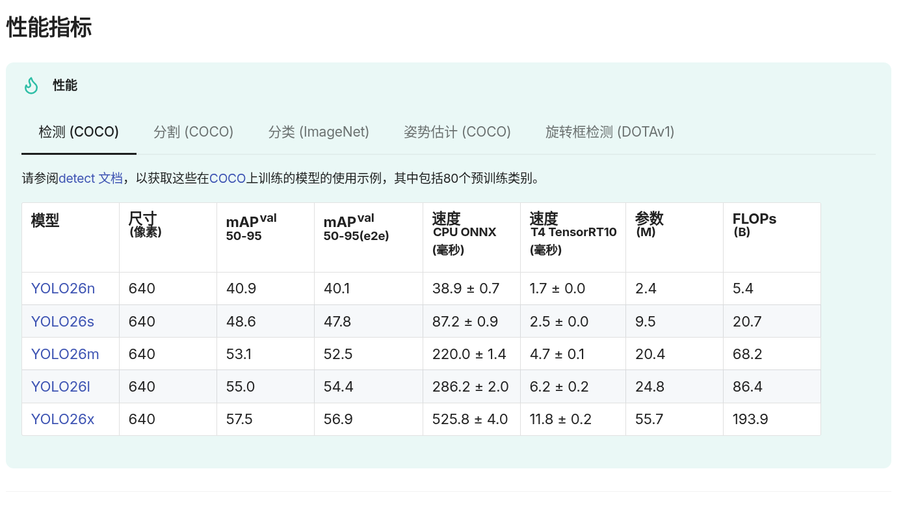

# Ubuntu 24.04配置深度学习全套流程  

**写在前面，文章有可能存在错误，如果发现了有毛病，欢迎随时提出pr，我会尽快合并**

## 前言
最近出现了爆火的萝卜，真棒，里面的哈基米通过努力地学习(bushi)来识别出萝卜和纸巾，为此，这篇文章讲简单介绍用大开门的视频数据进行识别，训练一个属于自己的yolo识别模型，并用它进行推理。

笔者使用的是ubuntu默认的24.04终端，系统信息如下，没有特别说明都是在终端进行的，下面开始教程
``` bash
(base) luomo@luomo-YAOSHI-Series:~$ lsb_release -a
No LSB modules are available.
Distributor ID:	Ubuntu
Description:	Ubuntu 24.04.3 LTS
Release:	24.04
Codename:	noble
(base) luomo@luomo-YAOSHI-Series:~$ 
```

## 配置miniconda前置环境
首先我们先下载miniconda，这个是python里面比较常用的包管理的工具，类似我们在启动minecraft里面的环境隔离，譬如一个地方用python3.10,一个是3.9,这样可以避免安装进同一个系统导致环境冲突。  
**conda**分为**Anaconda**和**Miniconda**，其中Miniconda仅包含了最小的包体，另一个集成了一些库，这里我们只需要安装miniconda即可。
### 具体安装步骤

#### 下载安装脚本
打开终端，使用 wget命令下载最新的Miniconda安装脚本。
``` bash
wget -c https://mirrors.tuna.tsinghua.edu.cn/anaconda/miniconda/Miniconda3-latest-Linux-x86_64.sh
```

#### 运行安装脚本
继续在刚才的终端，使用bash执行下面的安装脚本。
``` bash
bash Miniconda3-latest-Linux-x86_64.sh
```

#### 修改安装的目录
当终端里面提示安装目录的时候，可以修改路径，一般可以不做修改
``` bash
Miniconda3 will now be installed into this location:
/home/luomo/miniconda3

  - Press ENTER to confirm the location
  - Press CTRL-C to abort the installation
  - Or specify a different location below

[/home/luomo/miniconda3] >>> 
```

#### 自动配置环境变量
出现如下提示的时候
``` bash
installation finished.
Do you wish to update your shell profile to automatically initialize conda?
This will activate conda on startup and change the command prompt when activated.
If you'd prefer that conda's base environment not be activated on startup,
   run the following command when conda is activated:

conda config --set auto_activate_base false

Note: You can undo this later by running `conda init --reverse $SHELL`

Proceed with initialization? [yes|no]
[no] >>> 
```

#### 重新加载终端
当完成安装之后，需要刷新一下终端环境来加载miniconda进来。  
``` bash
source ~/.bashrc
```
当重启完终端后，你的命令行变成了下面的样子
``` bash
(base) luomo@luomo-YAOSHI-Series:~/下载$ 
```
用户名前面多了个 **(base)**，一切就大功告成了，base表示现在是基础的环境。  
在终端里面输入如下指令可以检查conda版本来确认是否正确安装。
``` bash
conda --version
```

#### miniconda基本的命令

| 命令 | 作用 |
| :--- | :--- |
| `conda create -n my_env python=3.xx` | 创建一个名为 `my_env`、Python版本为3.xx的新环境 |
| `conda activate my_env` | 激活名为 `my_env` 的环境 |
| `conda deactivate` | 退出当前环境 |
| `conda env list` | 列出所有已创建的环境 |
| `conda remove -n my_env --all` | 删除名为 `my_env` 的环境及其所有包 |

#### 创建新的隔离环境
在安装完miniconda之后，我们可以开始配置yolo学习需要的环境了,这里分为两个部分，一个是用于标注数据集的labelme的安装，另一个是yolo的训练推理环境。

## visual studio code的python环境配置

#### 创建配置文件
vscode可能会和其他的插件打架，为此有必要把python的环境隔离开来，点击左下角的小齿轮->配置文件->配置文件，进入到选项卡，然后创建一个新的配置文件，之后将工作区切换到新创建的配置环境，**创建配置文件的时候记得不要继承默认配置文件的插件！！！**

#### 安装python插件
前往插件市场搜索python,安装相关的插件。


#### 配置python解释器
安装好插件后，按下ctrl+shift+p,输入  
**Python: Select Interpreter**
就可以看到python解释器的位置，选择你安装好的conda环境即可

## 配置安装labelme用于数据集标注

#### 创建labelme的环境
输入终端的指令来创建新的miniconda环境，其中出现任何协议一律同意就行了,输入a代表accept同意。
``` bash
conda create -n labelme python=3.9
```
``` bash
(base) luomo@luomo-YAOSHI-Series:~$ conda create -n labelme python=3.9
Do you accept the Terms of Service (ToS) for 
https://repo.anaconda.com/pkgs/main? [(a)ccept/(r)eject/(v)iew]: a
```
#### 激活conda环境
部署好环境之后我们可以进行激活,下面的labelme就是你刚刚命名的环境名称
``` bash
conda activate labelme
```

#### 安装pyqt库
qt库是一个常用的跨平台开发组件库，为开发图形化界面提供的十分的便利，labelme软件也需要使用qt库，使用下面的指令安装pyqt和labelme
``` bash
conda install pyqt
pip install labelme
```

#### 启动labelme
当出现一大串类似下面的提示之后(有Successfully installed的字样)，应该就可以启动labelme了。
``` bash
Successfully installed PyQt5-sip-12.17.1 PySocks-1.7.1 annotated-types-0.7.0 beautifulsoup4-4.14.3 certifi-2026.1.4 charset_normalizer-3.4.4 click-8.1.8 coloredlogs-15.0.1 contourpy-1.3.0 cycler-0.12.1 filelock-3.19.1 flatbuffers-25.12.19 fonttools-4.60.2 gdown-5.2.1 humanfriendly-10.0 idna-3.11 imageio-2.37.2 imgviz-1.7.6 importlib-resources-6.5.2 kiwisolver-1.4.7 labelme-5.10.1 lazy-loader-0.4 loguru-0.7.3 matplotlib-3.9.4 mpmath-1.3.0 natsort-8.4.0 networkx-3.2.1 numpy-2.0.2 onnxruntime-1.19.2 osam-0.2.5 pillow-11.3.0 protobuf-6.33.4 pydantic-2.12.5 pydantic-core-2.41.5 pyparsing-3.3.2 pyqt5-5.15.11 pyqt5-qt5-5.15.18 python-dateutil-2.9.0.post0 pyyaml-6.0.3 requests-2.32.5 scikit-image-0.24.0 scipy-1.13.1 six-1.17.0 soupsieve-2.8.3 sympy-1.14.0 tifffile-2024.8.30 tqdm-4.67.1 typing-extensions-4.15.0 typing-inspection-0.4.2 urllib3-2.6.3 zipp-3.23.0
(labelme) luomo@luomo-YAOSHI-Series:~$ 
```
输入下面的命令来启动labelme
``` bash
labelme
```
当启动完成之后，会打开新的窗口，就代表安装成功了，后续标注数据集会用到labelme


## 使用labelme标注数据集

我已经事先处理好了数据集的照片，通过在b站up主超级无敌大开门下载视频  
  (up主空间:https://space.bilibili.com/3493132916230432?spm_id_from=333.337.0.0)

在后续的仓库里面，我提供了一些Python脚本用于从视频抽取一些帧出来变成图片用于标注数据集。

在下面的教程里面，我将标注哈基米(喵喵)，萝卜，纸巾和米老鼠，对应的tag就是
```
carrot,cat,tissue，mouse
```
打开数据集的目录，拿起左边的矩形工具，标吧
**左上角文件可以把自动保存打开！！！**

标好的应该是下面那样


这次采用的数据集有97张图片，用于区分这个up的猫猫，纸巾，萝卜还有米老鼠。

## 数据集转换

#### 转换labelme的json格式到yolo的txt格式
在文件的根目录下会存放刚刚标注好的json格式的文件，用于存放标注的信息，但是我们将要训练的是yolo模型，yolo使用的是txt格式，存放归一化的坐标，但是json里面是标准的坐标，我们需要进行转换。
**转换脚本在文章指向的github仓库 /datasettools/**  
里面提供了重命名工具，用于将其他照片格式改为.jpg，方便进行统一的管理。  

首先先将图片备份好，然后复制一份，同时把标签分开一个单独的文件夹


#### 配置工具集的环境
图片格式的转换需要opencv库，我们可以创建一个新的环境用于数据集的处理，使用如下命令创建一个新的环境。
``` bash
conda create -n dataset_process python=3.12
conda activate dataset_process
```
之后在刚刚激活好的环境安装opencv库
``` bash
pip install opencv-python
```
当显示成功安装后，就可以使用工具集里面的py脚本来转换数据集。


使用脚本之前记得切换好环境，可以在终端运行，也可以在vscode运行(记得切换解释器到你安装的环境里面)

#### py文件约定的参数
``` python
img_folder_path = r'./dataset/images'  # 图片存放文件夹
folder_path = r"./dataset/json_labels"  # 标注数据的文件地址
txt_folder_path = r"./dataset/txt_labels"  # 转换后的txt标签文件存放的文件夹
class_names = ["carrot", "cat", "mouse","tissue"]  # 请根据你的实际情况修改,可以查看目录下的categories.txt
```
**里面的class_names有顺序要求，一定要按顺序填写**
#### 检查json标注的情况
在工具目录下运行**see_json.py**，之后会打开新的窗口，检查窗口是否创建正确


#### 转换成txt格式
在dataset目录下面创建名为**txt_labels的文件夹**，之后运行**json_to_txt.py**,转换成txt文本文件。  
**文件顺带输出了categories.txt,里面含有从0开始的id对应的物体**

#### 检查txt转换是否正确
**在see_txt.py里面修改class_names,变成对应的单词，之后运行并检查，看看是否转换正确。**


#### 划分数据集和验证集
里面的数据集并不是要全部拿来训练，训练集的yolo是根据答案进行试卷的复习，验证集就是yolo拿着训练的成果进行考试，考完试再对答案，看看跟答案差别多少(正确率)，同时检查也没有过拟合和欠拟合，用来检验训练成果并进行下一步的训练。  

运行文件夹里面的**split_dataset.py**来划分刚刚弄好的数据集
**目录的格式应该按照下面进行**
```
dataset/
├── images/
│   ├── 1.jpg     # 图片1
│   └── 2.jpg     # 图片2
├── txt_labels/
│   ├── 1.txt     # 标注1
│   └── 2.txt     # 标注2
```

**划分好之后的数据集应该是下面的情况**
```
yolo_dataset/
├── train/
│   ├── images/     # 训练集图片
│   └── labels/     # 训练集标签（txt格式）
├── val/
│   ├── images/     # 验证集图片
│   └── labels/     # 验证集标签（txt格式）
└── data.yaml       # 数据集配置文件
```

#### 创建data.yaml文件
上面的yaml文件是没有的，需要我们手动添加，按照下面的格式创建这个文件。
``` yaml
# 数据集配置文件
train: yolo_dataset/train/images  # 训练集图片路径
val: yolo_dataset/val/images      # 验证集图片路径

# 类别数量（需要根据你的实际情况修改）
nc: 4

# 类别名称（需要替换为你的实际类别）
names: ["carrot", "cat", "mouse","tissue"]
```

**到这里，已经完成了数据集的准备了，接下来就是训练和推理环节**

## Yolo环境的配置

#### 创建新的conda虚拟环境
在终端窗口运行下面的代码。
``` bash
conda create -n yolo26 python=3.10 -y
conda activate yolo26
```

#### 查看显卡支持的cuda环境
在终端运行如下的代码
``` bash
nvidia-smi
```

在输出的第一行你就能看到显卡当前的驱动版本和支持的最高版本的cuda
``` bash
NVIDIA-SMI 580.95.05              Driver Version: 580.95.05      CUDA Version: 13.0 
```
笔者的电脑可以支持cuda13.0，就去pytorch官网检索自己版本的pytorch，链接如下:  
https://pytorch.org/get-started/locally/

在这里可以看到我选用了cuda13.0的安装命令，在激活的环境运行下面的命令。**安装过程比较久，需要给点耐心。**
``` bash
pip3 install torch torchvision --index-url https://download.pytorch.org/whl/cu130
```

安装完成之后会得到类似成功的结果。
``` bash
Successfully installed MarkupSafe-2.1.5 cuda-bindings-13.0.3 cuda-pathfinder-1.2.2 filelock-3.20.0 fsspec-2025.12.0 jinja2-3.1.6 mpmath-1.3.0 networkx-3.4.2 numpy-2.2.6 nvidia-cublas-13.1.0.3 nvidia-cuda-cupti-13.0.85 nvidia-cuda-nvrtc-13.0.88 nvidia-cuda-runtime-13.0.96 nvidia-cudnn-cu13-9.15.1.9 nvidia-cufft-12.0.0.61 nvidia-cufile-1.15.1.6 nvidia-curand-10.4.0.35 nvidia-cusolver-12.0.4.66 nvidia-cusparse-12.6.3.3 nvidia-cusparselt-cu13-0.8.0 nvidia-nccl-cu13-2.28.9 nvidia-nvjitlink-13.0.88 nvidia-nvshmem-cu13-3.4.5 nvidia-nvtx-13.0.85 pillow-12.0.0 sympy-1.14.0 torch-2.10.0+cu130 torchvision-0.25.0+cu130 triton-3.6.0 typing-extensions-4.15.0
(yolo26) luomo@luomo-YAOSHI-Series:~$ 
```
安装pytorch之后去tools文件夹运行**check_cuda.py**,如果产生以下的输出,则代表安装正确，否则需要检查前面安装pytorch的步骤是否正确。
``` bash
CUDA available: True
Current device: 0
Device name: NVIDIA GeForce RTX 5070 Ti Laptop GPU
PyTorch version: 2.10.0+cu130
CUDA version: 13.0
```
#### 准备前置文件和默认权重文件
去yolo官方的github仓库去克隆ultralytics文件夹到电脑上(我的github仓库已自带)  
github仓库链接:https://github.com/ultralytics/ultralytics

前往yolo官网的模型下载页面下载默认权重文件，并且放到根目录(我的仓库已经自带)。
模型下载链接:https://docs.ultralytics.com/zh/models/yolo26/#supported-tasks-and-modes  

点击上面的蓝蓝的按钮就能下载，从上到下模型的参数量依次增加，参数量越大检测的速度越慢，但是精确度越高，下载完之后拖到根目录。

#### 安装yolo
在根目录下打开终端，cd到ultralytics文件夹进行安装
``` bash
cd ultralytics
```
安装ultralytics,过程会咕噜咕噜下载文件，需要比较长的时间。都弄到这了，去喝口水，眺望一下远方。
``` bash
pip install ultralytics
```
出现如下的字样则安装成功
``` bash
Successfully installed certifi-2026.1.4 charset_normalizer-3.4.4 contourpy-1.3.2 cycler-0.12.1 fonttools-4.61.1 idna-3.11 kiwisolver-1.4.9 matplotlib-3.10.8 nvidia-cublas-cu12-12.8.4.1 nvidia-cuda-cupti-cu12-12.8.90 nvidia-cuda-nvrtc-cu12-12.8.93 nvidia-cuda-runtime-cu12-12.8.90 nvidia-cudnn-cu12-9.10.2.21 nvidia-cufft-cu12-11.3.3.83 nvidia-cufile-cu12-1.13.1.3 nvidia-curand-cu12-10.3.9.90 nvidia-cusolver-cu12-11.7.3.90 nvidia-cusparse-cu12-12.5.8.93 nvidia-cusparselt-cu12-0.7.1 nvidia-nccl-cu12-2.27.5 nvidia-nvjitlink-cu12-12.8.93 nvidia-nvshmem-cu12-3.3.20 nvidia-nvtx-cu12-12.8.90 opencv-python-4.13.0.90 packaging-26.0 polars-1.37.1 polars-runtime-32-1.37.1 psutil-7.2.1 pyparsing-3.3.2 python-dateutil-2.9.0.post0 pyyaml-6.0.3 requests-2.32.5 scipy-1.15.3 six-1.17.0 torch-2.9.1 torchvision-0.24.1 triton-3.5.1 ultralytics-8.4.7 ultralytics-thop-2.0.18 urllib3-2.6.3
(yolo26) luomo@luomo-YAOSHI-Series:~/Github/yolo-26-train/ultralytics$ 
```

## 运行yolo模型

#### 运行模型训练
完成了前面的全部工作，就可以开始训练模型了！在终端输入如下预设命令可以开始训练。  
``` bash
yolo task=detect mode=train model=yolo26n.pt data=data.yaml epochs=100 imgsz=640 batch=16 device='cuda'
```
过一会我们将跑完了模型，生成了训练好的权重文件，我们需要进行推理来检验成果。  

#### 查看训练结果
运行tools工具集里面的**draw_chart.py**,修改里面的csv为你runs/detect/train里面的文件路径，即可查看本次训练的成果。  
**绘制图像需要panda库，使用下面指令补全库**
``` bash
pip install pandas
```


#### 进行图像推理

#### 进行视频推理
