## 友情链接
ros2鱼香一键安装:https://fishros.org.cn/forum/topic/20/  
ros2官方教程wiki:http://dev.ros2.fishros.com/doc/Tutorials/Configuring-ROS2-Environment.html
ros2视频教程(赵虚左):https://www.bilibili.com/video/BV1VB4y137ys  

## ros2的概述与相关概念

#### ros2的设计理念
ros的全程是Robot Operating System,用于构建机器人应用程序的开发工具包，在很多方面都有用武之地，成为了机器人开发的重要框架之一。  

机器人是一个相当复杂的复合体，包含了机械结构，硬件设计，软件设计，算法设计等等诸多模块，是硬件软件的结合体。而机器人的一个部件如果都要自己造一遍轮子，那工作量将会大大增加，因此ros应运而生，它就是一个软件层面的框架，负责把众多功能打包好，集成一个统一的标准，可以轻松接耦合机器人的各种模块，同时作为一个大脑，来控制各种硬件。在上面的描述中，最重要的核心理念就是不重复造轮子，形成复用。  

#### ros2的发行方式
ros2采用版本化功能包的发行方式，通过固定在一个ubuntu发行版本，并跟随其维护周期，从而实现一个相对稳定的开发环境。  

#### ros2的组成
ros2的组成划分为以下的体系:
##### 通信
通信是ros2系统的核心实现，作为内置的消息传递系统，通常被叫作中间件。ros2的通信可以实现不同节点之间的通信细节，使用了**面向接口**的变成思想，通过设计规范的接口，把不同模块进行分离，使得ros2系统变得更具有维护性、提高了扩展性和复用性。
##### 工具
在开发遇到了一些问题或者需要查看效果之后，需要使用工具进行解决，ros2内置了launch、调试、可视化、绘制、绘图、回放等一系列数据，譬如我要知道激光雷达的输出是什么样子的，就可以用rviz工具进行可视化操作。  
##### 功能
ros2提供了一个生态系统，无论是需要什么设备驱动城市或者算法，ros都通通提供了相关的实现，开发者可以专注于眼前的功能业务实现
##### 社区
ros2提供了一个开源的社区，有着类似github的托管服务，同时维护着ros相关的工程项目

#### 学习路径
在接下来的学习过程中，我将从零开始，基于c++和python的编程语言基础来一步一步学习ros系统的主要模块
- ros2的通讯机制
- ros2的工具(launch、rosbag2、坐标变换、rviz2等可视化工具)

## ros2的体系框架


## ros2环境的配置安装

#### 使用鱼香ros2一键安装

在终端输入如下命令，按下数字1来一键安装ros2，之后把镜像源换成国内。
``` bash
wget http://fishros.com/install -O fishros && . fishros
```

安装完成之后，在终端输入下面的命令来启动ros2的小乌龟(Turtlesim)，这是以后学习中用到的简单模拟器，用于模拟一个机器人出来
``` bash
ros2 run turtlesim turtlesim_node
```
运行之后，会有一个小乌龟窗口，但是暂时无法控制它，在ros2里面，许多程序通过节点的形式运行，同理，操控小乌龟的节点也需要启动它。新建一个终端窗口，输入如下命令
``` bash
ros2 run turtlesim turtle_teleop_key
```
现在一共有三个窗口，分别是小乌龟的终端，小乌龟控制器的终端，还有现在小乌龟的图形化窗口，把鼠标聚焦于控制器终端窗口即可按下方向键来控制乌龟行动
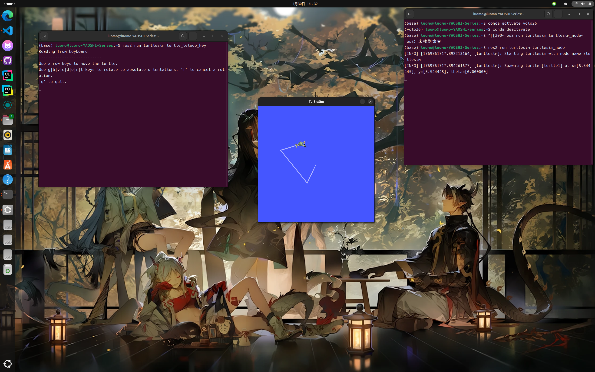
如果到这里，那么ros2的安装就基本完成了，现在ubuntu系统里面已经部署好ros2机器人系统和简单的模拟器，接下来开始正式学习ros2的内容。

## ros2的"hello world"
通过编写第一个hello world,感受一下使用接口来cout的感觉。
在一开始，先不使用vscode，使用最基本的终端命令来创建一个工作空间，来编写一个hello world。

#### 创建工作空间
在你喜欢的位置新建一个文件夹helloworld,然后在子目录新建一个src文件夹，用于存放编写的代码，接着使用colcon工具来构建，如果没有安装，则在终端输入如下命令来安装。安装完colcon之后，就可以在ROS2中编写应用程序。
``` bash
sudo apt install python3-colcon-common-extensions
```
如果已经安装，则cd到下面的目录来进行编译
``` bash
colcon build
```
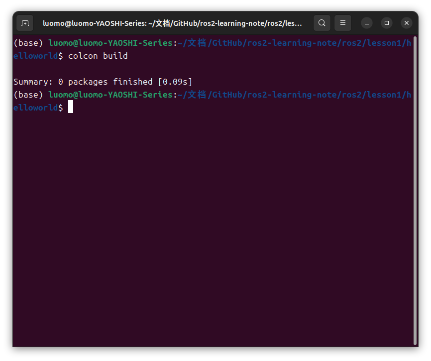
编译完成之后，会在文件夹产生下面四个目录
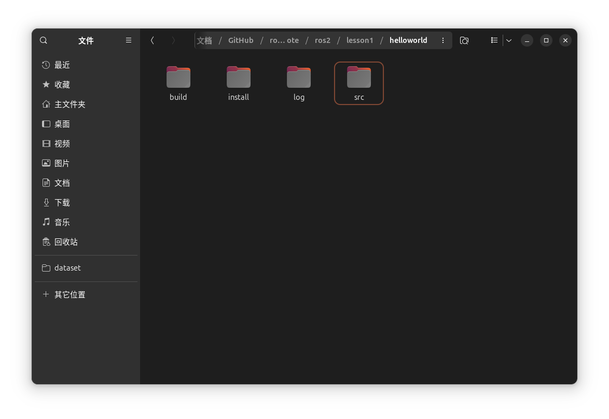

- build:软件构建完成后的所在位置
- install:
- log:日志文件
- src:工作目录(你写的代码还有工具包都在里面)

#### 工作流
在后续的开发过程中，大部分都遵守下面的操作流程
- 创建功能包
- 编辑源文件
- 编辑配置文件
- 编译与运行

#### 创建功能包
首先cd到src目录，输入下面终端命令才创建一个ros2功能包。
``` bash
ros2 pkg create pkg01_helloworld_cpp --build-type ament_cmake --dependencies rclcpp --node-name helloworld
```
接下来讲讲上面命令的意思
- ros2 pkg create：使用ros2来构建功能包
- pkg01_helloworld_cpp：功能包的名字，pkg就是包的类型，cpp就是说这个包基于c++来完成。
- --build-type：构建类型，ros2提供了cpp的cmake和python的构建类型，我的学习过程都是基于cpp完成，所以这里使用ament_cmake来完成。
- --dependencies：依赖，相当于导入ros2的一些库，这里的rclcpp有点类似于cpp的\<iostream>的意味。**rclcpp的意思其实就是ros2client,包含来ros2和c++一些相关的api**
- --node-name:节点名称，在创建的这个新的节点程序名字叫什么

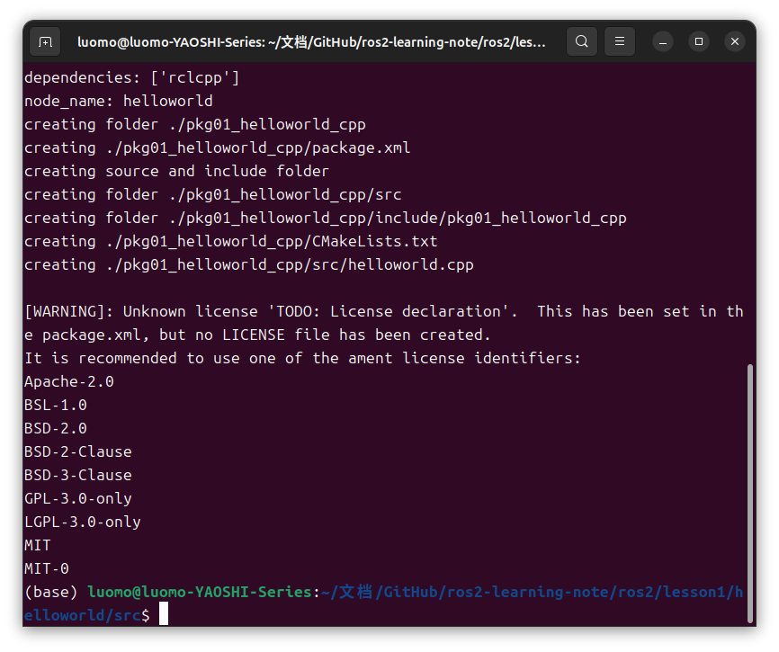
执行完上面的命令之后，就创建好工具包在根目录了，这里终端的警告可以不用管，上面的意思是让你选择对应的开源协议。

之后来到工具包的文件夹，会看到有如下的文件内容
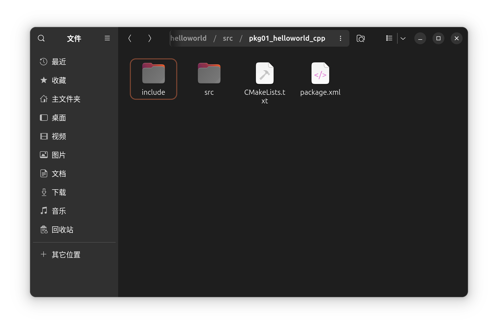
在src目录里面，有我们创建好的helloworld.cpp，就是我们的节点名称接下来看一看主要文件的内容。

#### 源文件
打开**src/helloworld.cpp**文件可以看到里面的内容
``` cpp
#include <cstdio>

int main(int argc, char ** argv)
{
  (void) argc;
  (void) argv;

  printf("hello world pkg01_helloworld_cpp package\n");
  return 0;
}
```
里面包含了最基本的cpp命令，但是并没有接入ros2的系统里面，后面会稍作修改  

#### 配置文件
打开根目录下的package.xml，可以看到里面的文件内容  
``` xml
<?xml version="1.0"?>
<?xml-model href="http://download.ros.org/schema/package_format3.xsd" schematypens="http://www.w3.org/2001/XMLSchema"?>
<package format="3">
  <name>pkg01_helloworld_cpp</name>
  <version>0.0.0</version>
  <description>TODO: Package description</description>
  <maintainer email="55038548+luomojim@users.noreply.github.com">luomo</maintainer>
  <license>TODO: License declaration</license>

  <buildtool_depend>ament_cmake</buildtool_depend>

  <depend>rclcpp</depend>

  <test_depend>ament_lint_auto</test_depend>
  <test_depend>ament_lint_common</test_depend>

  <export>
    <build_type>ament_cmake</build_type>
  </export>
</package>

```
其中最重要的是 ``**\<depend>rclcpp\</depend>**`` 它揭示了这个工具包依赖的外部第三方库。对应的就是上面创建工具包的时候的 ``**--dependencies rclcpp**``。  

#### cmakelist.txt
这个是cmake的清单文件，里面包含了使用cmake的相关参数
``` cmake
cmake_minimum_required(VERSION 3.8)
project(pkg01_helloworld_cpp)

if(CMAKE_COMPILER_IS_GNUCXX OR CMAKE_CXX_COMPILER_ID MATCHES "Clang")
  add_compile_options(-Wall -Wextra -Wpedantic)
endif()

# find dependencies
find_package(ament_cmake REQUIRED)
find_package(rclcpp REQUIRED)

add_executable(helloworld src/helloworld.cpp)
target_include_directories(helloworld PUBLIC
  $<BUILD_INTERFACE:${CMAKE_CURRENT_SOURCE_DIR}/include>
  $<INSTALL_INTERFACE:include/${PROJECT_NAME}>)
target_compile_features(helloworld PUBLIC c_std_99 cxx_std_17)  # Require C99 and C++17
ament_target_dependencies(
  helloworld
  "rclcpp"
)

install(TARGETS helloworld
  DESTINATION lib/${PROJECT_NAME})

if(BUILD_TESTING)
  find_package(ament_lint_auto REQUIRED)
  # the following line skips the linter which checks for copyrights
  # comment the line when a copyright and license is added to all source files
  set(ament_cmake_copyright_FOUND TRUE)
  # the following line skips cpplint (only works in a git repo)
  # comment the line when this package is in a git repo and when
  # a copyright and license is added to all source files
  set(ament_cmake_cpplint_FOUND TRUE)
  ament_lint_auto_find_test_dependencies()
endif()

ament_package()
```
我们着重关注cmakelist的几个部分
``` cmake
# find dependencies
# 查找依赖
find_package(ament_cmake REQUIRED)
find_package(rclcpp REQUIRED)
```
这里也和上面一致，用来查找所需的第三方包。其中ament_cmake是ROS 2的核心构建系统基础设施，为ROS包提供标准化的构建、测试和安装支持；而下面的rclcpp是ROS 2的C++客户端库，提供节点、话题、服务等ROS功能。
``` cmake
add_executable(helloworld src/helloworld.cpp)
```
上面的用意是创建名为helloworld名称的可执行文件，后面是链接的源文件
``` cmake
ament_target_dependencies(helloworld "rclcpp")
```
将找到的包（如rclcpp）的包含路径、库链接等依赖信息应用到目标上。相当于自动处理了target_link_libraries、target_include_directories等操作。
``` cmake
install(TARGETS helloworld DESTINATION lib/${PROJECT_NAME})
```
将可执行文件安装到lib/pkg01_helloworld_cpp目录，就是为可执行文件设置一个安装目录。

#### 编译工具包
首先在终端下输入下面命令安装colcon构建工具
``` bash
sudo apt install python3-colcon-common-extensions
```
然后运行编译指令
``` bash
colcon build
```
编译不一定一帆风顺，譬如我就遇到了如下错误
``` bash
ModuleNotFoundError: No module named 'catkin_pkg'
```
这时候需要补全依赖文件
``` bash
pip install catkin_pkg
```
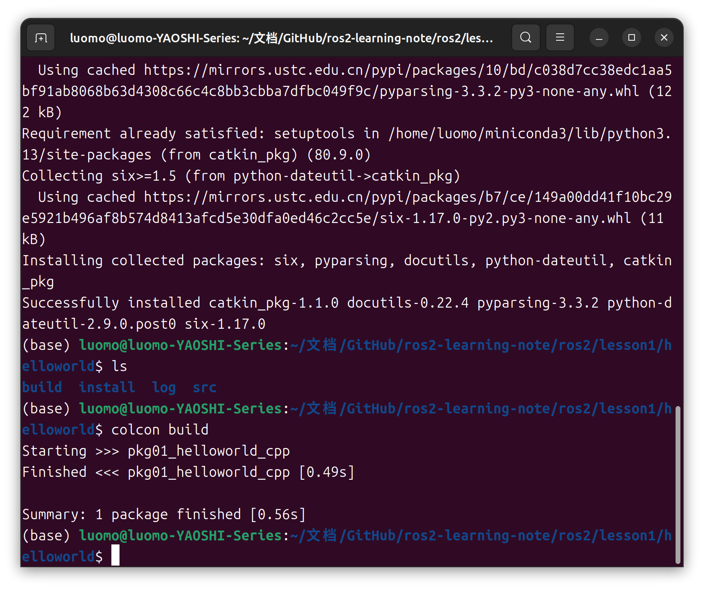
可以看到生成好了文件，回到了工作空间下面，进入到install文件夹，可以看到刚刚编译好的文件，``**helloworld/install/pkg01_helloworld_cpp**``的目录下面又有一个lib目录，里面就可以找到编译的文件helloworld
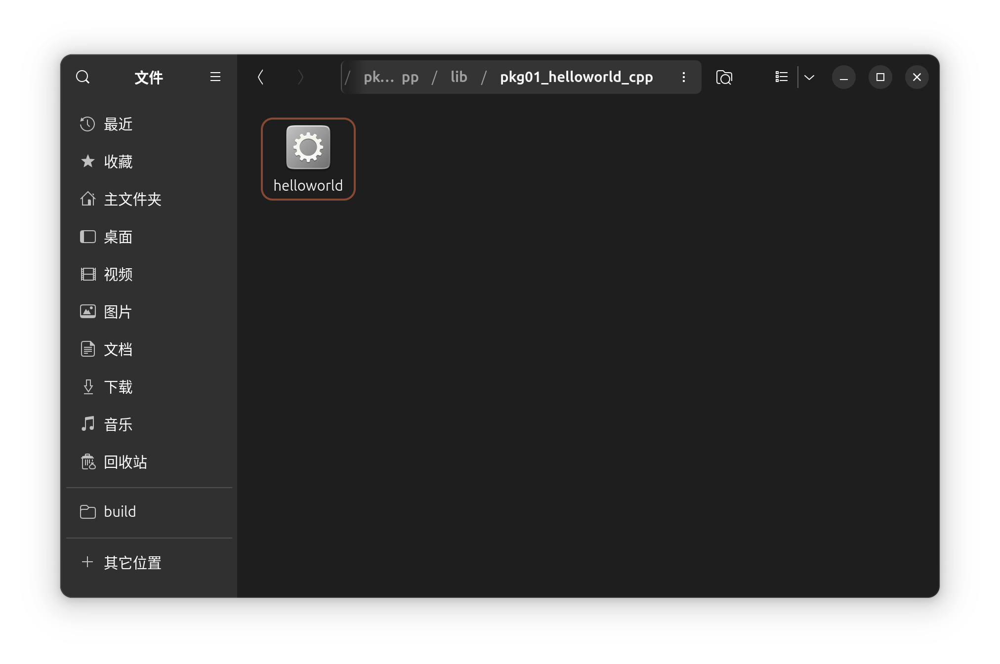

#### 执行工具包
回到工作目录，执行如下指令
``` bash
. install/setup.bash
```
安装之后刷新环境变量
``` bash
source ~/.bashrc
```
之后使用终端命令运行安装好的功能包
``` bash
ros2 run pkg01_helloworld_cpp helloworld
```
上面就是基本的编译运行流程，在构建工具包一定要记得！！！  
**一定要在src目录下创建工具包，工作目录再统一编译工具包！！！**

## 真正使用ros2工具库

#### 前言
前面创建的helloworld只是调用了cpp库自带的库，但是众所不周之，我们可以使用ros2的节点流来进行一站式的管理，接下来我们开始修改代码来实现原生使用ros2的节点功能

#### 编辑源文件
进入到**ros2/lesson1/helloworld/src/pkg01_helloworld_cpp/src/helloworld.cpp**目录，之后打开该cpp文件，修改成如下代码:
``` cpp
#include "rclcpp/rclcpp.hpp"

int main(int argc, char ** argv)
{
  // 初始化 ROS2
  rclcpp::init(argc,argv);
  // 创建节点
  auto node = rclcpp::Node::make_shared("helloworld_node");
  // 输出文本
  RCLCPP_INFO(node->get_logger(),"hello world!");
  // 保持节点
  rclcpp::spin(node);
  // 释放资源
  rclcpp::shutdown();
  return 0;
}
```
下面开始分析代码的含义
```cpp
#include "rclcpp/rclcpp.hpp"
```
包含ROS2 C++客户端库的头文件，这是所有ROS2 C++程序的基础依赖。
##### 1. 初始化ROS2
```cpp
int main(int argc, char ** argv)
{
  rclcpp::init(argc, argv);
```
- `argc` 和 `argv`：命令行参数个数和内容，用于ROS2初始化
- `rclcpp::init()`：**初始化ROS2环境**，必须在任何ROS2功能使用前调用

##### 2. 创建节点
```cpp
auto node = rclcpp::Node::make_shared("helloworld_node");
```
- `make_shared`：C++智能指针，自动管理节点内存生命周期
- `"helloworld_node"`：节点名称，在ROS2网络中必须唯一
- 创建成功后，节点就加入了ROS2通信系统

##### 3. 输出日志信息
```cpp
RCLCPP_INFO(node->get_logger(), "hello world!");
```
- `RCLCPP_INFO`：ROS2的日志宏，输出信息级别日志
- `node->get_logger()`：获取节点的日志记录器
- 这是程序的核心功能，在终端显示"hello world!"

##### 4. 保持运行
```cpp
rclcpp::spin(node);
```
这个函数应该放在`RCLCPP_INFO`之后、`shutdown`之前，它的作用是**保持节点运行并处理事件**。

##### 5. 资源清理
```cpp
rclcpp::shutdown();
return 0;
```
- `rclcpp::shutdown()`：**关闭ROS2**，释放所有资源
- 确保程序退出前清理网络连接和其他资源
#### 代码执行流程
1. **初始化** → 2. **创建节点** → 3. **日志输出** → 4. **资源释放**

上面是一个完整的ROS2节点生命周期，虽然简单但包含了所有必要环节。每个ROS2 C++程序都遵循这个基本模式。

#### 编译运行
当编写完代码后，记得保存，然后回到工作目录，打开终端，重复上面的编译运行流程，看一看新的代码是什么样子的。
``` bash
colcon build #编译刚刚写好的文件

. install/setup.bash #安装编译好的工具包

source ~/.bashrc #刷新环境变量

ros2 run pkg01_helloworld_cpp helloworld #运行ros2包
```
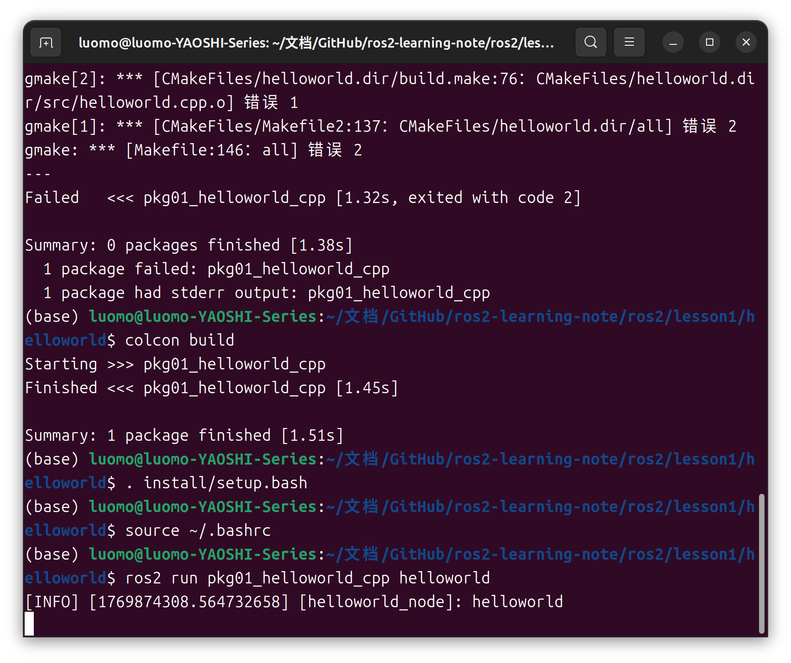
可以看到，现在变成了ros2机器人节点一样的输出，跟之前玩小乌龟的输出是一致的。

#### 配置环境变量
每次进入到终端之后，都要cd到工作目录，每次终端中都需要调用. install/setup.bash指令，使用不便，为此，需要将其添加进 ～/setup.bash里面  
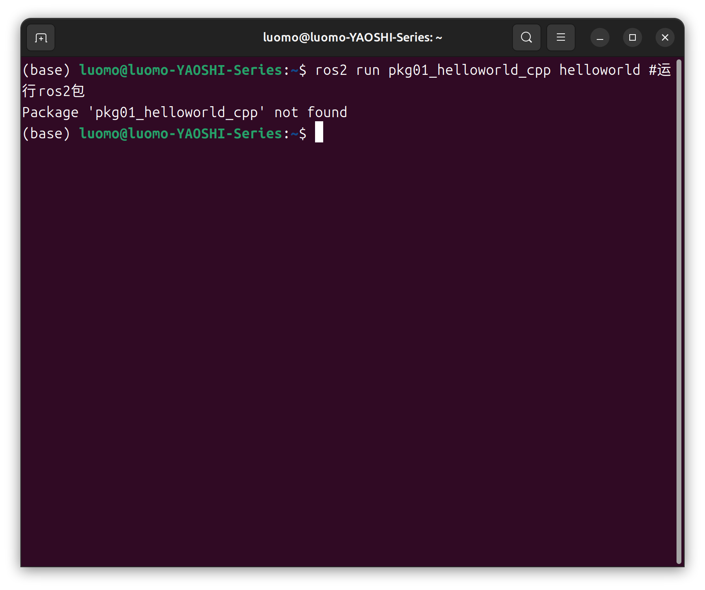
示例用法
``` bash
echo "source /{工作空间路径}/install/setup.bash" >> ~/.bashrc
```
例如把现在的helloworld给添加进取，把路径换成电脑的绝对路径
``` bash
echo "source /home/luomo/文档/GitHub/ros2-learning-note/ros2/lesson1/helloworld/install/setup.bash" >> ~/.bashrc
```
这时候再运行就是一切正常，不再需要手动刷新环境变量
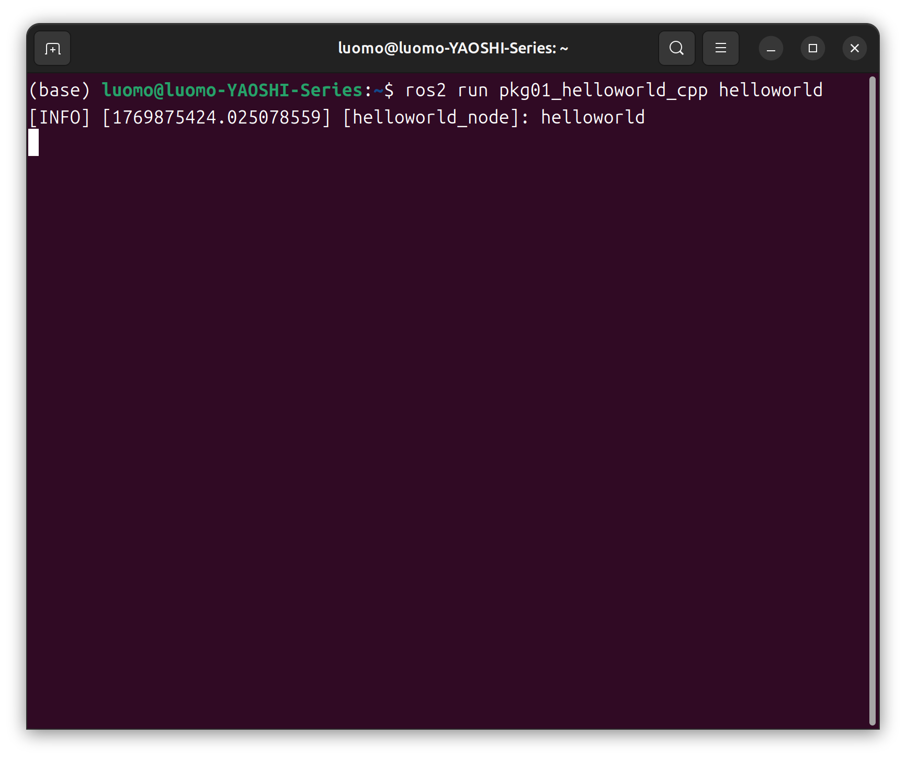
同样，如果我不再需要添加，则只需要进入主文件目录的bashrc文件里面删除该行即可
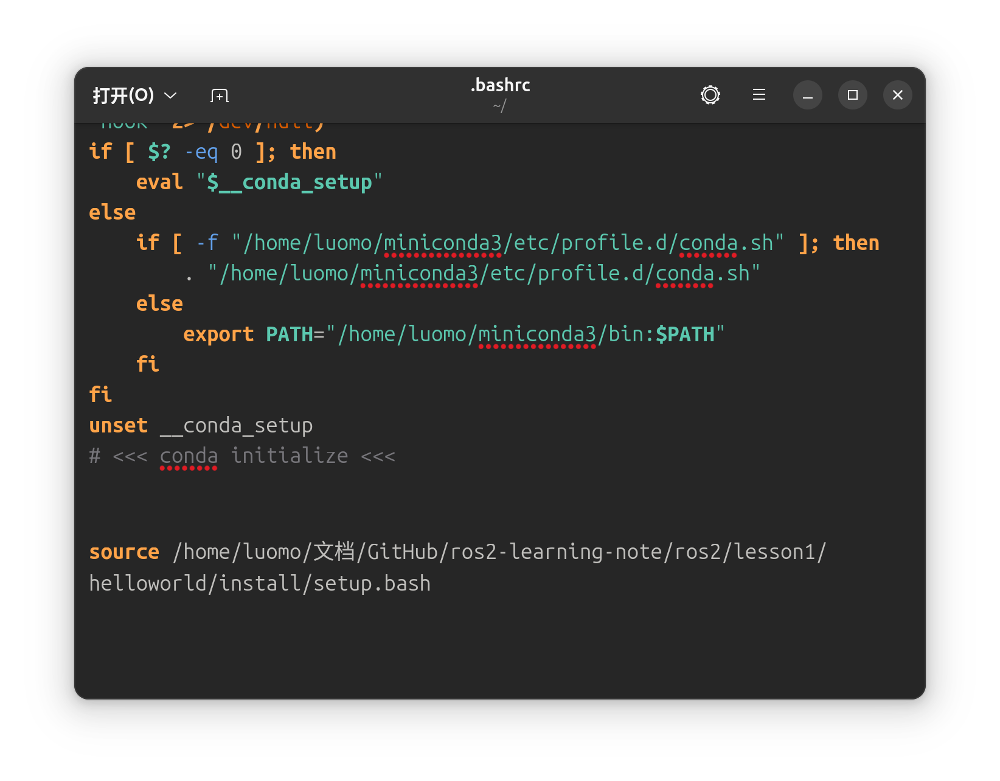

## 安装vscode
太弱鸡了！如果你用记事本写，那就很痛苦了，下面将配置vscode。  

#### 插件安装
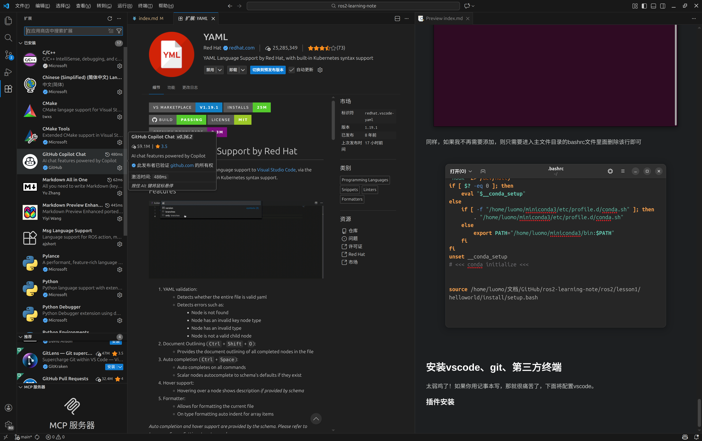
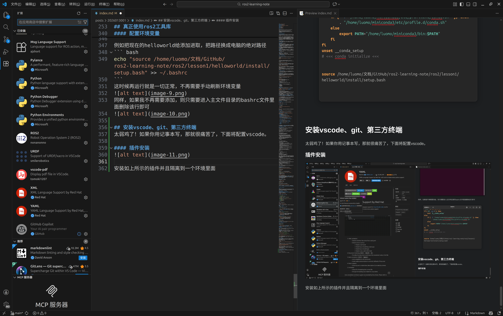
安装如上所示的插件并且隔离到一个环境里面,防止环境冲突打架。  

#### 解决"includepath"的问题
在cpp的文件里面，会检测不到头文件，我们需要帮vscode找到头文件的位置，后续新的工程都要设置path。
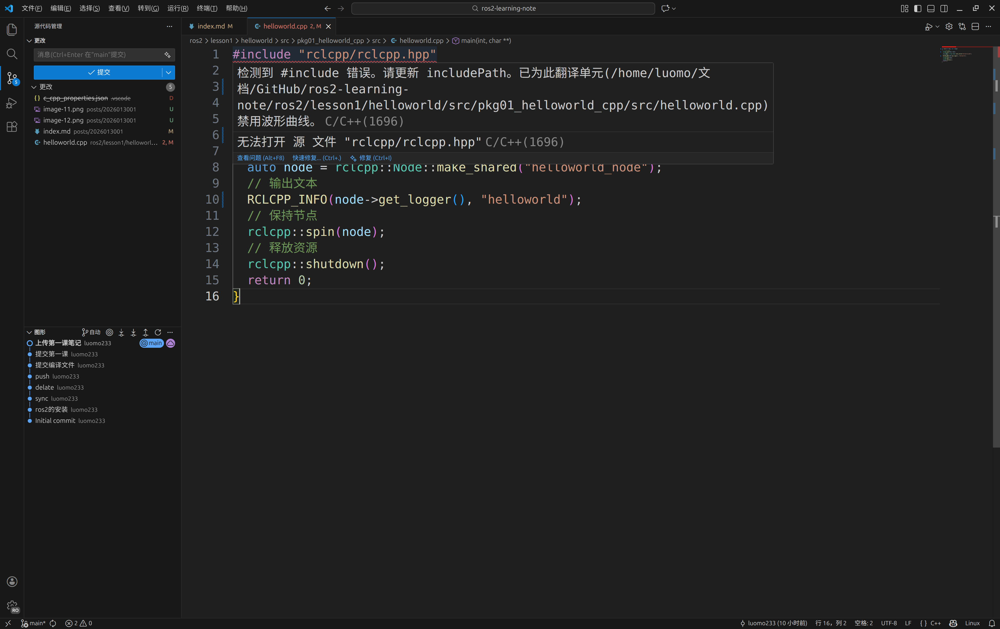
点击快速修复->编辑includepath->进入到c/c++配置界面，找到包含路径
**ros2规定，所有官方的头文件都包含在/opt/ros/jazzy/include，其中jazzy就是ros2安装的版本号，我的是ubuntu24.04,就安装了jazzy包。**  
我们添加为下面的路径,``/**``的作用是可以递归搜索整个目录下的全部文件
``` bash
/opt/ros/jazzy/include/**
```
回到刚刚的cpp源文件，我们现在可以正常使用补全了
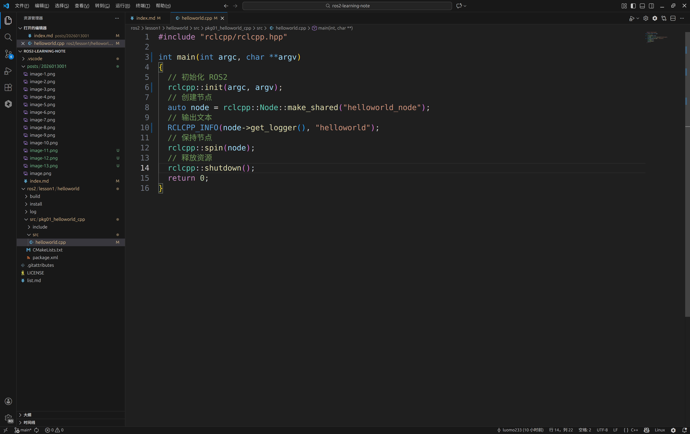

## 使用vscode从部署工具包到开发的简单流程

#### 打开工作空间
在vscode里面按下``ctrl + ~``打开终端，而终端的位置就是我们的工作空间，之后一路cd到第一个src目录下，即``ros2/lesson1/helloworld/src``目录下面，新建一个ros2工具包
``` bash
ros2 pkg create pkg02_hellovscode_cpp --dependencies rclcpp --node-name hellovsc
```

#### 编写一份代码
之后按照自己的想法写一个ros2cpp吧，熟悉一下ros2的流程
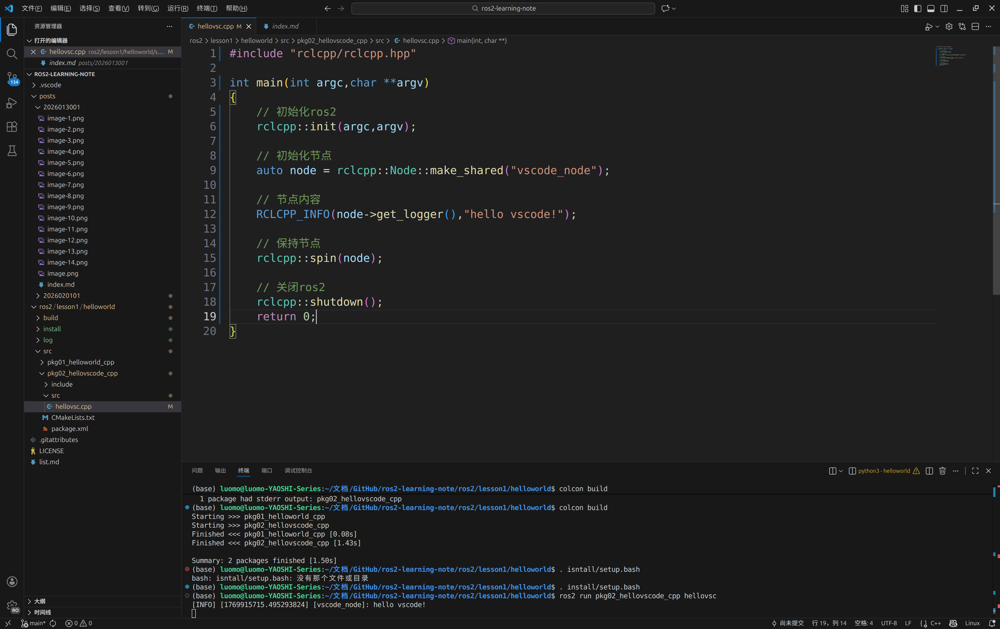

#### 选择性编译工具包
使用``colcon build``会一次性编译全部的工具包，有时候会耗费大量时间，为此我们可以选择编译一部分文件。其中下面的``pkg02_hellovscode_cpp``就是我们要新增的包
``` bash
colcon build --packages-select pkg02_hellovscode_cpp
```

#### ros2运行一个工具包里面的其他cpp
回到pkg02的src文件夹里面，创建一个新的cpp文件``son_node.cpp``，之后我们要来到cmakelist.txt当中，增加对应的三个配置，其中``add_executable``里面添加的名称``sonnode``一定要对应下面的两个参数``ament_target_dependencies(
  sonnode``以及``install(TARGETS sonnode``
``` cmake
add_executable(sonnode src/son_node.cpp)

ament_target_dependencies(
  sonnode
  "rclcpp"
)

install(TARGETS sonnode
  DESTINATION lib/${PROJECT_NAME})
```
其中``son_node.cpp``可以根据自己喜好修改一些内容来区分，接着重新执行上面的编译流程，**在运行的时候，要切换到另一个cpp文件来运行**,ros2运行的名称就是可执行文件``add_executable``里面的名称。
``` bash
colcon build --packages-select pkg02_hellovscode_cpp

. install/setup.bash

ros2 run pkg02_hellovscode_cpp sonnode
```

## 安装第三方终端
有时候虽然可以在终端开多个窗口，但是很多窗口同屏的时候会感到乏力，经常点来点去，非常的麻烦，接下来介绍一个第三方终端**terminator**，输入下面的命令即可安装。  
``` bash
sudo apt update
sudo apt install terminator
```
安装完成之后，按下``Ctrl+Alt+T``即可启动，下面是一些常用的快捷键
```
水平分屏：Ctrl+Shift+O
垂直分屏：Ctrl+Shift+E
关闭当前终端：Ctrl+Shift+W
新建终端标签页：Ctrl+Shift+T
切换标签页：Ctrl+Page_Up / Ctrl+Page_Down
全屏模式：F11
复制：Ctrl+Shift+C
粘贴：Ctrl+Shift+V
```

## 安装git
无需多言，强劲的版本控制系统
``` bash
sudo apt install git
```

## ros2的体系框架

#### ros2的文件系统
功能包是ros2里面重要的核心，功能包依赖于当前的工作空间，目录结构如下
``` tree
WorkSpace --- 自定义的工作空间。
    |--- build：存储中间文件的目录，该目录下会为每一个功能包创建一个单独子目录。
    |--- install：安装目录，该目录下会为每一个功能包创建一个单独子目录。
    |--- log：日志目录，用于存储日志文件。
    |--- src：用于存储功能包源码的目录。
        |-- C++功能包
            |-- package.xml：包信息，比如:包名、版本、作者、依赖项。
            |-- CMakeLists.txt：配置编译规则，比如源文件、依赖项、目标文件。
            |-- src：C++源文件目录。
            |-- include：头文件目录。
            |-- msg：消息接口文件目录。
            |-- srv：服务接口文件目录。
            |-- action：动作接口文件目录。
        |-- Python功能包
            |-- package.xml：包信息，比如:包名、版本、作者、依赖项。
            |-- setup.py：与C++功能包的CMakeLists.txt类似。
            |-- setup.cfg：功能包基本配置文件。
            |-- resource：资源目录。
            |-- test：存储测试相关文件。
            |-- 功能包同名目录：Python源文件目录。

|-- C++或Python功能包
    |-- launch：存储launch文件。
    |-- rviz：存储rviz2配置相关文件。
    |-- urdf：存储机器人建模文件。
    |-- params：存储参数文件。
    |-- world：存储仿真环境相关文件。
    |-- map：存储导航所需地图文件。
    |-- ......
```

#### 源文件规范
在ros2中，推荐使用继承对象的方式来进行节点的管理
``` cpp
#include "rclcpp/rclcpp.hpp"

class MyNode: public rclcpp::Node{
public:
    MyNode():Node("node_name"){
        RCLCPP_INFO(this->get_logger(),"hello world!");
    }

};

int main(int argc, char *argv[])
{
    rclcpp::init(argc,argv);
    auto node = std::make_shared<MyNode>();
    rclcpp::shutdown();
    return 0;
}
```
可以按照上面类和对象的编程思想来写一份新的cpp，同时编译运行来查看情况。可以看到他们的作用是等价的。

#### 数据的传递
构建的程序一般由若干个步骤组成，不同的步骤涉及到数据的传递，这时候使用到一个**Context**上下文对象进行传递，类似一个容器，可以进行读写。  
ros2初始化其实相当于创建一个Context对象，资源释放就是销毁Context对象。

#### 配置文件
在ros2的工具包里面，需要编辑package.xml来实现一些信息的编辑。下面的xml文件包含了包名、版本、作者、描述、依赖项等信息，**还可以为colcon编译工具确定功能包的编译顺序**
``` xml
<?xml version="1.0"?>
<?xml-model href="http://download.ros.org/schema/package_format3.xsd" schematypens="http://www.w3.org/2001/XMLSchema"?>
<package format="3">
  <name>pkg02_hellovscode_cpp</name>
  <version>0.0.0</version>
  <description>TODO: Package description</description>
  <maintainer email="55038548+luomojim@users.noreply.github.com">luomo</maintainer>
  <license>TODO: License declaration</license>

  <buildtool_depend>ament_cmake</buildtool_depend>

  <depend>rclcpp</depend>

  <test_depend>ament_lint_auto</test_depend>
  <test_depend>ament_lint_common</test_depend>

  <export>
    <build_type>ament_cmake</build_type>
  </export>
</package>
```

##### 1.根标签

- <package>：该标签为整个xml文件的根标签，format属性用来声明文件的格式版本。
##### 2.元信息标签

- <name>：包名；
- <version>：包的版本号；
- <description>：包的描述信息；
- <maintainer>：维护者信息；
- <license>：软件协议；
- <url>：包的介绍网址；
- <author>：包的作者信息。
##### 3.依赖项
- <buildtool_depend>：声明编译工具依赖；
- <build_depend>：声明编译依赖；
- <build_export_depend>：声明根据此包构建库所需依赖；
- <exec_depend>：声明执行时依赖；
- <depend>：相当于<build_depend>、<build_export_depend>、<exec_depend>三者的集成；
- <test_depend>：声明测试依赖；
- <doc_depend>：声明构建文档依赖。

#### 操作命令
ros2的核心是工具包，可以通过一些指令来实现功能包的创建、编译、执行、查找等等。
#### 1.创建功能包
新建功能包语法如下:
```bash
ros2 pkg create 包名 --build-type 构建类型 --dependencies 依赖列表 --node-name 可执行程序名称
```
格式解释:
- `--build-type`:是指功能包的构建类型,有cmake、ament_cmake、ament_python三种类型可选
- `--dependencies`:所依赖的功能包列表
- `--node-name`:可执行程序的名称,会自动生成对应的源文件并生成配置文件
#### 2.编译功能包
编译功能包语法如下:
```bash
colcon build
```
或
```bash
colcon build --packages-select 功能包列表
```
前者会构建工作空间下的所有功能包,后者可以构建指定功能包。

#### 3.查找功能包
在ros2 pkg命令下包含了多个查询功能包相关信息的参数。
```bash
ros2 pkg executables [包名] # 输出所有功能包或指定功能包下的可执行程序
ros2 pkg list # 列出所有功能包
ros2 pkg prefix 包名 # 列出功能包路径
ros2 pkg xml # 输出功能包的package.xml内容
```

#### 4.执行功能包
执行命令语法如下:
```bash
ros2 run 功能包 可执行程序 参数
```

## ros2的核心模块

#### 通信模块
通信模块负责管理各种传感器(雷达，摄像头，imu,gps等等传感器数据)，同时系统向机器人下达一些命令，比如控制机器人运动，控制机器人的摄像头拍照等等，这些都涉及到通信模块的使用。

#### 功能包的应用
在ros2中，官方或社区提供了相当丰富的功能包，其中都可以通过二进制方式安装，分为下面几种安装方法。
**使用官方或者社区的二进制文件安装**
``` bash
sudo apt search ros-foxy-<package_name> # 查找指定功能包

sudo apt search ros-foxy | grep -i <package_name> # 查找包含名称的功能包

sudo apt install ros-foxy-<package_name> # 安装指定功能包
```
**使用git下载源码进行安装**
``` bash
git clone xxx # 下载功能包源码
```

