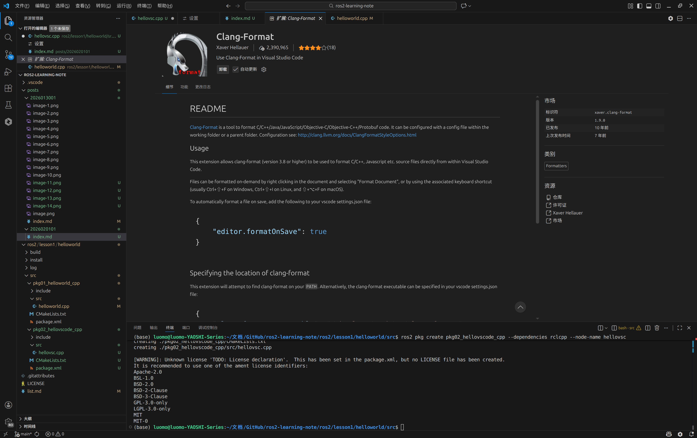

## vscode中设置自己喜欢的代码样式
在vscode中，我们可以通过设置来调整代码的缩进样式，从而提高代码的可读性。以下是具体步骤：

#### 下载格式化插件
这里选用的是clang-format插件，在插件市场中搜索clang-format，然后安装即可。


#### 设置vscode
按下``ctrl + ,``进入设置，搜索format设置，把  
Format On Paste：粘贴代码自动格式化  
Format On Save：保存时格式化  
Editor.DefaultFormatter：选择clang-format插件

#### 设置.clang-format文件
在项目根目录下新建一个.clang-format文件，然后把下面的内容复制进去，保存即可。
```
BasedOnStyle: LLVM
 
# 强制花括号遵循 Allman 风格
BreakBeforeBraces: Allman
 
# 对齐连续的宏定义
AlignConsecutiveMacros: AcrossEmptyLinesAndComments
 
# 控制行宽，避免行太长
ColumnLimit: 120
 
# 控制空格和标点符号风格
SpaceBeforeParens: ControlStatements  # 控制语句的括号前有空格
SpaceBeforeAssignmentOperators: true  # 赋值操作符前插入空格
 
# 缩进设置
IndentWidth: 4  # 使用4个空格缩进
 
# 控制每行最大空行数（避免空行过多）
MaxEmptyLinesToKeep: 1
 
# 启用注释对齐，注释前保留一个空格
AlignTrailingComments: true  
SpacesBeforeTrailingComments: 1  
 
# 对齐转义的换行符到左侧
AlignEscapedNewlinesLeft: true
 
# 允许将参数换行，但保持多个参数在同一行（打包参数）
AllowAllParametersOfDeclarationOnNextLine: true
BinPackParameters: true  # 启用参数打包，减少换行次数
```
