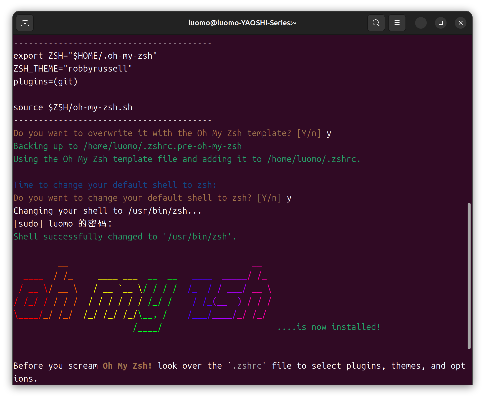
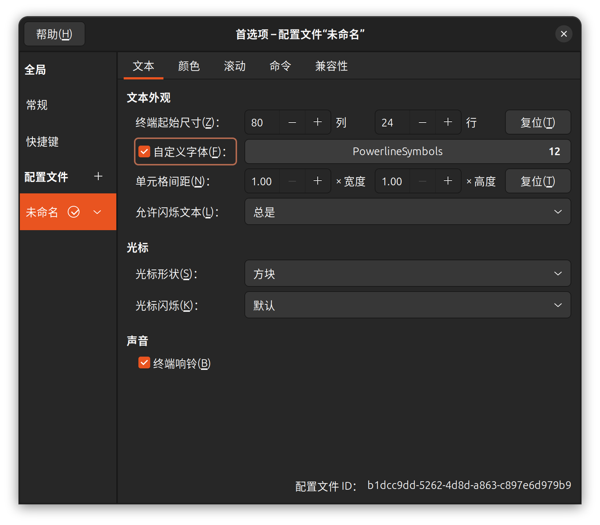
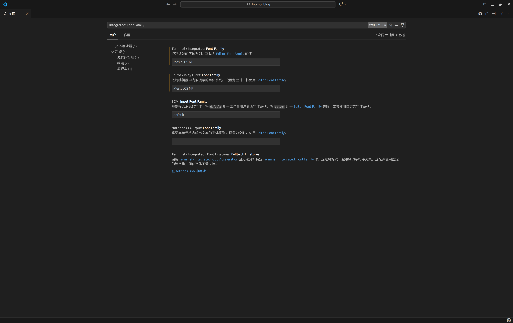
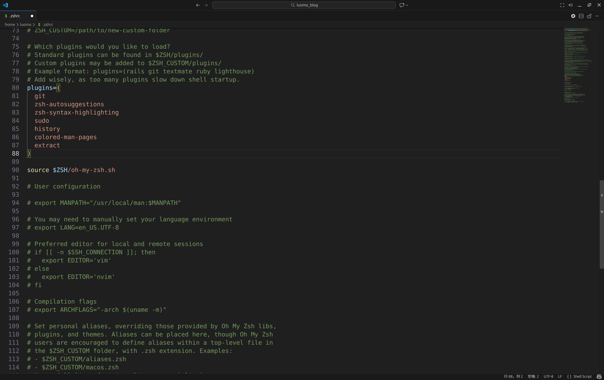
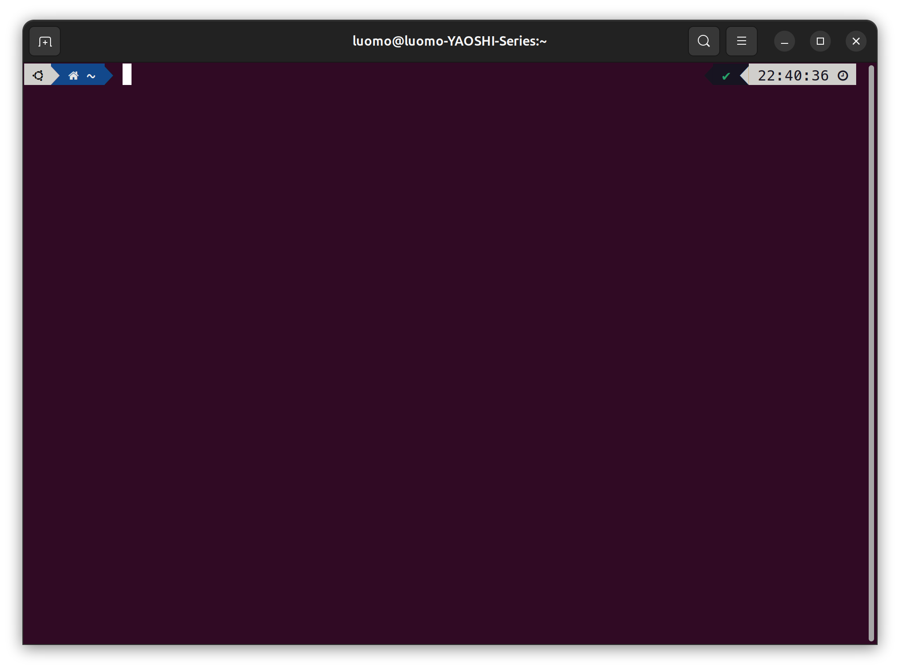
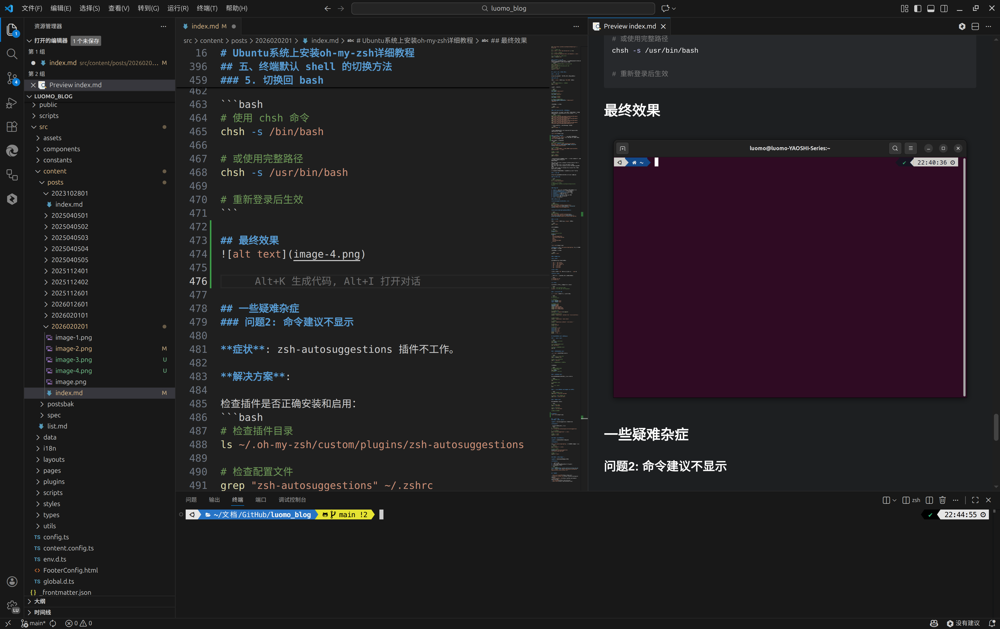

# Ubuntu系统上安装oh-my-zsh详细教程

oh-my-zsh 是一个功能强大的 zsh shell 配置框架，提供了丰富的主题、插件和配置选项，可以极大地提升终端的使用体验。本文将详细介绍在 Ubuntu 系统上安装和配置 oh-my-zsh 的完整步骤。

## 一、必要的依赖安装步骤

首先，我们需要安装必要的依赖工具。打开终端，执行以下命令：

### 1. 更新系统软件包

```bash
sudo apt update
sudo apt upgrade -y
```

### 2. 安装必要的工具

```bash
# 安装 git（oh-my-zsh 需要）
sudo apt install git -y

# 安装 curl（推荐使用）
sudo apt install curl -y

# 安装构建工具（某些插件可能需要）
sudo apt install build-essential -y

# 安装字体支持（可选，用于更好的主题显示）
sudo apt install fonts-powerline -y
```

### 3. 验证安装

```bash
# 检查 git 版本
git --version

# 检查 curl 版本
curl --version
```

## 二、zsh 的安装与设置

### 1. 安装 zsh

先检查zsh是否安装并安装最新版本：

```bash
# 检查是否已安装 zsh
zsh --version

# 如果未安装或需要升级，执行以下命令
sudo apt install zsh -y

# 验证安装
zsh --version
```

### 2. 创建 zsh 配置文件

在首次启动 zsh 之前，创建基本的配置文件：

```bash
# 如果不存在 .zshrc 文件，则创建一个
if [ ! -f ~/.zshrc ]; then
    touch ~/.zshrc
fi
```

### 3. 测试 zsh

```bash
# 临时切换到 zsh 进行测试
zsh
```

首次启动 zsh 时，会显示配置向导。可以选择 `0` 创建默认配置文件，或选择其他选项进行个性化配置。

输入 `exit` 可以退出 zsh 返回 bash。

## 三、oh-my-zsh 的官方安装方法

oh-my-zsh 提供了多种安装方式，推荐使用官方提供的安装脚本。

### 方法一：使用 curl 安装（推荐）

```bash
# 使用 curl 安装
sh -c "$(curl -fsSL https://raw.github.com/ohmyzsh/ohmyzsh/master/tools/install.sh)"
```

### 方法二：使用 wget 安装

```bash
# 使用 wget 安装
sh -c "$(wget https://raw.github.com/ohmyzsh/ohmyzsh/master/tools/install.sh -O -)"
```

### 安装过程说明

执行安装命令后，脚本会：

1. 检查系统环境
2. 备份现有的 `.zshrc` 文件（如果存在）
3. 克隆 oh-my-zsh 仓库到 `~/.oh-my-zsh`
4. 创建新的 `.zshrc` 配置文件
5. 尝试将默认 shell 切换为 zsh（需要输入密码）

安装成功后，会看到类似以下的欢迎信息：


### 手动安装（如果自动安装失败）
如果自动脚本安装失败，可以手动安装：

```bash
# 1. 克隆仓库
git clone https://github.com/ohmyzsh/ohmyzsh.git ~/.oh-my-zsh

# 2. 备份现有配置
cp ~/.zshrc ~/.zshrc.bak 2>/dev/null || true

# 3. 复制模板配置文件
cp ~/.oh-my-zsh/templates/zshrc.zsh-template ~/.zshrc

# 4. 手动设置 zsh 为默认 shell
chsh -s $(which zsh)
```

### 从.bashrc中迁移配置
如果之前在使用bash时自定义了一些环境变量、别名等，那么在切换到zsh后，你需要手动迁移这些自定义配置。
``` bash
# 查看bash配置文件，并手动复制自定义配置
cat ~/.bashrc
# 编辑zsh配置文件，并粘贴自定义配置
nano ~/.zshrc
# 启动新的zsh配置
source ~/.zshrc
```

## 四、常见主题和插件的配置建议

### 1. 主题配置

oh-my-zsh 提供了超过 300 种主题，配置方法如下：

#### 修改主题

编辑 `~/.zshrc` 文件，找到 `ZSH_THEME` 变量：

```bash
# 使用任何文本编辑器打开配置文件
nano ~/.zshrc
```

找到这一行并修改：

```bash
# 默认主题
ZSH_THEME="robbyrussell"

# 修改为其他主题
ZSH_THEME="agnoster"

# 或者使用 random
ZSH_THEME="random"

# 设置随机主题的黑名单
ZSH_THEME_RANDOM_CANDIDATES=( "robbyrussell" "agnoster" )
```

保存后重新加载配置：

```bash
source ~/.zshrc
```

#### 安装 Powerlevel10k 主题（推荐）

Powerlevel10k 是目前最流行的主题之一，功能强大且性能优秀  
首先安装以下第三方字体，以便在主题中显示更多图标：
``` bash
# 下载安装所需字体
wget https://github.com/romkatv/powerlevel10k-media/raw/master/MesloLGS%20NF%20Regular.ttf
wget https://github.com/romkatv/powerlevel10k-media/raw/master/MesloLGS%20NF%20Bold.ttf
wget https://github.com/romkatv/powerlevel10k-media/raw/master/MesloLGS%20NF%20Italic.ttf
wget https://github.com/romkatv/powerlevel10k-media/raw/master/MesloLGS%20NF%20Bold%20Italic.ttf
```
双击下载好的字体进行安装,之后刷新一下缓存  
``` bash
sudo fc-cache -fv
```

在终端配置文件首选项中选择 “MesloLGS NF Regular”或者“MesloLGS NF” 字体。



#### 在vscode中配置字体
在vscode中，按下 ``ctrl + ,``进入设置，搜索终端文本``Integrated: Font Family``，在参数设置中改为如下配置：


之后在终端进行字体的安装
```bash
# 克隆 Powerlevel10k 仓库
git clone --depth=1 https://github.com/romkatv/powerlevel10k.git ${ZSH_CUSTOM:-$HOME/.oh-my-zsh/custom}/themes/powerlevel10k

# 修改配置文件
sed -i 's/^ZSH_THEME=".*"/ZSH_THEME="powerlevel10k\/powerlevel10k"/' ~/.zshrc

# 重新加载配置
source ~/.zshrc

# 运行配置向导
p10k configure
```

为了确认字体安装是否成功，在正式开始配置前，要先回答几个问题才能进入到主题的自定义向导。
问题有诸如：
```
Does this look like a diamond (rotated square)? 这是看起来菱形吗？
Does this look like a lock? 这看起来是锁吗？
Does this look like an upwards arrow? 这看起来是向上箭头吗？
Do all these icons fit between the crosses? 这些图表有没有在十字线之间？
```
按实际情况回答问题即可。一般情况下，都是选择 "Yes"。

### 2. 插件配置

oh-my-zsh 提供了大量插件，可以增强 shell 的功能。

#### 查看可用插件

```bash
# 列出所有内置插件
ls ~/.oh-my-zsh/plugins/

# 或者在线浏览插件库
# 访问：https://github.com/ohmyzsh/ohmyzsh/wiki/Plugins
```

#### 推荐插件

1. **git** - 提供 git 相关的别名和功能（默认启用）
2. **zsh-autosuggestions** - 命令自动补全建议
3. **zsh-syntax-highlighting** - 语法高亮
4. **sudo** - 双击 ESC 自动在命令前加 sudo
5. **history** - 历史命令增强
6. **colored-man-pages** - 彩色 man 页面
7. **extract** - 统一的解压命令
8. **z** - 智能目录跳转

#### 安装常用插件

**zsh-autosuggestions（命令建议）**

```bash
# 克隆插件仓库
git clone https://github.com/zsh-users/zsh-autosuggestions ${ZSH_CUSTOM:-~/.oh-my-zsh/custom}/plugins/zsh-autosuggestions
```

**zsh-syntax-highlighting（语法高亮）**

```bash
# 克隆插件仓库
git clone https://github.com/zsh-users/zsh-syntax-highlighting.git ${ZSH_CUSTOM:-~/.oh-my-zsh/custom}/plugins/zsh-syntax-highlighting
```

#### 启用插件

编辑 `~/.zshrc` 文件，找到 `plugins` 变量：

```bash
nano ~/.zshrc
```

修改插件列表：

```bash
# 原始配置
plugins=(git)

# 修改为包含常用插件
plugins=(
  git
  zsh-autosuggestions
  zsh-syntax-highlighting
  sudo
  history
  colored-man-pages
  extract
)
```



**重要提示**: 确保 `zsh-syntax-highlighting` 必须是插件列表中的最后一个插件。

保存并重新加载配置：

```bash
source ~/.zshrc
```

#### 插件功能说明

**git 插件**

提供了丰富的 git 别名，例如：

- `gst` - `git status`
- `gco` - `git checkout`
- `gcm` - `git commit -m`
- `gp` - `git push`
- `gl` - `git pull`
- `gd` - `git diff`

**sudo 插件**

在命令行按两次 `ESC` 键，自动在命令前添加 `sudo`。

**extract 插件**

使用统一的 `x` 命令解压任何格式的压缩文件：

```bash
x filename.tar.gz
x filename.zip
```

**z 插件**

智能目录跳转，根据使用频率自动建议目录：

```bash
# 访问过 /var/log/nginx 之后
z nginx  # 自动跳转到 /var/log/nginx
```

### 3. 其他自定义配置

在 `~/.zshrc` 文件末尾添加自定义配置：

```bash
# 用户配置
# =============

# 设置编辑器
export EDITOR='nano'
export VISUAL='nano'

# 历史记录配置
HISTSIZE=10000
SAVEHIST=10000
setopt SHARE_HISTORY
setopt HIST_IGNORE_DUPS
setopt HIST_IGNORE_SPACE

# 自动补全配置
autoload -Uz compinit && compinit

# 补全时不区分大小写
zstyle ':completion:*' matcher-list 'm:{a-z}={A-Za-z}'

# 补全菜单选择
zstyle ':completion:*' menu select

# 彩色补全
zstyle ':completion:*:default' list-colors ''

# 目录导航
setopt AUTO_CD

# 别名配置
alias ll='ls -alF'
alias la='ls -A'
alias l='ls -CF'
alias cls='clear'
alias ..='cd ..'
alias ...='cd ../..'
```

## 五、终端默认 shell 的切换方法

### 1. 检查当前 shell

```bash
# 查看当前使用的 shell
echo $SHELL

# 查看系统已安装的 shell
cat /etc/shells

# 查看当前用户的默认 shell
echo $0
```

### 2. 永久切换默认 shell

使用 `chsh` 命令更改默认 shell：

```bash
# 方法一：使用 chsh 命令
chsh -s $(which zsh)

# 方法二：使用完整路径
chsh -s /bin/zsh

# 执行后需要输入当前用户密码
```

验证切换：

```bash
# 重新登录或重启终端
# 检查默认 shell
echo $SHELL
# 应该输出: /bin/zsh
```

### 3. 临时切换 shell

如果不想永久切换，可以临时使用其他 shell：

```bash
# 临时切换到 zsh
zsh

# 临时切换回 bash
bash

# 退出当前 shell
exit
```

### 4. 为其他用户切换 shell（需要 root 权限）

```bash
# 为指定用户切换 shell
sudo chsh -s /bin/zsh username

# 示例：为 user1 切换到 zsh
sudo chsh -s /bin/zsh user1
```

### 5. 切换回 bash

如果需要切换回 bash：

```bash
# 使用 chsh 命令
chsh -s /bin/bash

# 或使用完整路径
chsh -s /usr/bin/bash

# 重新登录后生效
```

## 最终效果

<center>系统自带终端</center>


<center>vscode终端</center>

## 一些疑难杂症
### 问题2: 命令建议不显示

**症状**: zsh-autosuggestions 插件不工作。

**解决方案**:

检查插件是否正确安装和启用：
```bash
# 检查插件目录
ls ~/.oh-my-zsh/custom/plugins/zsh-autosuggestions

# 检查配置文件
grep "zsh-autosuggestions" ~/.zshrc

# 重新加载配置
source ~/.zshrc
```

### 问题3: 语法高亮不工作

**症状**: 命令输入时没有颜色提示。

**解决方案**:

确保 `zsh-syntax-highlighting` 是插件列表中的最后一个：
```bash
# 检查配置
grep "plugins=" ~/.zshrc

# 确保格式正确
plugins=(git zsh-autosuggestions zsh-syntax-highlighting)

# 重新加载
source ~/.zshrc
```

### 问题4: 安装脚本无法执行

**症状**: 安装命令报错或无法连接。

**解决方案**:

1. 检查网络连接
2. 尝试使用不同的安装方法（curl 或 wget）
3. 使用代理或镜像源：
```bash
# 使用镜像源
export REMOTE=https://gitee.com/mirrors/oh-my-zsh.git
sh -c "$(curl -fsSL https://raw.github.com/ohmyzsh/ohmyzsh/master/tools/install.sh)"
```

## 参考资源

- [oh-my-zsh 官方网站](https://ohmyz.sh/)
- [oh-my-zsh GitHub 仓库](https://github.com/ohmyzsh/ohmyzsh)
- [Powerlevel10k 主题](https://github.com/romkatv/powerlevel10k)
- [zsh 官方文档](https://www.zsh.org/)
- [Nerd Fonts](https://www.nerdfonts.com/)
