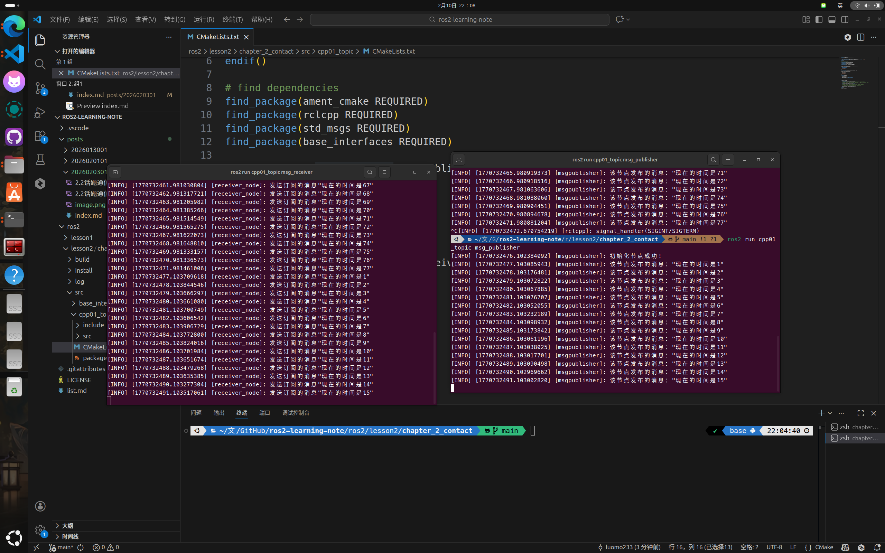
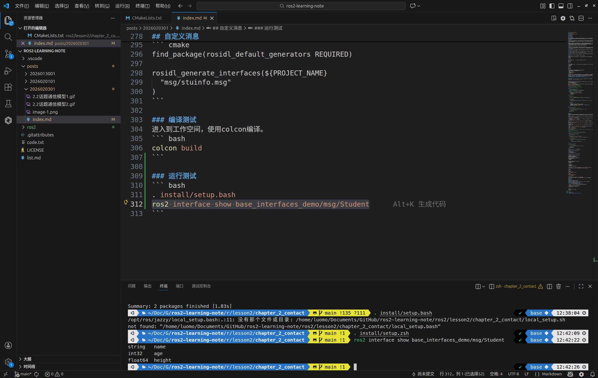
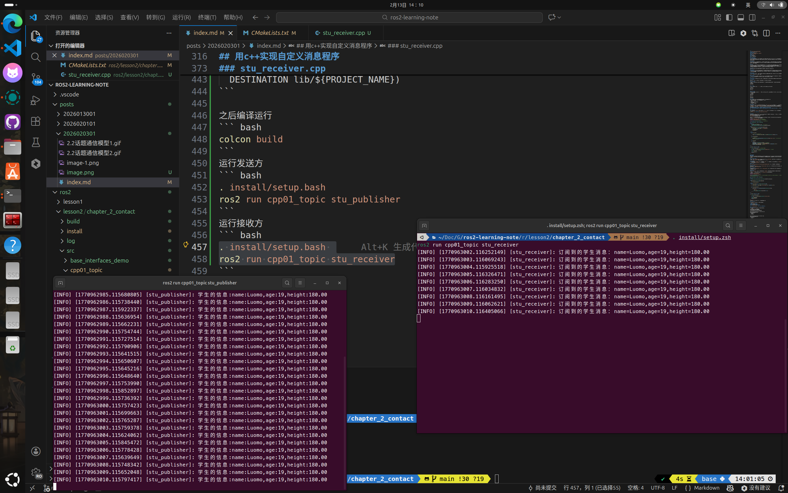
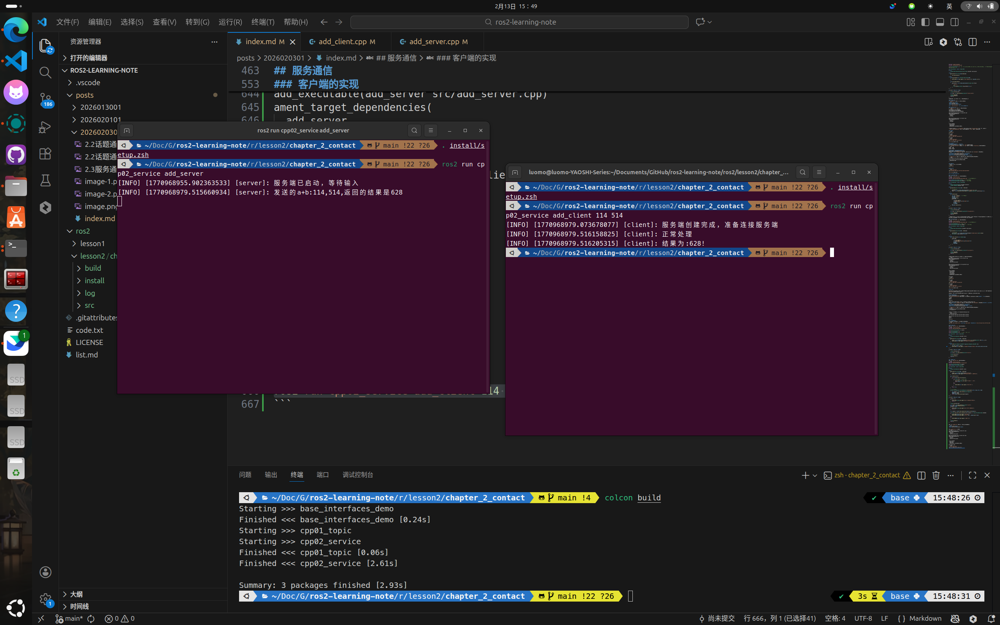
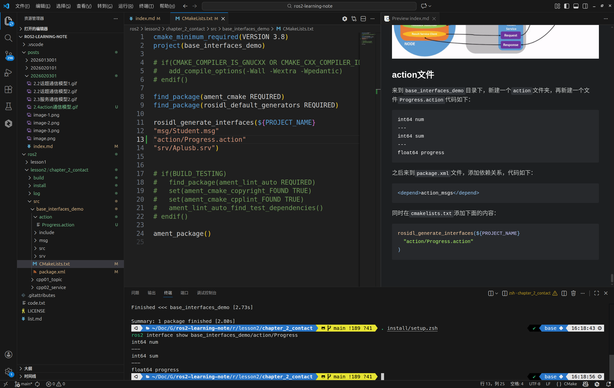
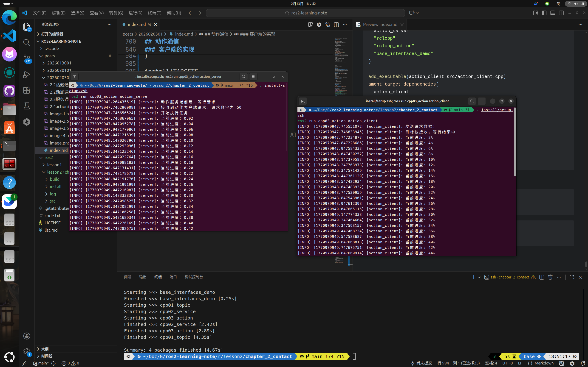
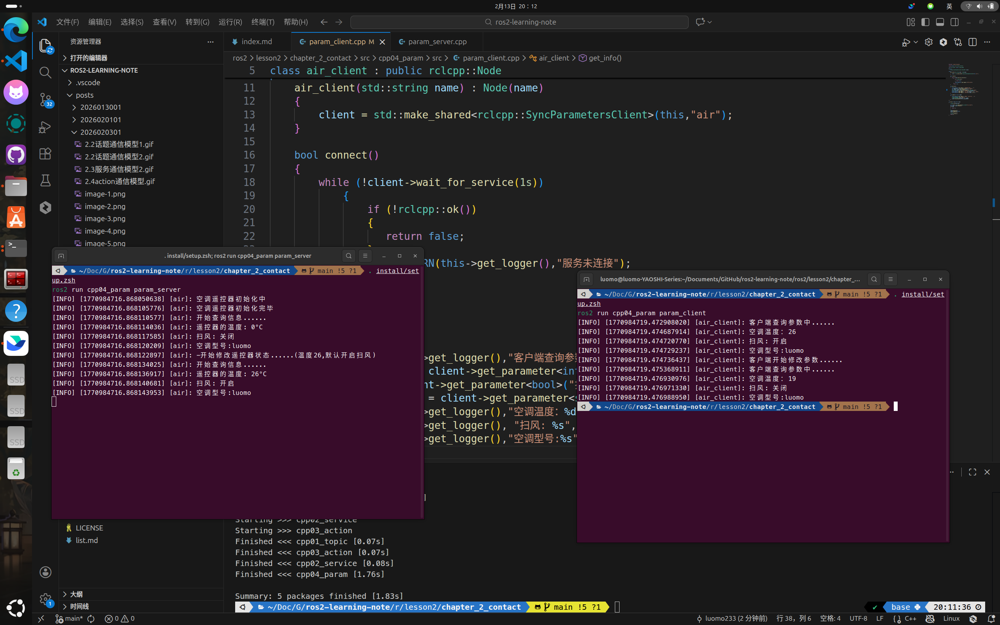

## ros2的通信机制
### 通信机制的引入
在ros2机器人控制系统当中，通信部分负责沟通起不同的功能模块，譬如在机器人导航应用当中，路径规划需要利用到输入数据，同时自身也要输出数据。输入数据包含了地图的信息，机器人的位姿数据，还有主人提供的目标点；输出部分包含了订阅，还有回传到主人的电脑里面。

### 通信节点
在ros2当中通信对象都依赖节点(Node)，一般情况下每个节点都对应某一单一的功能模块(例如：雷达驱动节点可能负责发布雷达消息，摄像头驱动节点可能负责发布图像消息)。一个完整的机器人系统可能由许多协同工作的节点组成，ROS2中的单个可执行文件可以包含一个或多个节点。

### 话题
话题(Topic)是一个纽带，具有相同话题的节点可以关联在一起，而这正是通信的前提。并且ROS2是跨语言的，有的节点可能是使用C++实现，有的节点可能是使用Python实现的，但是只要二者使用了相同的话题，就可以实现数据的交互。  
下面通俗一点去理解这个话题，就是相当于一个公告板，发布者（如雷达驱动节点）只管向公告板贴数据（发布），它不关心谁在看。订阅者（如路径规划节点）也只管从公告板读取数据（订阅），它不关心是谁贴的。

### 通信模型
不同的对象只要有相同的话题就可以产生沟通，下面来简单介绍常用的几种通信模型。  

#### 话题通信
**单向通信模型**，发布方在发布了消息之后，订阅方就可以接收到消息，但是自身不支持消息的接受，只管发不管其他的东西。因为发送消息是单向的，所以不需要等待服务端上线，直接发就行，数据的实时性比较高。因此发送频率快，实时性强的传感器数据的传递一般使用话题实现。

#### 服务通信
**双向通信模型**，相当于一问一答，有点类似数据接口，譬如往后端数据库查询一个数据，他再返回结果给你。频率较低，强调服务特性和反馈的场景一般使用服务实现。

#### 动作通信
**双向通信模型**，和上面的差不多，但是他是异步进行的，同时还可以实现连续的反馈，譬如我发送一个请求，他可以同时多次答复，连续答复，比如我交代一个事情，隔三差五就答复以下进度，直到任务完成。

#### 参数通信
**单向通信模型**，有点特殊，相当于共享一个配置文件，可以用于调整参数等等。客户端可以连接并修改服务端的数据。

## ros2的接口
接口相当于一份协议，双方约定好传输信息的交流格式，有点类似与结构体。  

#### msg消息文件
msg文件用于定义话题通信中数据载体的接口文件，一个.msg文件示例如下。话题之间传递的就是msg消息文件。
``` msg
int64 num1
int64 num2
```

#### srv文件
srv用于双向的服务通信由``---``进行分割，前半部分是请求，后半部分是响应。
``` srv
int64 num1
int64 num2
---
int64 sum
```

#### action文件
action用于双向的动作通信，由``---``分割为三部分，上半部分用于声明请求数据，中间部分用于返回结果，下半部分用于声明连续反馈数据。据个
``` action
int64 num1
int64 num2
---
int64 sum
---
int64 num1
int64 num2
```
### 变量类型
无论是哪种接口文件，都遵守下面的变量约定。可以使用以下的变量类型。  
- int8, int16, int32, int64 (或者无符号类型: uint*)
- float32, float64
- string
- time, duration(时间间隔)
- 其他msg文件
- 变长数组和定长数组

### 消息接口
在ros2中已经封装好了一些常用的消息接口，可以直接使用。``sensor_msgs``包中定义了许多关于传感器消息的接口（雷达、摄像头、点云......），``geometry_msgs``包中则定义了许多几何消息相关的接口（坐标点、坐标系、速度指令......）；  
在``std_msgs``包中定义了许多标准消息接口（String、Int8、Int16、Int32、Int64、Float32、Float64、Char、Bool、Empty......）  
**如果上述接口文件都不能满足我们的需求，那么就可以自定义接口消息。**  
**有一种很特殊的头叫做Header标头文件，包含了时间戳还有ros2中常用的坐标帧信息，很多接口的第一行都包含了Header标头**

### 创建工作空间
创建一个新的目录``lesson2``，然后在里面创建一个``src``目录，用于存放代码。后续再创建一个ros2的功能包
``` bash
ros2 pkg create --build-type ament_cmake base_interfaces_demo
```

## 话题通信
话题通信是ros2中最常用的通信模型，也是最简单的通信模型，前面介绍过话题通信相当于一个布告板，一个节点发布消息，另一个节点订阅这个消息，既可以一对一也可以多对多。  


接下来通过一个实际的例子讲讲话题通信的运作机制：话题方通过定时发布一个文本，然后订阅方订阅消息并且输出终端。  
新建一个``publisher.cpp``文件，代码如下：
``` cpp
#include "rclcpp/rclcpp.hpp"  //ros2的基础头文件
#include "std_msgs/msg/string.hpp"  //话题消息头文件

using namespace std::chrono_literals;  //加载高精度计时器

class msg_publisher : public rclcpp::Node
{
private:
    int count;  //消息计数器
    rclcpp::TimerBase::SharedPtr timer;  //创建计时器对象
    rclcpp::Publisher<std_msgs::msg::String>::SharedPtr publisher;

public:
    msg_publisher(std::string node_name):Node(node_name)
    {
        RCLCPP_INFO(this->get_logger(),"初始化节点成功!");
        this->count = 0;
        init_publisher();
        init_timer();
    }

private:
    void init_timer()
    {
        //  创建基于真实时间的计时器
        timer = this->create_wall_timer(1000ms,std::bind(&msg_publisher::send_msg,this));
    }

    void init_publisher()
    {
        // 主题topic_1
        publisher = this->create_publisher<std_msgs::msg::String>("topic_1",10);  //创建话题发布方，名字为主题，次数为10
    }

    void send_msg()
    {
        count++;
        auto message = std_msgs::msg::String();  //创建消息对象
        message.data = "现在的时间是" + std::to_string(count);
        RCLCPP_INFO(this->get_logger(),"该节点发布的消息：\"%s\"",message.data.c_str());
        publisher->publish(message);  //发布消息
    }
};

int main(int argc,char **argv)
{
    rclcpp::init(argc,argv);  //初始化ROS2客户端库

    auto node = std::make_shared<msg_publisher>("msgpublisher");  //创建节点

    rclcpp::spin(node);  //维持节点

    rclcpp::shutdown();
    return 0;
}
```

### 代码解析
#### 头文件
代码的前面几行先声明了ros2的头文件，其中包含了rclcpp还有std_msgs,其中std_msgs是ros2定义的话题消息头文件。  
使用命名空间std::chrono_literals，这样就可以使用字面量来规定时间，而不需要写std::chrono::milliseconds(100)。  

#### 创建消息发布的类
定义了一个名为 ``msg_publisher`` 的新类，它公有继承自 ``rclcpp::Node``类。这是ROS 2中创建节点的典型方式。通过继承， ``msg_publisher``类就拥有了节点的基本属性和行为。  

#### 成员变量
使用rclcpp里面的``TimerBase``创建一个共享指针``timer``,用于计时。之后使用rclcpp里面的模板类``Publisher``创建一个字符串共享指针``publisher``,用于发布消息。  

#### 构造函数
构造函数``msg_publisher(std::string node_name):Node(node_name)``，用于初始化节点，传入节点名称。  

#### 初始化计时器
初始化计时器``init_timer()``，使用``create_wall_timer``创建一个基于真实时间的计时器，参数为1000ms,也就是1秒钟，然后绑定一个函数``send_msg``。  

#### 初始化发布者
初始化发布者``init_publisher()``，使用``create_publisher``创建一个字符串发布者，参数为话题名称topic_1,QoS消息缓冲区大小为10。  

#### 发送消息
发送消息``send_msg()``，创建一个字符串消息对象``message``,然后将字符串拼接到消息中，最后发布消息。  

完成之后准备一下接收方的代码，新建一个``subscriber.cpp``文件，代码如下：
``` cpp
#include "rclcpp/rclcpp.hpp"
#include "std_msgs/msg/string.hpp"

using std::placeholders::_1;  //入占位符 _1。它与后面的 std::bind配合使用，表示回调函数的第一个参数（即收到的消息）将由ROS2在调用时自动传入

class msg_receiver : public rclcpp::Node
{
private:
    rclcpp::Subscription<std_msgs::msg::String>::SharedPtr subscription;

public:
    msg_receiver(std::string name):Node(name)
    {
        init_subscription();
    }
private:
    void msg_callback(const std_msgs::msg::String &msg)
    {
        RCLCPP_INFO(this->get_logger(),"发送订阅的消息\"%s\"",msg.data.c_str());
    }

    void init_subscription()
    {
        subscription = this->create_subscription<std_msgs::msg::String>
        (
            "topic_1",
            10,
            std::bind(&msg_receiver::msg_callback,this,_1)
        );
    }
};

int main(int argc,char **argv)
{
    rclcpp::init(argc,argv);

    auto node = std::make_shared<msg_receiver>("receiver_node");

    rclcpp::spin(node);
    rclcpp::shutdown();
    return 0;
}
```
代码跟上面是差不多的，下一步进行配置、编译、运行。  

#### package.xml
在``package.xml``文件中添加依赖关系，如下：
``` xml
<depend>rclcpp</depend>
<depend>std_msgs</depend>
<depend>base_interfaces</depend> 
```
**其中``base_interfaces``是我们自己创建的功能包**

#### CMakeLists.txt
在``CMakeLists.txt``文件中添加编译选项，如下：
``` cmake
find_package(rclcpp REQUIRED)
find_package(std_msgs REQUIRED)
find_package(base_interfaces REQUIRED)

add_executable(msg_publisher src/publisher.cpp)
ament_target_dependencies(
  msg_publisher
  "rclcpp"
  "std_msgs"
)

add_executable(msg_receiver src/receiver.cpp)
ament_target_dependencies(
  msg_receiver
  "rclcpp"
  "std_msgs"
)

install(TARGETS 
  msg_publisher
  msg_receiver
  DESTINATION lib/${PROJECT_NAME})
```

在上面的配置里面，使用``find_package``来查找依赖关系，然后``add_executable``来添加可执行文件，用``ament_target_dependencies``来添加依赖关系。最后的``install``将可执行文件安装。    

### 编译运行
``` bash
colcon build
```
运行发送方
``` bash
. install/setup.bash
ros2 run cpp01_topic msg_publisher
```
运行接收方
``` bash
. install/setup.bash 
ros2 run cpp01_topic msg_receiver
```


## 自定义消息
**消息文件一定要大写字母开头！！！**
自定义消息跟话题通信差不多，只不过是通过``msg``文件来定义的。  
在``./src/base_interfaces``里面新建一个``msg``文件夹,在里面新建``Stuinfo.msg``文件，代码如下：
``` cpp
string   name
int32    age
float64  height
```
**这个msg文件一定要在英文目录下！！！**
上面的msg就包含了学生的名字、年龄和身高。  
然后在**当前目录**``package.xml``文件中添加依赖关系，同时删除``test/depend``，代码如下：
``` xml
<build_depend>rosidl_default_generators</build_depend>
<exec_depend>rosidl_default_runtime</exec_depend>
<member_of_group>rosidl_interface_packages</member_of_group>
```
在``CMakeLists.txt``文件中添加编译选项，用来转换成对应的cpp代码，代码如下：
``` cmake
find_package(rosidl_default_generators REQUIRED)

rosidl_generate_interfaces(${PROJECT_NAME}
  "msg/stuinfo.msg"
)
```

### 编译测试
进入到工作空间，使用colcon编译。  
``` bash
colcon build
```

### 运行测试
``` bash
. install/setup.bash
ros2 interface show base_interfaces_demo/msg/Student
```


## 用c++实现自定义消息程序

### stu_publisher.cpp
新建一个``stu_publisher.cpp``文件，代码如下：
``` cpp
#include "rclcpp/rclcpp.hpp"
#include "base_interfaces_demo/msg/student.hpp"  // 自定义学生消息类型

using namespace std::chrono_literals;  // 启用时间字面量
using base_interfaces_demo::msg::Student; // 简化类型名称

class stu_publisher : public rclcpp::Node
{
private:
    rclcpp::Publisher<Student>::SharedPtr publisher;
    rclcpp::TimerBase::SharedPtr timer;

public:
    stu_publisher(std::string name) : Node(name)
    {
        // 创建发布方
        publisher = this->create_publisher<Student>("student_topic",10);
        timer = this->create_wall_timer(1000ms,std::bind(&stu_publisher::publish_msg,this));
    }

private:
    void publish_msg()
    {
        auto stu = Student();  // 初始学生对象
        stu.name = "Luomo";
        stu.age = 19;
        stu.height = 180;
        RCLCPP_INFO
        (
            this->get_logger(),
            "学生的信息:name:%s,age:%d,height:%.2f",
            stu.name.c_str(),
            stu.age,
            stu.height
        );
        publisher->publish(stu);
    }
};

int main(int argc,char **argv)
{
    rclcpp::init(argc,argv);

    auto node = std::make_shared<stu_publisher>("stu_publisher");

    rclcpp::spin(node);
    rclcpp::shutdown();
    return 0;
}
```
和上面的自带通信是差不多的，多了个引入头文件，同时可以使用命名空间将命名空间中的特定名称引入当前作用域，相当于告诉编译器当我在代码中写 Student 时，指的就是 base_interfaces_demo::msg::Student。  

### stu_receiver.cpp
新建一个``stu_receiver.cpp``文件，代码如下：
``` cpp
#include "rclcpp/rclcpp.hpp"
#include "base_interfaces_demo/msg/student.hpp"  // 自定义学生消息类型

using std::placeholders::_1;  // 引入占位符
using base_interfaces_demo::msg::Student;  // 简化类型名称

class stu_receiver : public rclcpp::Node
{
private:
    rclcpp::Subscription<Student>::SharedPtr subscription;

public:
    stu_receiver(std::string name) : Node(name)
    {
        // 创建订阅方
        subscription = this->create_subscription<Student>("student_topic",10,std::bind(&stu_receiver::topic_receiver,this,_1));
    }

private:
    void topic_receiver(const Student& msg)
    {
        RCLCPP_INFO
        (
            this->get_logger(),
            "订阅到的学生消息：name=%s,age=%d,height=%.2f",
            msg.name.c_str(),
            msg.age,
            msg.height
        );
    }
};

int main(int argc,char **argv)
{
    rclcpp::init(argc,argv);

    auto node = std::make_shared<stu_receiver>("stu_receiver");

    rclcpp::spin(node);
    rclcpp::shutdown();
    return 0;
}
```

完成之后，需要在Cmakelists.txt文件中添加编译选项，代码如下：
``` cmake
add_executable(stu_receiver src/stu_receiver.cpp)
ament_target_dependencies(
  stu_receiver
  "rclcpp"
  "std_msgs"
  "base_interfaces_demo"
)

add_executable(stu_publisher src/stu_publisher.cpp)
ament_target_dependencies(
  stu_publisher
  "rclcpp"
  "std_msgs"
  "base_interfaces_demo"
)

install(TARGETS 
  msg_publisher
  msg_receiver
  stu_receiver
  stu_publisher
  DESTINATION lib/${PROJECT_NAME})
```  

之后编译运行
``` bash
colcon build
```
运行发送方
``` bash
. install/setup.bash
ros2 run cpp01_topic stu_publisher
```
运行接收方
``` bash
. install/setup.bash 
ros2 run cpp01_topic stu_receiver
```


## 服务通信

跟上面的话题通信有点不同，服务通信需要客户端发送请求，才会有服务端的返回，同时也支持一对多，一个服务端可以响应多个客户端的需求。  


接下来通过实现一个A+B problem来演示服务通信，通过客户端发送a和b,服务端返回a+b。

### 服务端的接口消息
在ros2中，服务接口的标准是使用srv文件来进行传递。  
回到``base_interfaces_demo``功能包下新建一个srv文件夹，再新建Aplusb.srv文件(**大写字母开头**)，代码如下：
``` cpp
int64 a
int64 b
---
int64 sum
```
上面的srv就包含了两个整数a和b，以及一个整数sum，用来表示a+b的结果。  
然后在**当前目录**``package.xml``文件中添加依赖关系，同时删除``test/depend``，代码如下(**如果之前添加了，则不再需要**)：
``` xml
<build_depend>rosidl_default_generators</build_depend>
<exec_depend>rosidl_default_runtime</exec_depend>
<member_of_group>rosidl_interface_packages</member_of_group>
```

在``CMakeLists.txt``文件中添加编译选项，用来转换成对应的cpp代码，代码如下：
``` cmake
rosidl_generate_interfaces(${PROJECT_NAME}
  "srv/Aplusb.srv"
)
```

回到工作空间，编译运行，看看有没有返回这个消息类型。  
``` bash
. install/setup.bash
ros2 interface show base_interfaces_demo/srv/Aplusb

ros2 interface show base_interfaces_demo/srv/Aplusb
int64 a
int64 b
---
int64 sum
```

### 创建新的功能包
在src目录下使用bash新建一个ros2功能包，代码如下：
``` bash
ros2 pkg create cpp02_service --build-type ament_cmake --dependencies rclcpp std_msgs base_interfaces_demo
```

### 服务端的实现
新建一个``add_server.cpp``文件，代码如下：
``` cpp
#include "rclcpp/rclcpp.hpp"
#include "base_interfaces_demo/srv/aplusb.hpp"

using base_interfaces_demo::srv::Aplusb;

using std::placeholders::_1;
using std::placeholders::_2;  //使用两个占位符用于a+b

class add_server : public rclcpp::Node
{
private:
    rclcpp::Service<Aplusb>::SharedPtr server;

public:
    add_server(std::string name) : Node(name)
    {
        server = this->create_service<Aplusb>("a_plus_b",std::bind(&add_server::add,this,_1,_2));
        RCLCPP_INFO(this->get_logger(),"服务端已启动，等待输入");
    }

private:
    void add(Aplusb::Request::SharedPtr req,Aplusb::Response::SharedPtr res)
    {
        res->sum = req->a + req->b;
        RCLCPP_INFO(this->get_logger(),"发送的a+b:%ld,%ld,返回的结果是%ld",req->a,req->b,res->sum);
    }
};

int main(int argc,char **argv)
{
    rclcpp::init(argc,argv);

    auto server = std::make_shared<add_server>("server");

    rclcpp::spin(server);

    rclcpp::shutdown();
    return 0;
}
```

### 客户端的实现
新建一个``add_client.cpp``文件，代码如下：
``` cpp
#include "rclcpp/rclcpp.hpp"
#include "base_interfaces_demo/srv/aplusb.hpp"

using base_interfaces_demo::srv::Aplusb;
using namespace std::chrono_literals;

class add_client : public rclcpp::Node
{
private:
    rclcpp::Client<Aplusb>::SharedPtr client;

public:
    add_client(std::string name) : Node(name)
    {
        client = this->create_client<Aplusb>("a_plus_b");
        RCLCPP_INFO(this->get_logger(),"服务端创建完成，准备连接服务端");
    }

    bool connect_server()
    {
        while(!client->wait_for_service(1s))
        {
            if(!rclcpp::ok())  //按下终止信号
            {
                RCLCPP_INFO(rclcpp::get_logger("rclcpp"),"退出！");
                return false;
            }
            else
            {
                RCLCPP_INFO(this->get_logger(),"正在连接中");
            }
        }
        return true;
    }

    // 使用异步通信
    rclcpp::Client<Aplusb>::FutureAndRequestId send_request(int64_t num1,int64_t num2)
    {
        auto request = std::make_shared<Aplusb::Request>();
        request->a = num1;
        request->b = num2;
        return client->async_send_request(request);
    }
};

int main(int argc,char **argv)
{
    if(argc != 3)
    {
        RCLCPP_INFO(rclcpp::get_logger("main"),"输入两个整形数据");
        return 1;
    }

    rclcpp::init(argc,argv);

    auto client = std::make_shared<add_client>("client"); 
    bool flag = client->connect_server();
    if(flag == false)
    {
        RCLCPP_INFO(rclcpp::get_logger("main"),"服务连接失败！");
        return 0;
    }

    auto response = client->send_request(atol(argv[1]),atol(argv[2]));

    if(rclcpp::spin_until_future_complete(client,response) == rclcpp::FutureReturnCode::SUCCESS)
    {
        RCLCPP_INFO(client->get_logger(),"正常处理");
        RCLCPP_INFO(client->get_logger(),"结果为:%ld!", response.get()->sum);
    }
    else
    {
        RCLCPP_ERROR(client->get_logger(),"请求异常");
    }

    rclcpp::shutdown();
    return 0;
}
```

之后检查``package.xml``文件，添加依赖关系，代码如下：
``` xml
<depend>rclcpp</depend>
<depend>base_interfaces_demo</depend>
```

还有``cmakelists.txt``的文件
``` cmake
add_executable(add_server src/add_server.cpp)
ament_target_dependencies(
  add_server
  "rclcpp"
  "base_interfaces_demo"
)
add_executable(add_client src/add_client.cpp)
ament_target_dependencies(
  add_client
  "rclcpp"
  "base_interfaces_demo"
)

install(TARGETS 
  add_server
  add_client
  DESTINATION lib/${PROJECT_NAME})
```
之后编译运行代码
``` bash
. install/setup.bash
ros2 run cpp02_service add_server
ros2 run cpp02_service add_client 114 514
```


### 代码笔记
服务通信稍微和其他有点不一样，就像连接一个网站一样，我们需要发送请求，同时使用异步处理，防止中途出现阻塞，发送之后使用``spin_until_future_complete``阻塞当前线程，同时保持节点等待，如果成功则返回结果，否则返回异常。  

``` 
启动客户端
    ↓
创建节点 → 创建 Client（仅注册，未连接）
    ↓
connect_server()
    ├── 服务未就绪 → 打印"连接中..." → 循环等待
    └── 服务就绪 → 返回 true
    ↓
组织 Request（填充 num1, num2）
    ↓
async_send_request() → 返回 Future（此时无数据）
    ↓
spin_until_future_complete() → 阻塞，启动事件循环
    ↓
发送请求 → 服务端接收计算 → 返回响应
    ↓
Future 被填充 → spin_until_future_complete 返回 SUCCESS
    ↓
response.get()->sum 获取结果
    ↓
shutdown()
```

## 动作通信
举个例子，譬如我点了一份外卖，然后就会开始弄外卖，直到送到门口就给我打个电话，**但是有个不舒服的地方，我没办法定时轮训外卖的进度**；动作通信就可以隔一会就给我上报进度。通过上面的例子，就可以很清晰地知道：我们需要下达命令，然后动作端会时不时给我返回现场的情况，直到任务完成，就会告诉我结果。 


### action文件
来到``base_interfaces_demo``目录下，新建一个``action``文件夹，再新建一个文件``Progress.action``代码如下：
``` action
int64 num
---
int64 sum
---
float64 progress
```

之后来到``package.xml``文件，添加依赖关系，代码如下：
``` xml
<depend>action_msgs</depend>
```

同时在``cmakelists.txt``添加下面的内容：
``` cmake
rosidl_generate_interfaces(${PROJECT_NAME}
  "action/Progress.action"
)
```

编译运行


### 创建新的功能包
在src目录下使用bash新建一个ros2功能包，代码如下：
``` bash
ros2 pkg create cpp03_action --build-type ament_cmake --dependencies rclcpp rclcpp_action base_interfaces_demo
```

### 服务端的实现
新建一个``action_server.cpp``文件，代码如下：
``` cpp
#include "rclcpp/rclcpp.hpp"
#include "rclcpp_action/rclcpp_action.hpp"
#include "base_interfaces_demo/action/progress.hpp"

using namespace std::placeholders;  //占位符
using base_interfaces_demo::action::Progress;  //把命名空间包括到这个作用域
using GoalHandleProgress = rclcpp_action::ServerGoalHandle<Progress>;  //用于管理单个任务的生命周期

class action_server : public rclcpp::Node
{
private:
    rclcpp_action::Server<Progress>::SharedPtr action_server_;  // 声明成员变量，智能指针类型，管理Action服务端生命周期，自动释放内存

public:
    // explicit防止隐式类型转换，NodeOptions是节点配置参数
    explicit action_server
    (std::string name,const rclcpp::NodeOptions&options = rclcpp::NodeOptions()): Node(name, options)
{
    this->action_server_ = rclcpp_action::create_server<Progress>
    (
        this,   // 第一个参数：当前节点实例（作为服务端载体）
        "get_sum",                    // Action 话题名称
        std::bind(&action_server::handle_goal, this, _1, _2),     // 目标处理回调，_1是uuid，_2是goal指针
        std::bind(&action_server::handle_cancel, this, _1),       // 取消处理回调，_1是goal_handle
        std::bind(&action_server::handle_accepted, this, _1)      // 接受后处理回调，_1是goal_handle，在这里开线程
    );
    RCLCPP_INFO(this->get_logger(), "动作服务端创建，等待请求"); 
}

private:
    // 处理请求目标，决定是否接受任务
    rclcpp_action::GoalResponse handle_goal
    (const rclcpp_action::GoalUUID & uuid,std::shared_ptr<const Progress::Goal> goal)  //请求id和请求内容
    {
        (void)uuid;  //显式处理，转换成空，消除未使用变量的警告
        RCLCPP_INFO(this->get_logger(), "接收到动作客户端请求，请求数字为 %ld", goal->num);
        if (goal->num < 1) 
        {
            return rclcpp_action::GoalResponse::REJECT;  //输入数据不合法，拒绝请求
        }
        return rclcpp_action::GoalResponse::ACCEPT_AND_EXECUTE;  //接受并执行
    }

    // 处理取消请求（客户端随时可能按Ctrl+C或发取消指令）
    rclcpp_action::CancelResponse handle_cancel
    (const std::shared_ptr<GoalHandleProgress> goal_handle)  // 指向当前任务的句柄，通过它可以操作任务状态
    {
        (void)goal_handle;
        RCLCPP_INFO(this->get_logger(), "接收到任务取消");
        return rclcpp_action::CancelResponse::ACCEPT;  //同意取消任务
    }

    //目标被接受后的处理
    void handle_accepted(const std::shared_ptr<GoalHandleProgress> goal_handle)
    {
        std::thread{std::bind(&action_server::execute, this, _1), goal_handle}.detach();
        //使用detach，让线程独立运行，防止阻塞spin任务导致无法取消等等
    }

    void execute(const std::shared_ptr<GoalHandleProgress> goal_handle)
    {
        RCLCPP_INFO(this->get_logger(), "开始执行任务");
        rclcpp::Rate loop_rate(10.0);  //创建频率控制，防止处理太快
        const auto goal = goal_handle->get_goal();  // 从句柄中取出目标数据
        auto feedback = std::make_shared<Progress::Feedback>();  // 反馈消息
        auto result = std::make_shared<Progress::Result>();      // 结果消息
        int64_t sum = 0;
        
        for (int i = 1; (i <= goal->num) && rclcpp::ok(); i++) 
        {
            sum += i;
            
            // 如果任务被取消
            if (goal_handle->is_canceling()) 
            {
                result->sum = sum;
                goal_handle->canceled(result);  //取消任务，同时把现在算好的数据返回回去
                RCLCPP_INFO(this->get_logger(), "任务取消");
                return;
            }
            
            feedback->progress = static_cast<double>(i) / goal->num;  //进度反馈,static_cast强制转换
            goal_handle->publish_feedback(feedback);  //发布feedback,发送进度百分比
            RCLCPP_INFO(this->get_logger(), "当前进度：%.2f", feedback->progress);  //反馈进度
            loop_rate.sleep();  //控制循环频率
        }

        // 如果任务完成了
        if (rclcpp::ok()) 
        {
            result->sum = sum;  //最终结果
            goal_handle->succeed(result);  //标记任务完成
            RCLCPP_INFO(this->get_logger(), "任务完成！");
        }
    }
};

int main(int argc,char **argv)
{
    rclcpp::init(argc,argv);
    auto server = std::make_shared<action_server>("server");
    rclcpp::spin(server);
    rclcpp::shutdown();
    return 0;
}
```

### 客户端的实现
新建一个``action_client.cpp``文件，代码如下：
``` cpp
#include "rclcpp/rclcpp.hpp"              // ROS2基础节点库
#include "rclcpp_action/rclcpp_action.hpp" // Action客户端支持
#include "base_interfaces_demo/action/progress.hpp" // 自定义Action接口（与Server相同）

using base_interfaces_demo::action::Progress;  // Action类型简写
using GoalHandleProgress = rclcpp_action::ClientGoalHandle<Progress>; // 客户端Goal句柄

using namespace std::placeholders;        // 占位符_1, _2
using namespace std::chrono_literals;

class action_client : public rclcpp::Node
{
private:
    rclcpp_action::Client<Progress>::SharedPtr client_ptr;  // 客户端智能指针

public:
    explicit action_client(std::string name,const rclcpp::NodeOptions & node_options = rclcpp::NodeOptions())  // explicit防隐式转换
    : Node(name, node_options)  // 初始化节点
    {
        this->client_ptr = rclcpp_action::create_client<Progress>(this, "get_sum");  // 创建Action客户端，连接的话题名必须与服务端"get_sum"一致
    }

    void send_goal(int64_t num)
    {
        if (!this->client_ptr) // 检查客户端是否初始化成功
        {  
            RCLCPP_ERROR(this->get_logger(), "动作客户端未被初始化。");  // ERROR级别日志（红色）
        }

        // 阻塞等待服务端上线，最多等10秒。服务端如果没启动，卡10秒返回false
        if (!this->client_ptr->wait_for_action_server(10s)) 
        {
            RCLCPP_ERROR(this->get_logger(), "服务连接失败！");
            return; 
        }

        auto goal_msg = Progress::Goal();
        goal_msg.num = num;  // 填充数据
        RCLCPP_INFO(this->get_logger(), "发送请求数据！");

        // 配置回调选项三个回调对应三个阶段的反馈
        auto send_goal_options = rclcpp_action::Client<Progress>::SendGoalOptions();
        
        // 目标被接收/拒绝 时触发对应Server的handle_goal返回值
        send_goal_options.goal_response_callback = std::bind(&action_client::goal_response_callback, this, _1);
        
        // 收到连续反馈时触发 对应Server的publish_feedback
        send_goal_options.feedback_callback = std::bind(&action_client::feedback_callback, this, _1, _2);
        
        // 任务完成（成功/取消/中止）时触发对应Server的succeed/canceled/abort
        send_goal_options.result_callback = std::bind(&action_client::result_callback, this, _1);

        // 异步发送目标。async_send_goal立即返回，不会阻塞。结果通过上面的回调异步通知
        auto goal_handle_future = this->client_ptr->async_send_goal(goal_msg, send_goal_options);
        // 这里返回的future只是"发送成功"的凭证，不是任务结果。任务结果在result_callback里拿
    }

private:
    //第一个回调实现
    void goal_response_callback(GoalHandleProgress::SharedPtr goal_handle)
    {
        if (!goal_handle) // 如果指针为空，说明Server返回了REJECT
        {  
            RCLCPP_ERROR(this->get_logger(), "目标请求被服务器拒绝！");
        } 
        else 
        {
            RCLCPP_INFO(this->get_logger(), "目标被接收，等待结果中");  // Server返回了ACCEPT
        }
    }
    
    // 回调2
    void feedback_callback(GoalHandleProgress::SharedPtr,  // 第一个参数是goal_handle（这里用不到，所以不写参数名）
                          const std::shared_ptr<const Progress::Feedback> feedback)  // 反馈数据，const表示只读
    {
        int32_t progress = (int32_t)(feedback->progress * 100);  // 转百分比，0.5 -> 50
        RCLCPP_INFO(this->get_logger(), "当前进度: %d%%", progress);  // %%打印百分号
    }

    // 回调3
    void result_callback(const GoalHandleProgress::WrappedResult & result)  // WrappedResult包装了结果和状态码
    {
        switch (result.code) 
        {  // 判断任务结束的原因
            case rclcpp_action::ResultCode::SUCCEEDED:  // Server调用了succeed()
                break;  // 正常完成，继续往下执行打印结果
            case rclcpp_action::ResultCode::ABORTED:    // Server调用了abort()
                RCLCPP_ERROR(this->get_logger(), "任务被中止");
                return;  // 异常结束，直接返回
            case rclcpp_action::ResultCode::CANCELED:   // Server调用了canceled()
                RCLCPP_ERROR(this->get_logger(), "任务被取消");
                return;
            default:
                RCLCPP_ERROR(this->get_logger(), "未知异常");
                return;
        }
        RCLCPP_INFO(this->get_logger(), "任务执行完毕，最终结果: %ld", result.result->sum);
    }
};

int main(int argc,char **argv)
{
    rclcpp::init(argc,argv);
    auto client = std::make_shared<action_client>("action_client");
    client->send_goal(50);  //传入数据(vivo50)
    rclcpp::spin(client);
    rclcpp::shutdown();
    return 0;
}
```
完事之后就可以编译运行看看结果,不要忘记去改``CMakeLists.txt``和``package.xml``文件，添加新文件的路径
``` xml
<depend>rclcpp</depend>
<depend>rclcpp_action</depend>
<depend>base_interfaces_demo</depend>
```
``` cmake
find_package(rclcpp REQUIRED)
find_package(rclcpp_action REQUIRED)
find_package(base_interfaces_demo REQUIRED)

add_executable(action_server src/action_server.cpp)
ament_target_dependencies(
  action_server
  "rclcpp"
  "rclcpp_action"
  "base_interfaces_demo"
)

add_executable(action_client src/action_client.cpp)
ament_target_dependencies(
  action_client
  "rclcpp"
  "rclcpp_action"
  "base_interfaces_demo"
)

install(TARGETS 
  action_server
  action_client
  DESTINATION lib/${PROJECT_NAME})
```
运行命令
``` bash
. install/setup.bash
ros2 run cpp03_action action_server
```
``` bash
. install/setup.bash
ros2 run cpp03_action action_client
```


## 参数服务
参数服务是ros2内置的键值对系统，用于保存一些数据，然后其他节点可以访问这个服务来获取数据并修改数据。  
譬如说我买了个空调遥控器，其中温度和温度对应的值就是一对。  
``` cpp
this->declare_parameter("温度", 26.0);      // 默认26度
this->declare_parameter("模式", "制冷");     // 默认制冷
this->declare_parameter("风速", 2);          // 默认2档
this->declare_parameter("扫风", false);      // 默认不扫风
```
接下来实现一个空调遥控器，可以设置温度，风速，扫风参数。  

### 创建功能包
``` bash
ros2 pkg create --build-type ament_cmake cpp04_param --dependencies rclcpp
```

### 服务端的实现
新建一个``param_server.cpp``文件，代码如下：
``` cpp
#include "rclcpp/rclcpp.hpp"
#include <string>
#include <vector>


class aircondition : public rclcpp::Node
{
public:
    aircondition(std::string name) : Node (name)
    {
        RCLCPP_INFO(this->get_logger(),"空调遥控器初始化中");

        // 初始空调信息
        init_air_condition();

        RCLCPP_INFO(this->get_logger(),"空调遥控器初始化完毕");
    }

    void init_air_condition()
    {
        //设置遥控器参数
        this->declare_parameter("温度",26);
        this->declare_parameter("扫风",false);
        this->declare_parameter("型号","luomo");
    }

    void get_info()
    {
        RCLCPP_INFO(this->get_logger(), "开始查询信息......");

        // 通过 get_parameter 获取 Parameter 对象
        rclcpp::Parameter temp = this->get_parameter("温度");
        RCLCPP_INFO(this->get_logger(), "遥控器的温度: %d°C", temp.as_int());

        // 链式调用
        bool sweep = this->get_parameter("扫风").as_bool();
        std::string model = this->get_parameter("型号").as_string();
        RCLCPP_INFO(this->get_logger(), "扫风: %s",sweep ? "开启" : "关闭");
        RCLCPP_INFO(this->get_logger(),"空调型号:%s",model.c_str());
    }

    void update()
    {
        RCLCPP_INFO(this->get_logger(),"-开始修改遥控器状态......");
        this->set_parameter(rclcpp::Parameter("温度",19));
        this->set_parameter(rclcpp::Parameter("扫风",true));
    }
};

int main(int argc,char **argv)
{
    rclcpp::init(argc,argv);
    auto airserver = std::make_shared<aircondition>("air");
    airserver->get_info();
    airserver->update();
    airserver->get_info();

    rclcpp::spin(airserver);
    rclcpp::shutdown();
    return 0;
}
```

### 客户端的实现
新建一个``param_client.cpp``文件，代码如下：
``` cpp
#include "rclcpp/rclcpp.hpp"

using namespace std::chrono_literals;

class air_client : public rclcpp::Node
{
private:
    rclcpp::SyncParametersClient::SharedPtr client;

public:
    air_client(std::string name) : Node(name)
    {
        client = std::make_shared<rclcpp::SyncParametersClient>(this,"air");
    }

    bool connect()
    {
        while (!client->wait_for_service(1s))
            {
                if (!rclcpp::ok())
                {
                   return false;
                }  
                RCLCPP_WARN(this->get_logger(),"服务未连接");
            }
            return true;
    }

    void get_info()
    {
        RCLCPP_INFO(this->get_logger(),"客户端查询参数中......");
        int temperature = client->get_parameter<int>("温度");
        bool sweep = this->get_parameter("扫风").as_bool();
        std::string model = this->get_parameter("型号").as_string();
        RCLCPP_INFO(this->get_logger(), "扫风: %s",sweep ? "开启" : "关闭");
        RCLCPP_INFO(this->get_logger(),"空调型号:%s",model.c_str());
    }

    void update(int t,bool sweep)
    {
        RCLCPP_INFO(this->get_logger(),"客户端开始修改参数......");
        rclcpp::Parameter fix_t("温度",t);
        rclcpp::Parameter sweep_mode("扫风",sweep);
        client->set_parameters({fix_t,sweep_mode});
    }
};

int main(int argc,char** argv)
{
    rclcpp::init(argc,argv);

    auto client = std::make_shared<air_client>("air_client");
    bool flag = client->connect();
    if(!flag)
    {
        return -1;
    }

    client->get_info();
    client->update(19,false);
    client->get_info();

    rclcpp::shutdown();
    return 0;
}
```

之后配置``CMakeLists.txt``和``package.xml``文件，添加新文件的路径
``` xml
<depend>rclcpp</depend>
```
``` cmake
find_package(rclcpp REQUIRED)

add_executable(param_server src/param_server.cpp)
ament_target_dependencies(
  param_server
  "rclcpp"
)
add_executable(param_client src/param_client.cpp)
ament_target_dependencies(
  param_client
  "rclcpp"
)

install(TARGETS 
  param_server
  param_client
  DESTINATION lib/${PROJECT_NAME})
  
```

编译运行
``` bash
. install/setup.bash
ros2 run cpp04_param param_server
```
``` bash
. install/setup.bash
ros2 run cpp04_param param_client
```

