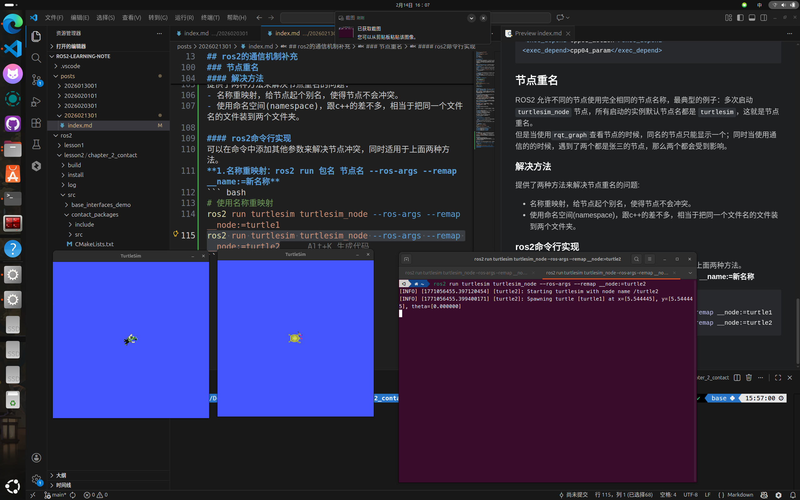
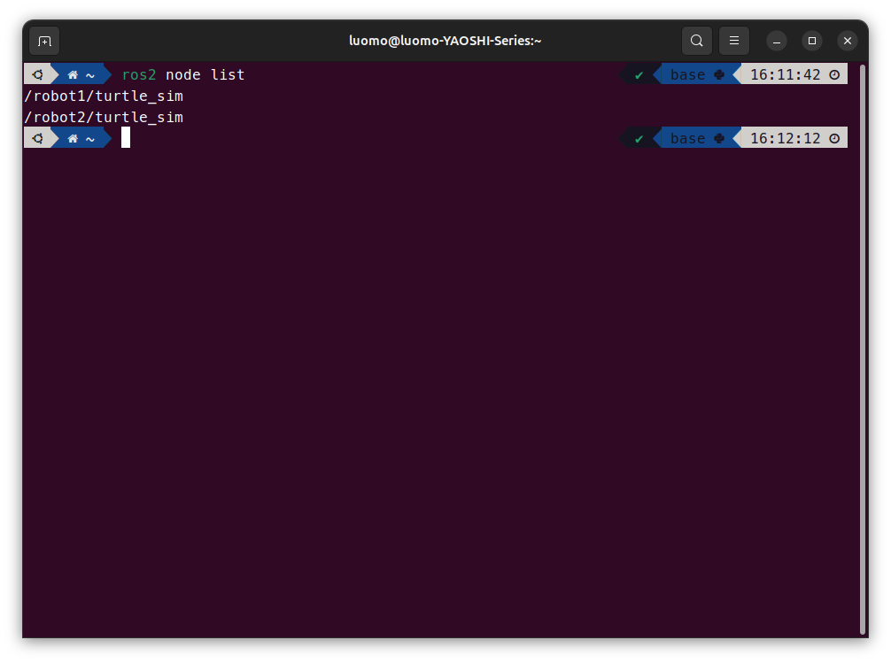
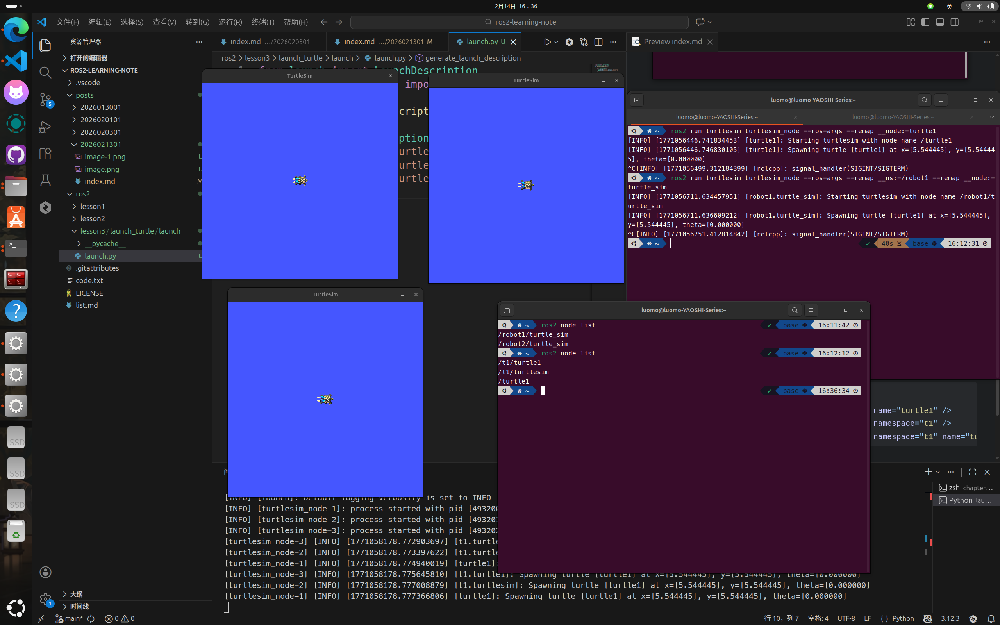
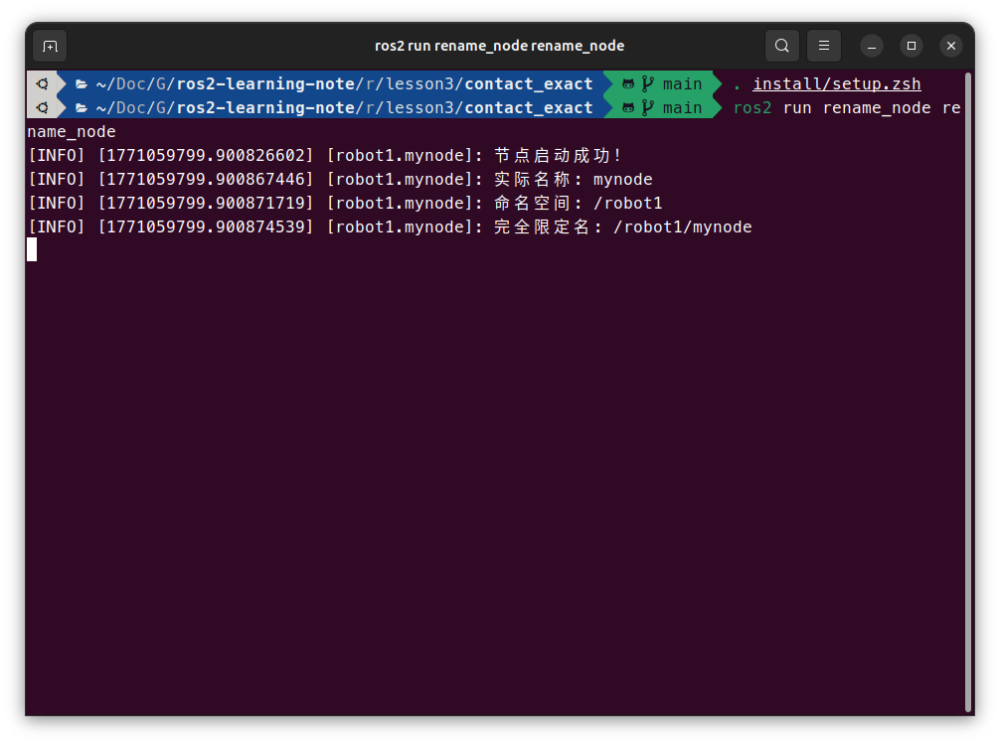
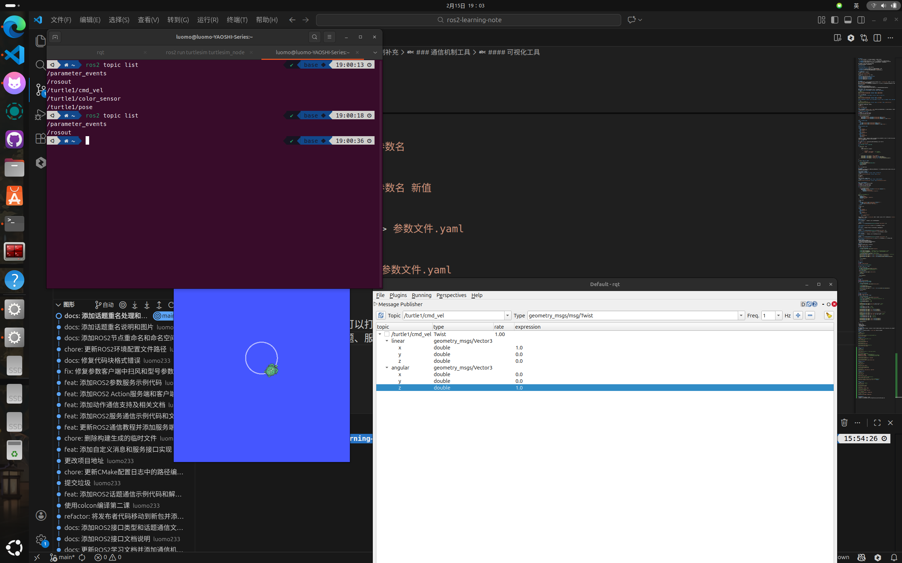
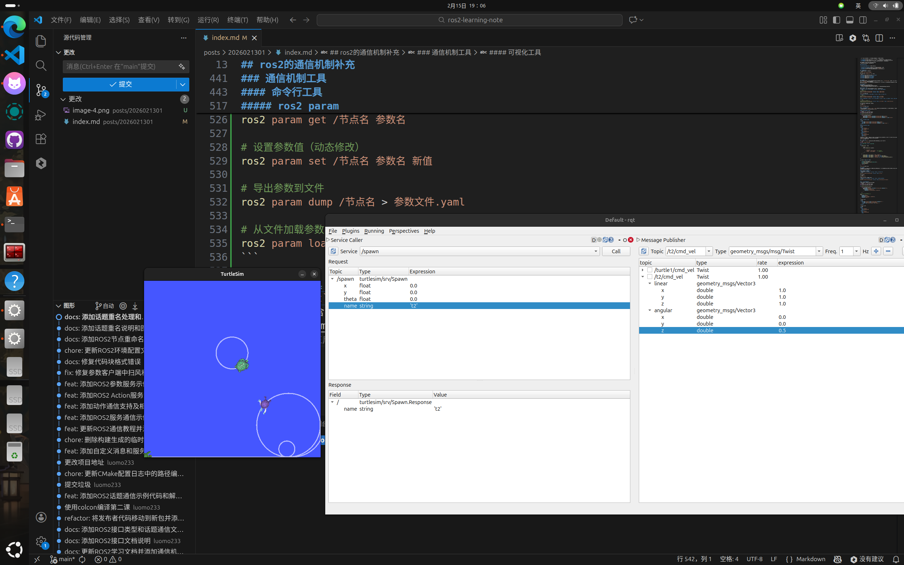
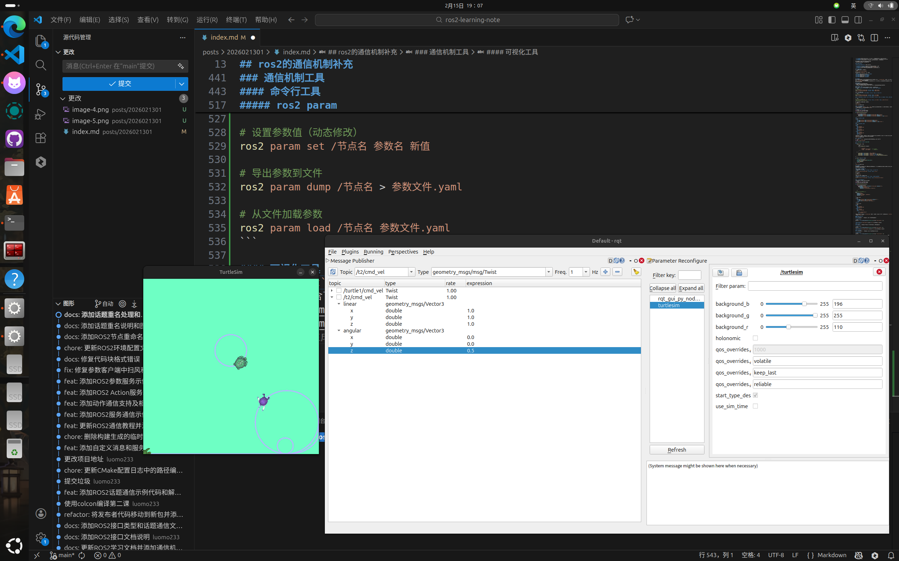

## ros2的通信机制补充
### 分布式通信
在机器人方面，需要使用到以下情况：好几个机器人连到一个局域网，然后在网络下进行通信，之前的通信都是在同一台主机进行的，但是实际生活里面，每个机器人有自己的主机，他们就需要连接到一个网络下进行通信，这时候基于DDS中间件的ros2就可以很方便互联机器人，因为ros2原生支持DDS。  

### 域
ROS2使用 **域ID（ROS_DOMAIN_ID）** 作为分组机制，实现多机之间的发现与隔离，允许在同一物理网络中划分多个逻辑通信域。

#### 域的核心特点
- **同域互通**：相同Domain ID的节点自动发现、自由通信，无需额外配置
- **异域隔离**：不同Domain ID的节点完全隔离，无法互相发现话题或服务
- **默认值**：所有节点默认使用``Domain ID 0``，即同一网络下的所有ROS2节点默认互通

#### 应用场景

- **机器人编队**：无人车编队、无人机群，同编队内的机器人需要共享位置、速度信息
- **多机隔离**：实验室中不同项目组共享同一WiFi，通过不同Domain ID避免互相干扰
- **远程控制**：控制端电脑与机器人主机设置相同Domain ID，实现跨机调试

#### 实际操作
**临时设置（仅当前终端有效）**：
```bash
# 将当前终端的节点划分到域6
export ROS_DOMAIN_ID=6
ros2 run my_package my_node
```
**永久设置（永久生效）**：
```bash
# 对所有新终端生效
echo "export ROS_DOMAIN_ID=6" >> ~/.bashrc
source ~/.bashrc
```
**查看当前域ID**：
```bash
echo $ROS_DOMAIN_ID
```

#### 域的规定
在ros2当中，域的id不是随意的，建议放到``[0~101]``，其中**域 0-100：最多 120个节点（每个节点占用2个端口）域 101：最多 54个节点（后半段端口被系统预留）**  
DDS是基于``TCP/UDP``进行计算，从基础端口开始，每个域占用250个端口，每个ros2节点占用2个端口，在实际场景里面建议按照功能进行区域划分，避免出现不够用的情况，同时域的范围在``[0~101]``，避免和系统预留端口冲突。  

### 工作空间覆盖
在单一工作空间内，不允许存在同名功能包（Package）。在实际开发中，经常会遇到多个工作空间并存的情况：
- 自定义工作空间A包含`turtlesim`功能包
- 自定义工作空间B也包含`turtlesim`功能包  
- 系统自带（/opt/ros/humble）同样包含`turtlesim`功能包。  
当执行 `ros2 run turtlesim turtlesim_node` 时，系统就会产生覆盖，后面的环境变量会把前面的覆盖了，加入A是最晚配置的，那么启动的就是A的turtlesim_node。  

**工作空间覆盖（Workspace Overlay）**：当不同工作空间存在同名功能包时，ROS2的调用机制会产生"覆盖"现象——只有优先级最高的功能包会被调用，其他同名包被"隐藏"。  

#### ros2的功能包加载顺序
ROS2 会解析 ``~/.bashrc`` 文件，并生成全局环境变量 ``AMENT_PREFIX_PATH``，所以调整 ``~/.bashrc`` 文件的顺序，可以调整功能包的加载顺序。  

#### 避免覆盖
制定规范的命名，避免覆盖或者功能错乱。  

### 元功能包
开发复杂的机器人系统时，一个完整的功能模块往往由多个子功能包组成：

- **导航模块**：地图服务(map_server) + 定位(amcl) + 路径规划(planner) + 控制(controller)
- **感知模块**：相机驱动(camera_driver) + 目标检测(yolo_detector) + 点云处理(pcl_processing)
- **仿真模块**：环境模型(worlds) + 机器人模型(robot_description) + 插件(plugins)

如果我需要逐一安装每个子包，可以弄到明年了。  
为了解决这个问题就需要使用到元功能包。  

#### 元功能包的定义

**MetaPackage（元功能包）** 在ROS2中的定义：

- **虚包（Virtual Package）**：不包含实质性的代码、节点或可执行文件
- **依赖聚合器**：仅声明对其他功能包的依赖关系（`exec_depend`）
- **目录索引**：类似书籍的目录，指示该功能模块包含哪些子包及获取位置

#### 元功能包的使用
在第二章的目录新建一个元功能包:
```bash
ros2 pkg create contact_packages
```
之后在功能包的``package.xml``中添加依赖：
```xml
<exec_depend>base_interfaces_demo</exec_depend>
<exec_depend>cpp01_topic</exec_depend>
<exec_depend>cpp02_service</exec_depend>
<exec_depend>cpp03_action</exec_depend>
<exec_depend>cpp04_param</exec_depend>
```

### 节点重名
ROS2 允许不同的节点使用完全相同的节点名称，最典型的例子：多次启动 ``turtlesim_node`` 节点，所有启动的实例默认节点名都是 ``turtlesim``，这就是节点重名。  
但是当使用``rqt_graph``查看节点的时候，同名的节点只能显示一个；同时当使用通信的的时候，遇到了两个都是张三的节点，那么两个都会受到影响。  

#### 解决方法
提供了两种方法来解决节点重名的问题:
- 名称重映射，给节点起个别名，使得节点不会冲突。  
- 使用命名空间(namespace)，跟c++的差不多，相当于把同一个文件名的文件装到两个文件夹。  

#### ros2命令行实现
可以在命令中添加其他参数来解决节点冲突，同时适用于上面两种方法。  
**1.名称重映射：ros2 run 包名 节点名 --ros-args --remap __name:=新名称**
``` bash
# 使用名称重映射
ros2 run turtlesim turtlesim_node --ros-args --remap __node:=turtle1
ros2 run turtlesim turtlesim_node --ros-args --remap __node:=turtle2
```

**2.使用命名空间：ros2 run 包名 节点名 --ros-args --remap __ns:=命名空间**
``` bash
# 使用命名空间
ros2 run turtlesim turtlesim_node --ros-args --remap __ns:=/robot1
ros2 run turtlesim turtlesim_node --ros-args --remap __ns:=/robot2
```
**两个东西还可以组合使用：语法: ros2 run 包名 节点名 --ros-args --remap __ns:=新名称 --remap __name:=新名称**
``` bash
# 使用命名空间和名称重映射
ros2 run turtlesim turtlesim_node --ros-args --remap __ns:=/robot1 --remap __node:=turtle_sim
# 最终节点全名：/robot1/turtle_sim
```
运行之后可以运行下面的命令来检查节点：
``` bash
ros2 node list
```


#### 使用launch文件实现
在ros2中launch可以用``python``,``xml``,``yaml``来编写，launch文件可以批量启动多个节点，比如有十几个节点，一个个启动就很浪费时间，使用launch可以快捷全部启动。  

##### 使用python编写启动文件
``` python
from launch import LaunchDescription
from launch_ros.actions import Node

def generate_launch_description():

    return LaunchDescription([
        Node(package="turtlesim",executable="turtlesim_node",name="turtle1"),
        Node(package="turtlesim",executable="turtlesim_node",namespace="t1"),
        Node(package="turtlesim",executable="turtlesim_node",namespace="t1", name="turtle1")
    ])
```
##### 使用xml编写启动文件
``` xml
<launch>
    <node pkg="turtlesim" exec="turtlesim_node" name="turtle1" />
    <node pkg="turtlesim" exec="turtlesim_node" namespace="t1" />
    <node pkg="turtlesim" exec="turtlesim_node" namespace="t1" name="turtle1" />
</launch>
```
##### 使用yaml编写启动文件
``` yaml
launch:
- node:
    pkg: turtlesim
    exec: turtlesim_node
    name: turtle1
- node:
    pkg: turtlesim
    exec: turtlesim_node
    namespace: t1
- node:
    pkg: turtlesim
    exec: turtlesim_node
    namespace: t1
    name: turtle1
```
上面三种方式都实现了同一个功能：启动名称为turtle1的turtlesim_node节点；启动命名空间为t1的turtlesim_node节点；启动命名空间为t1，名称为turtle1的turtlesim_node节点。  


### 使用代码实现
在``rclcpp``和``rclpy``中提供了对应的函数来设置节点名称和命名空间的参数
``` cpp
#include "rclcpp/rclcpp.hpp"

class rename_node : public rclcpp::Node
{
public:
    rename_node() : Node
    (
        "node",
        rclcpp::NodeOptions().arguments
        (
            {
                "--ros-args",
                "--remap", "__node:=mynode",  // 重映射节点名
                "--remap", "__ns:=/robot1"       // 设置命名空间
            }
        )
    )
    {
        RCLCPP_INFO(this->get_logger(), "节点启动成功！");
        RCLCPP_INFO(this->get_logger(), "实际名称: %s", this->get_name());
        RCLCPP_INFO(this->get_logger(), "命名空间: %s", this->get_namespace());
        RCLCPP_INFO(this->get_logger(), "完全限定名: %s", this->get_fully_qualified_name());
    }
};

int main(int argc,char **argv)
{
    rclcpp::init(argc,argv);
    auto node = std::make_shared<rename_node>();
    rclcpp::spin(node);
    rclcpp::shutdown();
    return 0;
}
```


### 话题重名
与节点重名类似，话题名称也可能出现重名，但话题重名不会抛出异常，系统允许同名话题存在，但可能导致通信逻辑错乱。但是有一些特殊的情况也需要特殊处理。  

#### 使用ros2 run设置命名空间
和上面节点重名一模一样。  
**语法：ros2 run 包名 节点名 --ros-args --remap __ns:=命名空间**
``` bash
ros2 run turtlesim turtlesim_node --ros-args --remap __ns:=/t1
```
查看话题名称
``` bash
ros2 topic list
```
同样，话题也可以使用名称重映射。  
**语法：ros2 run 包名 节点名 --ros-args --remap 原话题名:=新话题名**
``` bash
ros2 run turtlesim turtlesim_node --ros-args --remap /turtle1/cmd_vel:=/cmd_vel
```

#### 使用launch文件来修改
同上面一样，分为三种方式来修改launch文件
``` python
from launch import LaunchDescription
from launch_ros.actions import Node

def generate_launch_description():

    return LaunchDescription([
        Node(package="turtlesim",executable="turtlesim_node",namespace="t1"),
        Node(package="turtlesim",
            executable="turtlesim_node", 
            remappings=[("/turtle1/cmd_vel","/cmd_vel")]
        )

    ])

# Python方式（与节点重名类似）
Node(
    package='包名',
    executable='节点名',
    remappings=[('原话题名', '新话题名')],
    namespace='命名空间'
)
```
使用xml格式修改
``` xml
<launch>
    <node pkg="turtlesim" exec="turtlesim_node" namespace="t1" />
    <node pkg="turtlesim" exec="turtlesim_node">
        <remap from="/turtle1/cmd_vel" to="/cmd_vel" />
    </node>
</launch>
```
使用yaml格式修改
``` yaml
launch:
- node:
    pkg: turtlesim
    exec: turtlesim_node
    namespace: t1
- node:
    pkg: turtlesim
    exec: turtlesim_node
    remap:
    -
        from: "/turtle1/cmd_vel"
        to: "/cmd_vel"
```
上面三个例子都是启动了两个``turtlesim_node``节点，一个节点添加了命名空间，另一个节点将话题从``/turtle1/cmd_vel``映射到了``/cmd_vel``。

#### 在代码中修改话题
##### 全局话题
**格式**：定义时以`/`开头的名称，和命名空间、节点名称无关。

**rclcpp示例**：
```cpp
publisher_ = this->create_publisher<std_msgs::msg::String>("/topic/chatter", 10);
```

**最终话题名称**：`/topic/chatter`，与命名空间`xxx`以及节点名称`yyy`无关。

##### 相对话题
**格式**：非`/`开头的名称，参考命名空间设置话题名称，和节点名称无关。

**rclcpp示例**：
```cpp
publisher_ = this->create_publisher<std_msgs::msg::String>("topic/chatter", 10);
```
**最终话题名称**：`/xxx/topic/chatter`，与命名空间`xxx`有关，与节点名称`yyy`无关。

#### 3. 私有话题
**格式**：定义时以`~/`开头的名称，和命名空间、节点名称都有关系。

**rclcpp示例**：
```cpp
publisher_ = this->create_publisher<std_msgs::msg::String>("~/topic/chatter", 10);
```
**最终话题名称**：`/xxx/yyy/topic/chatter`，使用命名空间`xxx`以及节点名称`yyy`作为话题名称前缀。

### 时间相关的api
ROS2的时间系统提供了三种时钟类型：
- 时间点rclcpp::Time：表示某一具体时刻
- 持续时间rclcpp::Duration：表示两个时间点的间隔
- 频率控制rclcpp::Rate：控制循环的频率

#### 时间点
接下来创建对象来调用time对象和对应的函数
``` cpp
#include "rclcpp/rclcpp.hpp"
int main(int argc, char const **argv)
{
    rclcpp::init(argc,argv);
    auto node = rclcpp::Node::make_shared("time_demo");

    // 创建 Time 对象
    rclcpp::Time t1(10500000000L);  //后面的L表示long类型 10,500,000,000 纳秒 = 10.5秒
    rclcpp::Time t2(2,1000000000L);  //秒 + 纳秒构造，2秒 + 1,000,000,000纳秒 = 3秒
    // 通过节点获取当前时刻。
    // rclcpp::Time roght_now = node->get_clock()->now();
    rclcpp::Time roght_now = node->now();  //返回当前时间点
    RCLCPP_INFO(node->get_logger(),"s = %.2f, ns = %ld",t1.seconds(),t1.nanoseconds());  //返回秒和纳秒
    RCLCPP_INFO(node->get_logger(),"s = %.2f, ns = %ld",t2.seconds(),t2.nanoseconds());
    RCLCPP_INFO(node->get_logger(),"s = %.2f, ns = %ld",roght_now.seconds(),roght_now.nanoseconds());

    rclcpp::shutdown();

    return 0;
}
```
#### 频率控制
``` cpp
#include "rclcpp/rclcpp.hpp"

using namespace std::chrono_literals;

int main(int argc, char ** argv)
{
  rclcpp::init(argc,argv);
  auto node = rclcpp::Node::make_shared("rate_demo");
  // rclcpp::Rate rate(1000ms); // 创建 Rate 对象方式1
  rclcpp::Rate rate(1.0); // 创建 Rate 对象方式2
  while (rclcpp::ok())
  {
    RCLCPP_INFO(node->get_logger(),"hello rate");
    // 休眠
    rate.sleep();
  }

  rclcpp::shutdown();
  return 0;
}
```

#### 持续时间
``` cpp
#include "rclcpp/rclcpp.hpp"
using namespace std::chrono_literals;
int main(int argc, char const **argv)
{
    rclcpp::init(argc,argv);
    auto node = rclcpp::Node::make_shared("duration_node");

    // 创建 Duration 对象
    rclcpp::Duration du1(1s);
    rclcpp::Duration du2(2,500000000);

    RCLCPP_INFO(node->get_logger(),"s = %.2f, ns = %ld", du2.seconds(),du2.nanoseconds());

    rclcpp::shutdown();
    return 0;
}
```

#### Time和Duration的运算
``` cpp
#include "rclcpp/rclcpp.hpp"
int main(int argc, char const **argv)
{
    rclcpp::init(argc,argv);
    auto node = rclcpp::Node::make_shared("time_opt_demo");

    rclcpp::Time t1(1,500000000); //1.5秒 从1970-01-01 00:00:00 UTC开始算
    rclcpp::Time t2(10,0);  // 10秒

    rclcpp::Duration du1(3,0);  // 3秒
    rclcpp::Duration du2(5,0);  // 5秒

    // 比较
    RCLCPP_INFO(node->get_logger(),"t1 >= t2 ? %d",t1 >= t2);  //返回0
    RCLCPP_INFO(node->get_logger(),"t1 < t2 ? %d",t1 < t2);  //返回1

    // 数学运算
    rclcpp::Time t3 = t2 + du1;  // 13秒
    rclcpp::Time t4 = t1 - du1;  // -1.5s
    rclcpp::Duration du3 = t2 - t1;  // 9秒

    RCLCPP_INFO(node->get_logger(), "t3 = %.2f",t3.seconds());  
    RCLCPP_INFO(node->get_logger(), "t4 = %.2f",t4.seconds()); 
    RCLCPP_INFO(node->get_logger(), "du3 = %.2f",du3.seconds()); 

    RCLCPP_INFO(node->get_logger(),"--------------------------------------");
    // 比较
    RCLCPP_INFO(node->get_logger(),"du1 >= du2 ? %d", du1 >= du2);  //返回0
    RCLCPP_INFO(node->get_logger(),"du1 < du2 ? %d", du1 < du2);  //返回1
    // 数学运算
    rclcpp::Duration du4 = du1 * 3.0;  // 输出9.0
    rclcpp::Duration du5 = du1 + du2;  // 输出8.0
    rclcpp::Duration du6 = du1 - du2;  // 输出-2.0

    RCLCPP_INFO(node->get_logger(), "du4 = %.2f",du4.seconds()); 
    RCLCPP_INFO(node->get_logger(), "du5 = %.2f",du5.seconds()); 
    RCLCPP_INFO(node->get_logger(), "du6 = %.2f",du6.seconds()); 

    rclcpp::shutdown();
    return 0;
}
```
注意以下几点：
- 时间不能加时间
- 时间后面才能跟时间段
- 时间不能乘除

### 通信机制工具
通信工具就是ROS2的" Debugger + Dashboard "，可以看清系统内部的数据流动。目前ros2提供命令行工具和可视化图形工具来进行调试。  
#### 命令行工具
命令的使用一般都会提供帮助文档,通过``命令 --help``可以查看帮助文档。

##### ros2 node
``` bash
# 列出所有活跃节点
ros2 node list

# 查看某个节点的详细信息（订阅/发布的话题、服务等）
ros2 node info /节点名
```
##### ros2 interace
``` bash
# 查看所有接口类型（消息/服务/动作）
ros2 interface list

# 查看特定包下的接口
ros2 interface package 包名

# 查看接口具体定义
ros2 interface show 接口名

# 查看接口的依赖（包含的其他消息类型）
ros2 interface proto 接口名
```

##### ros2 topic
``` bash
# 列出所有话题
ros2 topic list

# 列出话题并显示类型（-t 是 --show-types 的缩写）
ros2 topic list -t

# 查看话题的带宽、频率等信息
ros2 topic bw /话题名      # bandwidth（带宽）
ros2 topic hz /话题名      # hertz（频率，查看实际发布频率）
ros2 topic echo /话题名    # 实时打印话题数据（像print一样）

# 手动发布消息（测试用）
ros2 topic pub /话题名 消息类型 "消息内容"

# 查看话题消息的具体结构
ros2 topic type /话题名 | ros2 interface show
```
##### ros2 service
``` bash
# 列出所有服务
ros2 service list

# 查看服务类型
ros2 service type /服务名

# 查看服务请求/响应的数据结构
ros2 interface show 服务类型名

# 手动调用服务
ros2 service call /服务名 服务类型 "请求参数"
```
##### ros2 action
``` bash
# 列出所有动作
ros2 action list

# 查看动作详情
ros2 action info /动作名

# 查看动作消息结构（goal/feedback/result）
ros2 interface show 动作类型名

# 发送动作目标（命令行发送，实际开发中很少用，但调试很有用）
ros2 action send_goal /动作名 动作类型 "目标值" --feedback
```

##### ros2 param
``` bash
# 列出所有参数（所有节点）
ros2 param list

# 查看某个节点的所有参数
ros2 param list /节点名

# 获取参数值
ros2 param get /节点名 参数名

# 设置参数值（动态修改）
ros2 param set /节点名 参数名 新值

# 导出参数到文件
ros2 param dump /节点名 > 参数文件.yaml

# 从文件加载参数
ros2 param load /节点名 参数文件.yaml
```

#### 可视化工具
在终端输入``rqt``就可以打开工具箱  
在plugins中包含了话题、服务、动作、参数、日志等等相关的插件，可以按需选用。  


