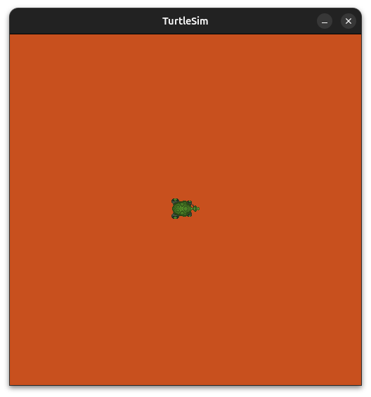
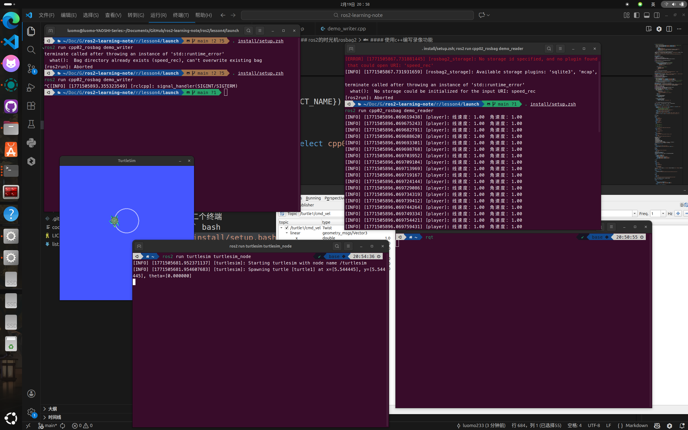

## ros2的工具
### launch文件
一个机器人当中会有很多的节点，如果一个一个启动，那要十万八千年，这时候可以编写一个launch文件来实现快速的启动。  
#### launch文件的格式
目前有python、xml、yaml三种启动方法，其中python是最方便的方式。  
#### launch文件的编写流程
先创建好工作空间，进入到目录使用``colcon build``，创建功能包
``` bash
ros2 pkg create cpp01_launch --build-type ament_cmake --dependencies rclcpp
```
由于python的启动文件有很多东西，涉及很多api，所以可以在vscode设置python的launch文件模板。
``` json
{
    // Place your snippets for python here. Each snippet is defined under a snippet name and has a prefix, body and 
    // description. The prefix is what is used to trigger the snippet and the body will be expanded and inserted. Possible variables are:
    // $1, $2 for tab stops, $0 for the final cursor position, and ${1:label}, ${2:another} for placeholders. Placeholders with the 
    // same ids are connected.
    // Example:
    // "Print to console": {
    //     "prefix": "log",
    //     "body": [
    //         "console.log('$1');",
    //         "$2"
    //     ],
    //     "description": "Log output to console"
    // }

    "ros2 node": {
        "prefix": "ros2_node_py",
        "body": [
            "\"\"\"  ",
            "    需求：",
            "    流程：",
            "        1.导包；",
            "        2.初始化ROS2客户端；",
            "        3.自定义节点类；",
            "                        ",          
            "        4.调用spain函数，并传入节点对象；",
            "        5.资源释放。 ",
            "",
            "",
            "\"\"\"",
            "# 1.导包；",
            "import rclpy",
            "from rclpy.node import Node",
            "",
            "# 3.自定义节点类；",
            "class MyNode(Node):",
            "    def __init__(self):",
            "        super().__init__(\"mynode_node_py\")",
            "",
            "def main():",
            "    # 2.初始化ROS2客户端；",
            "    rclpy.init()",
            "    # 4.调用spain函数，并传入节点对象；",
            "    rclpy.spin(MyNode())",
            "    # 5.资源释放。 ",
            "    rclpy.shutdown()",
            "",
            "if __name__ == '__main__':",
            "    main()",
        ],
        "description": "ros2 node"
    },
    "ros2 launch py": {
        "prefix": "ros2_launch_py",
        "body": [
            "from launch import LaunchDescription",
            "from launch_ros.actions import Node",
            "# 封装终端指令相关类--------------",
            "# from launch.actions import ExecuteProcess",
            "# from launch.substitutions import FindExecutable",
            "# 参数声明与获取-----------------",
            "# from launch.actions import DeclareLaunchArgument",
            "# from launch.substitutions import LaunchConfiguration",
            "# 文件包含相关-------------------",
            "# from launch.actions import IncludeLaunchDescription",
            "# from launch.launch_description_sources import PythonLaunchDescriptionSource",
            "# 分组相关----------------------",
            "# from launch_ros.actions import PushRosNamespace",
            "# from launch.actions import GroupAction",
            "# 事件相关----------------------",
            "# from launch.event_handlers import OnProcessStart, OnProcessExit",
            "# from launch.actions import ExecuteProcess, RegisterEventHandler,LogInfo",
            "# 获取功能包下share目录路径-------",
            "# from ament_index_python.packages import get_package_share_directory",
            "",
            "def generate_launch_description():",
            "    ",    
            "    return LaunchDescription([])"
        ],
        "description": "ros2 launch"
    }
}
```
#### launch的使用
在工作空间的``cpp01_launch``里面，创建launch目录，上面的格式三选一，不同的类型在之前示例里面有，一般都是用python。  
在cmakelists里面也要添加对应的配置，无论launch里面有多少文件，只需要设置一次就可以了。  
``` cmake
install(DIRECTORY launch DESTINATION share/${PROJECT_NAME})
```
``` xml
<exec_depend>ros2launch</exec_depend>
```
之后编译运行
``` bash
colcon build --packages-select cpp01_launch
```
在终端的项目目录下面安装运行
``` bash
. install/setup.bash
ros2 run cpp01_launch xxx.py
```

#### launch里面的node节点语法
launch里面的节点被封装了``launch_ros.actions.Node`` 对象。  
``` python
turtle1 = Node(package="turtlesim",  # 功能包
                executable="turtlesim_node",  # 可执行文件的名称
                namespace="group_1",  # 命名空间
                name="t1", # 节点名称
                exec_name="turtle_label", # 流程的标签
                remappings=[("/turtle1/cmd_vel","/cmd_vel")] # 话题重映射，从左->右
                ros_arguments=["--remap", "__ns:=/t4_ns", "--remap", "__node:=t4"]  # 相当于 arguments 前缀 --ros-args
                respawn=True)  # 节点自动重启
```
##### 在node节点中使用yaml文件
在启动文件中，可以使用两种方法来导入一些启动参数，以下面的代码作为一个例子
``` python
turtle2 = Node(package="turtlesim", 
                executable="turtlesim_node", 
                name="t2",
                # 参数设置方式1
                parameters=[{"background_r": 0,"background_g": 0,"background_b": 0}],
                # 参数设置方式2: 从 yaml 文件加载参数，yaml 文件所属目录需要在配置文件中安装。
                parameters=[os.path.join(get_package_share_directory("cpp01_launch"),"config","xxx.yaml")],
                )
```
上面的第一种设置方式使用python的字典来编写，外层使用列表，里面使用字典再存储多个键值对。与此同时可以设置``yaml``配置文件来配置启动参数，**在功能包下面新建config目录，在里面新建xxx.yaml,输入下面的内容**
``` yaml
/xxx:
  ros__parameters:
    background_b: 0
    background_g: 0
    background_r: 50
    qos_overrides:
      /parameter_events:
        publisher:
          depth: 1000
          durability: volatile
          history: keep_last
          reliability: reliable
    use_sim_time: false
```
记得在``cmakelists``新增下面的内容
``` cmake
install(DIRECTORY 
  launch
  config
  DESTINATION share/${PROJECT_NAME})
```
##### 在launch中启动rviz2
创建一个 `rviz2` 节点，并加载了 `rviz2` 相关的配置文件。配置文件先启动 `rviz2` ，配置完毕后，保存到 config 目录并命名为 ``xxx.rviz``。  
``` python
rviz = Node(package="rviz2",
                executable="rviz2",
                # 节点启动时传参
                arguments=["-d", os.path.join(get_package_share_directory("cpp01_launch"),"config","xxx.rviz")]
    )
```
#### launch文件的执行命令的用法
在launch文件夹里面新建文件``cmd.launch.py``文件，输入以下内容,可以用来带参数启动小乌龟，同时在指定的坐标生成一个乌龟节点。  
``` python
from launch import LaunchDescription
from launch_ros.actions import Node
from launch.actions import ExecuteProcess
from launch.substitutions import FindExecutable

def generate_launch_description():
    turtle = Node(package="turtlesim", executable="turtlesim_node")
    spawn = ExecuteProcess(
        # cmd=["ros2 service call /spawn turtlesim/srv/Spawn \"{x: 8.0, y: 9.0,theta: 0.0, name: 'turtle2'}\""],
        # 或
        cmd = [
            FindExecutable(name = "ros2"), # 不可以有空格
            " service call",
            " /spawn turtlesim/srv/Spawn",
            " \"{x: 8.0, y: 9.0,theta: 1.0, name: 'turtle2'}\""
        ],
        output="both",  # 设置为both的时候，同时输出到log和screen，即输出到日志和终端界面
        shell=True)  # 是否在终端显示
    return LaunchDescription([turtle,spawn])
```
#### launch的参数设置
在启动文件中可以自行声明启动参数，在使用launch文件的时候可以自定义启动参数。在文档中，声明和调用分别被封装为``launch.actions.DeclareLaunchArgument``和``launch.substitutions import LaunchConfiguration``两个类里面，下面示范设置启动文件来动态传入一个参数，调整小乌龟的rgb背景，在新建的launch文件夹里面新建一个python文件，这里名字为``py03_args.launch.py``，粘贴如下内容。  
``` python
from pkg_resources import declare_namespace
from launch import LaunchDescription
from launch_ros.actions import Node
from launch.actions import DeclareLaunchArgument
from launch.substitutions import LaunchConfiguration

def generate_launch_description():

    decl_bg_r = DeclareLaunchArgument(name="background_r",default_value="255") # 设置默认背景颜色
    decl_bg_g = DeclareLaunchArgument(name="background_g",default_value="255") 
    decl_bg_b = DeclareLaunchArgument(name="background_b",default_value="255")

    turtle = Node(
            package="turtlesim", 
            executable="turtlesim_node",
            parameters=[{"background_r": LaunchConfiguration("background_r"), "background_g": LaunchConfiguration("background_g"), "background_b": LaunchConfiguration("background_b")}]  # 使用启动参数
            )
    return LaunchDescription([decl_bg_r,decl_bg_g,decl_bg_b,turtle])
```
上面代码通过使用``DeclareLaunchArgument``来声明启动参数，然后通过``LaunchConfiguration``来获取启动参数。实际上也可以在终端填入启动参数。不填入参数的时候，就是默认的255,255,255
``` bash
ros2 launch cpp01_launch py03_args.launch.py background_r:=200 background_g:=80 background_b:=30
```


#### launch文件套娃
launch里面可以包含其他launch。  
``` python
from launch import LaunchDescription
from launch.actions import IncludeLaunchDescription
from launch.launch_description_sources import PythonLaunchDescriptionSource

import os
from ament_index_python import get_package_share_directory

def generate_launch_description():

    include_launch = IncludeLaunchDescription(  # 包含启动描述文件
        launch_description_source= PythonLaunchDescriptionSource(
            launch_file_path=os.path.join(
                get_package_share_directory("cpp01_launch"),
                "launch/py",
                "py03_args.launch.py"
            )
        ),
        launch_arguments={  # 启动参数的键值对
            "background_r": "200",
            "background_g": "100",
            "background_b": "70",
        }.items()
    )

    return LaunchDescription([include_launch])
```
上面包含了一个启动的板子，通过使用``launch.actions.IncludeLaunchDescription``和``launch.launch_description_sources.PythonLaunchDescriptionSource``。  

#### launch的分组设置
在launch文件中，为了方便管理可以对节点进行分组，使用``launch.actions.GroupAction``和``launch_ros.actions.PushRosNamespace``。在工作空间下面新建一个``py05_group.launch.py``文件
``` python
from launch import LaunchDescription
from launch_ros.actions import Node
from launch_ros.actions import PushRosNamespace
from launch.actions import GroupAction

def generate_launch_description():
    turtle1 = Node(package="turtlesim",executable="turtlesim_node",name="t1")
    turtle2 = Node(package="turtlesim",executable="turtlesim_node",name="t2")
    turtle3 = Node(package="turtlesim",executable="turtlesim_node",name="t3")
    g1 = GroupAction(actions=[PushRosNamespace(namespace="g1"),turtle1, turtle2])  # 创建一个组，包含上面两个乌龟
    g2 = GroupAction(actions=[PushRosNamespace(namespace="g2"),turtle3])  # 第二个组包含另一个乌龟
    return LaunchDescription([g1,g2])
```
上面的函数用来创建三个乌龟，在g1、g2划分三个乌龟进两个组里面。  
#### launch文件添加事件
在launch文件中，节点运行过程中会触发不同的事件，这时候可以给这个事件绑定一些逻辑，使用``launch.actions.RegisterEventHandler``、``launch.event_handlers.OnProcessStart``、``launch.event_handlers.OnProcessExit``来完成上面的任务。新建一个``py06_event.launch.py``文件，输入以下内容。  
``` python
from launch import LaunchDescription
from launch_ros.actions import Node
from launch.actions import ExecuteProcess, RegisterEventHandler,LogInfo
from launch.substitutions import FindExecutable
from launch.event_handlers import OnProcessStart, OnProcessExit
def generate_launch_description():
    turtle = Node(package="turtlesim", executable="turtlesim_node")
    spawn = ExecuteProcess(
        cmd = [
            FindExecutable(name = "ros2"), # 不可以有空格
            " service call",
            " /spawn turtlesim/srv/Spawn",
            " \"{x: 8.0, y: 1.0,theta: 1.0, name: 'turtle2'}\""
        ],
        output="both",
        shell=True)

    start_event = RegisterEventHandler(
        event_handler=OnProcessStart(
            target_action = turtle,
            on_start = spawn
        )
    )
    exit_event = RegisterEventHandler(
        event_handler=OnProcessExit(
            target_action = turtle,
            on_exit = [LogInfo(msg = "turtlesim_node退出!")]
        )
    )

    return LaunchDescription([turtle,start_event,exit_event])
```
上面注册了启动事件和退出事件，当节点启动之后执行spawn，退出的时候打印日志。

#### xml和yaml格式的实现
launch也可以用xml和yaml写，和上面的差不多，这里快速带过。  
``` xml
<launch>
    <node pkg="turtlesim" exec="turtlesim_node" name="t1" namespace="t1_ns" exec_name="t1_label" respawn="true"/>
    <node pkg="turtlesim" exec="turtlesim_node" name="t2">
        <!-- <param name="background_r" value="255" />
            <param name="background_g" value="255" />
            <param name="background_b" value="255" /> -->
        <param from="$(find-pkg-share cpp01_launch)/config/t2.yaml" />
    </node>
    <node pkg="turtlesim" exec="turtlesim_node" name="t3">
        <remap from="/turtle1/cmd_vel" to="/cmd_vel" />
    </node>
    <node pkg="turtlesim" exec="turtlesim_node" ros_args="--remap __name:=t4 --remap __ns:=/group_2" />
    <node pkg="rviz2" exec="rviz2" args="-d $(find-pkg-share cpp01_launch)/config/my.rviz" />  

</launch>
```
yaml格式的如下
``` yaml
launch:
- node:
    pkg: "turtlesim"
    exec: "turtlesim_node"
    name: "t1"
    namespace: "t1_ns"
    exec_name: "t1_label"
    respawn: "false"
- node:
    pkg: "turtlesim"
    exec: "turtlesim_node"
    name: "t2"
    param:
    # - 
    #   name: "background_r"
    #   value: 255
    # - 
    #   name: "background_b"
    #   value: 255
    -
      from: "$(find-pkg-share cpp01_launch)/config/t2.yaml"
- node:
    pkg: "turtlesim"
    exec: "turtlesim_node"
    remap:
    -
      from: "/turtle1/cmd_vel"
      to: "/cmd_vel"

- node:
    pkg: "turtlesim"
    exec: "turtlesim_node"
    ros_args: "--ros-args --remap __name:=t4 --remap __ns:=/t4"
- node:
    pkg: "rviz2"
    exec: "rviz2"
    args: "-d $(find-pkg-share cpp01_launch)/config/my.rviz"
```
上面两个文件的格式如下
- pkg：功能包
- exec：可执行文件
- name：节点名称
- namespace：命名空间
- exec_name：流程标签
- respawn：节点关闭后是否重启
- args：调用指令时的参数列表
- ros_args：相当于 args 前缀 --ros-args
- param：参数标签，包括`name`参数名称，`value`参数值，`from`参数文件路径
- remap：话题重映射标签，`from`原话题名称，`to`新话题名称

##### xml和yaml格式的执行命令
xml格式：
``` xml
<launch>
    <node pkg="turtlesim" exec="turtlesim_node" />
    <executable cmd="ros2 run turtlesim turtlesim_node" output="both" />
</launch>
```
yaml格式：
``` yaml
launch:
- executable:
    cmd: "ros2 run turtlesim turtlesim_node"
    output: "both"
```
- cmd：运行指令
- output：输出的目的，跟上面的一样
##### xml和yaml格式的参数设置
和python的写法差不多，也能实现启动的时候传入参数，下面分别提供两种写法
``` xml
<launch>
    <arg name="bg_r" default="255"/>
    <arg name="bg_g" default="255"/>
    <arg name="bg_b" default="255"/>
    <node pkg="turtlesim" exec="turtlesim_node">
        <param name="background_r" value="$(var bg_r)" />
        <param name="background_g" value="$(var bg_g)" />
        <param name="background_b" value="$(var bg_b)" />
    </node>

</launch>
```
``` yaml
launch:
- arg:
    name: "bgr"
    default: "255"
- node:
    pkg: "turtlesim"
    exec: "turtlesim_node"
    param:
    -
      name: "background_r"
      value: $(var bgr)
```
使用``arg name``可以声明参数名称，使用``arg default``可以声明参数的默认值，`$(var 参数名称)`用来获取启动时传入的参数的值。

##### xml和yaml格式的套娃
``` xml
<launch>
    <let name="bg_r" value="0" />
    <include file="$(find-pkg-share cpp01_launch)/launch/xml/xml03_args.launch.xml"/>

</launch>
```
``` yaml
launch:
- let:
    name: "bgr"
    value: "255"
- include:
    file: "$(find-pkg-share cpp01_launch)/launch/yaml/yaml03_arg.launch.yaml"
```
可以通过填入参数名称还有值来自定义上一个文件的参数设置。  

##### xml和yaml格式的分组设置
``` xml
<launch>

    <group>
        <push_ros_namespace namespace="g1" />
        <node pkg="turtlesim" exec="turtlesim_node" name="t1"/>
        <node pkg="turtlesim" exec="turtlesim_node" name="t2"/>
    </group>
    <group>
        <push_ros_namespace namespace="g2" />
        <node pkg="turtlesim" exec="turtlesim_node" name="t3"/>
    </group>

</launch>
```
``` yaml
launch:
- group:
   - push_ros_namespace:
       namespace: "g1"
   - node:
       pkg: "turtlesim"
       exec: "turtlesim_node"
       name: "t1"
   - node:
       pkg: "turtlesim"
       exec: "turtlesim_node"
       name: "t2"
- group:
   - push_ros_namespace:
       namespace: "g2"
   - node:
       pkg: "turtlesim"
       exec: "turtlesim_node"
       name: "t3"
```
xml文件通过使用<group>标签来分组,``push_ros_namespace``可以通过该标签中的 ``namespace`` 属性设置组内节点使用的命名空间。``node``就是节点名称。  

### ros2的时光机rosbag2
譬如我要设计一个机器人寻路算法，但是每次都要开一次机器人，跑一遍建图，那样效率太low了，所以我需要一个工具来记录机器人运行过程，然后再回放，这样就节省了时间。而ros2提供了一个时光机rosbag2，将建图过程中传感器的数据记录下来，话题记录下来，可以进行回放，后续改进算法直接回放数据就行了。有点类似cs的demo，可以回放一整局的录像。  
总结起来一句话：话题消息写入磁盘文件，从磁盘文件读取消息并发布到话题。使用下面命令来新建一个功能包。  
``` bash
ros2 pkg create cpp02_rosbag --build-type ament_cmake --dependencies rclcpp rosbag2_cpp geometry_msgs
```
#### rosbag2的命令行用法
**录制数据**
``` bash
# 录制指定话题（最常用）
ros2 bag record /turtle1/cmd_vel /turtle1/pose

# 录制所有话题（慎用，数据量很大）
ros2 bag record -a

# 指定保存文件名（默认按时间命名）
ros2 bag record -o my_bag /turtle1/cmd_vel

# 限制单个 bag 文件大小（单位：MB，达到后自动分卷）
ros2 bag record -b 1000 /turtle1/cmd_vel
```
**回放数据**
``` bash
# 基础回放
ros2 bag play my_bag

# 倍速回放（0.5倍速）
ros2 bag play my_bag -r 0.5

# 循环回放
ros2 bag play my_bag -l

# 从指定时间点开始（跳过前10秒）
ros2 bag play my_bag -s 10
```
**查看数据**
``` bash
# 查看 bag 文件信息
ros2 bag info my_bag
```

#### 使用c++编写录像功能
在新建的功能包里面新建一个``demo_writer.cpp``文件，来进行乌龟速度的录制。  
``` cpp
#include "rclcpp/rclcpp.hpp"
#include "rosbag2_cpp/writer.hpp"
#include "geometry_msgs/msg/twist.hpp"

using std::placeholders::_1;

class turtle_speed_writer : public rclcpp::Node
{
public:
    turtle_speed_writer() : Node("recorder")
    {
        // 创建写入对象指针
        writer = std::make_unique<rosbag2_cpp::Writer>();
        
        // 设置写出的目标文件
        writer->open("speed_rec");
        
        // 创建订阅，绑定回调函数
        subscription = create_subscription<geometry_msgs::msg::Twist>
        (
            "/turtle1/cmd_vel", 
            10, 
            std::bind(&turtle_speed_writer::writer_callback, this, _1)
        );
    }

private:
    // 回调函数，当收到 Twist 消息时被调用
    void writer_callback(std::shared_ptr<rclcpp::SerializedMessage> msg) const
    {
        rclcpp::Time time_stamp = this->now();
        // 写出消息到 bag 文件
        writer->write(
            msg, 
            "/turtle1/cmd_vel", 
            "geometry_msgs/msg/Twist", 
            time_stamp
        );
    }

    rclcpp::Subscription<geometry_msgs::msg::Twist>::SharedPtr subscription;
    std::unique_ptr<rosbag2_cpp::Writer> writer;
};

int main(int argc, char ** argv)
{
    rclcpp::init(argc, argv);
    auto node = std::make_shared<turtle_speed_writer>();
    rclcpp::spin(node);
    rclcpp::shutdown(); 
    return 0;
}
```
接着写反序列化播放,创建``demo_reader.cpp``文件。
``` cpp
#include "rclcpp/rclcpp.hpp"
#include "rosbag2_cpp/reader.hpp"
#include "geometry_msgs/msg/twist.hpp"

// 定义节点类，继承自 rclcpp::Node
class replay : public rclcpp::Node
{
public:
    // 构造函数：初始化节点并执行读取逻辑
    replay() : Node("player")
    {
        // Reader 用于从 bag 文件中读取序列化的话题数据
        reader = std::make_unique<rosbag2_cpp::Reader>();
        // 打开后，Reader 可以访问文件中存储的所有话题消息
        reader->open("speed_rec");

        // has_next() 检查文件中是否还有未读取的消息（返回 bool）
        while (reader->has_next())
        {
            // 读取下一条消息，并直接反序列化为 Twist 对象
            // 模板参数 <geometry_msgs::msg::Twist> 指定要还原的消息类型
            // 这将返回一个 Twist 对象（包含 linear 和 angular 字段）
            geometry_msgs::msg::Twist twist = reader->read_next<geometry_msgs::msg::Twist>();
            
            // 打印读取到的速度数据
            // linear.x: 线速度（前进/后退），angular.z: 角速度（旋转）
            RCLCPP_INFO
            (
                this->get_logger(),            // 使用当前节点的日志器
                "线速度：%.2f  角速度：%.2f",     // 格式化字符串：保留两位小数
                twist.linear.x,                // 海龟的线速度
                twist.angular.z                // 海龟的角速度
            );
        }
        // 释放文件句柄，确保数据完整性（析构时也会自动调用，但显式关闭更安全）
        reader->close();
    }

private:
    // Reader 智能指针，管理 bag 文件读取器的生命周期
    // unique_ptr 确保只有一个所有者，自动管理内存释放
    std::unique_ptr<rosbag2_cpp::Reader> reader;
};

int main(int argc, char const **argv)
{
    rclcpp::init(argc, argv);
    auto node = std::make_shared<replay>();
    rclcpp::spin(node);
    rclcpp::shutdown(); 
    return 0;
}
```
同时要处理好``package.xml``和``CMakeLists.txt``文件。  
``` xml
<depend>rclcpp</depend>
<depend>rosbag2_cpp</depend>
<depend>geometry_msgs</depend>
```
``` cmake
add_executable(demo_writer src/demo_writer.cpp)
ament_target_dependencies(
  demo_writer
  "rclcpp"
  "rosbag2_cpp"
  "geometry_msgs"
)

add_executable(demo_reader src/demo_reader.cpp)
ament_target_dependencies(
  demo_reader
  "rclcpp"
  "rosbag2_cpp"
  "geometry_msgs"
)

install(TARGETS 
  demo_writer
  demo_reader
  DESTINATION lib/${PROJECT_NAME})
```
之后编译好功能包，运行。  
``` bash
colcon build --packages-select cpp02_rosbag
```
第一个终端
``` bash
. install/setup.bash
ros2 run cpp02_rosbag demo_writer
```
第二个终端
``` bash
. install/setup.bash 
ros2 run cpp02_rosbag demo_reader
```

之后就可以记录下乌龟的信息在左上角的终端，右上角的终端用于回放。  