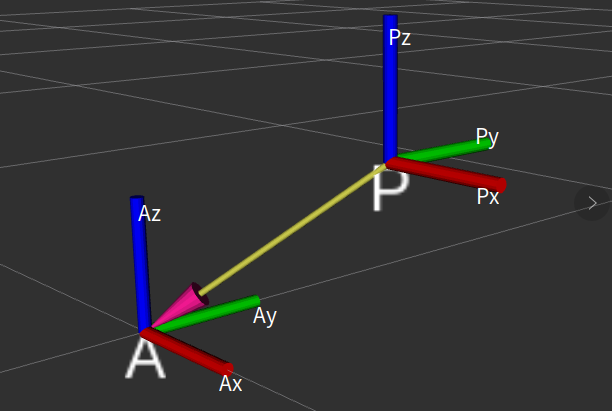
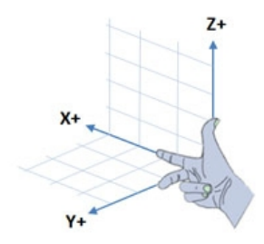
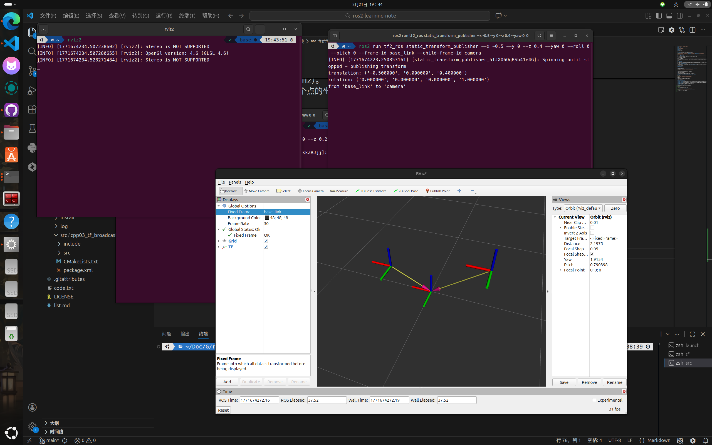
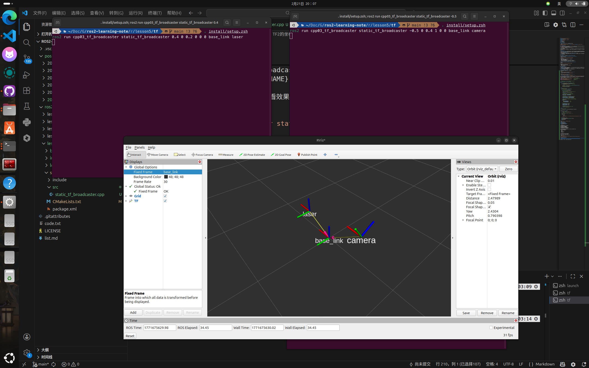
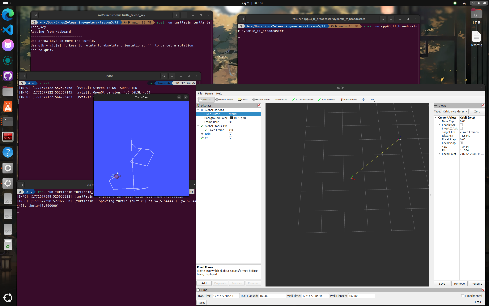
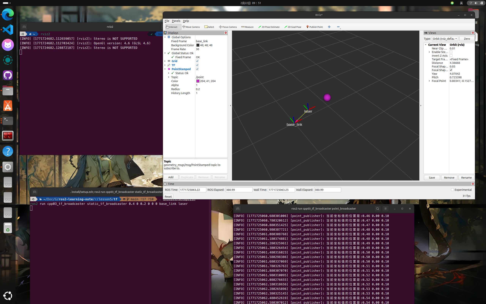
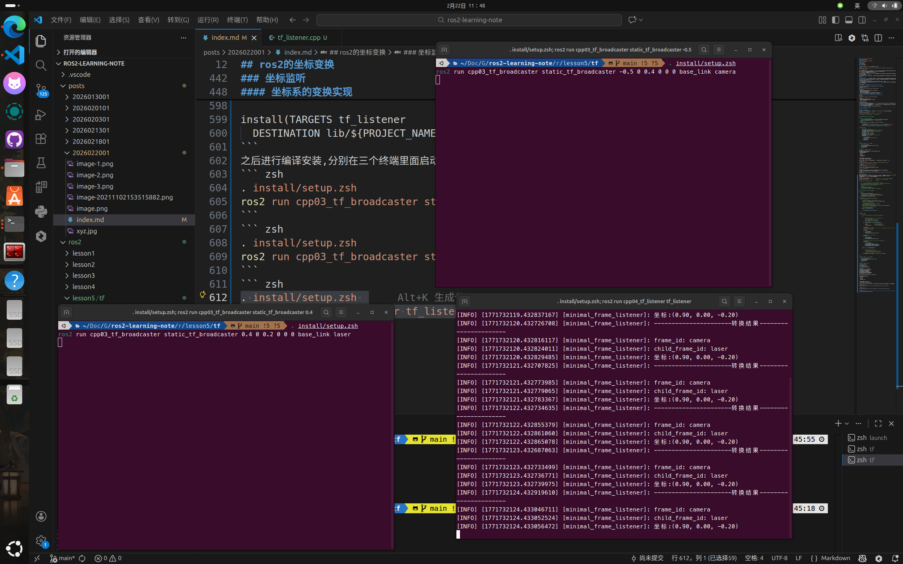
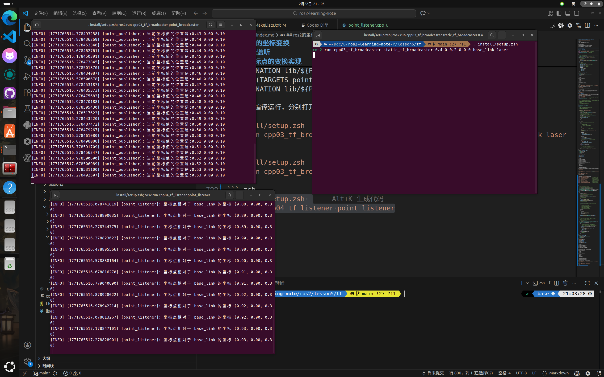
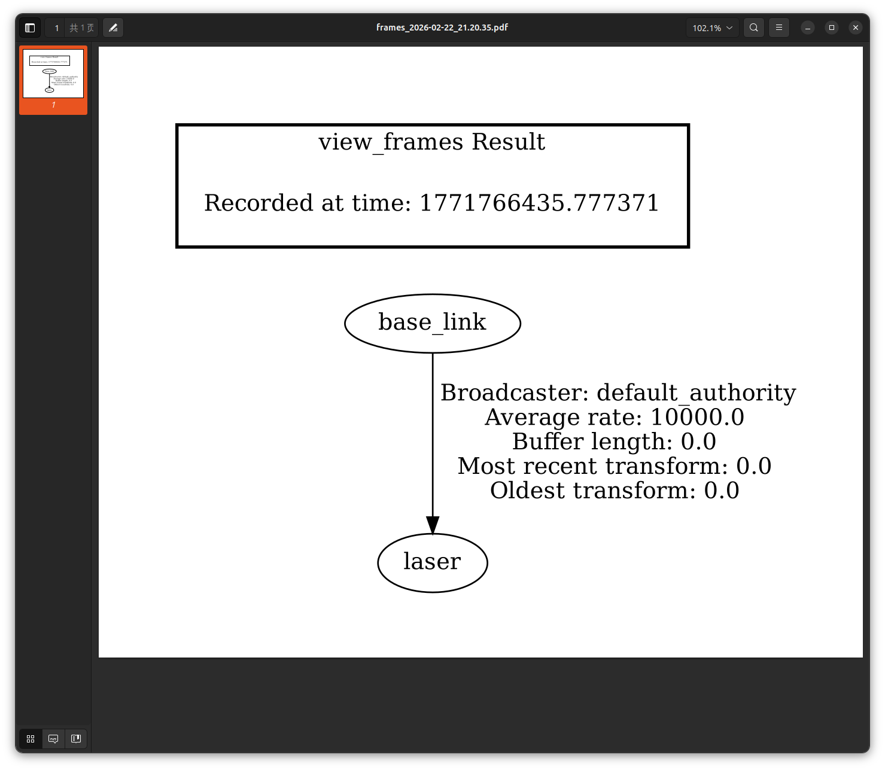

## ros2的坐标变换
**前置准备**：创建好工作空间，使用下面命令创建好工具包
``` bash
ros2 pkg create cpp03_tf_broadcaster --build-type ament_cmake --dependencies rclcpp tf2 tf2_ros geometry_msgs turtlesim
```
### 为什么需要坐标变换
在机器人系统中，不同传感器/部件看到的坐标，都是“以自己为参考系”表达的，不能直接当成“以底盘/机械臂/世界坐标系”为参考的坐标使用，必须做坐标变换。坐标变换是机器人多传感器、多部件协同的基础。  

- 场景 1：雷达坐标 → 底盘坐标
雷达测到障碍物坐标 (x, y, z)，这是“雷达坐标系”下的点。因为雷达相对底盘有偏移（且偏移已知），要把点换算到“底盘坐标系”才能用于导航/避障。
- 场景 2：摄像头坐标 → 夹爪坐标
摄像头识别到目标点 (x, y, z)，但真正执行抓取的是机械臂夹爪。要抓取就必须把目标点变到“夹爪坐标系”或机械臂规划所用的参考系。

### TF2的坐标变换
**TF2（TransForm Frame2）**是ROS2的坐标变换库，使用它可以很方便地实现坐标变换。单词后面的frame代表它可以随时间跟踪多个坐标系，相当于不断更新的、带时间戳的坐标关系数据库 + 查询变换的 API。TF2的坐标系使用右手坐标系完成。  

TF2 会维护一棵**坐标树（tree）**：
- 广播方：发布两个坐标之间的相对关系。谁是父、谁是子、平移多少、旋转多少。  
- 监听方：把来自多个广播方的关系融合成一棵树 **（只有一个根坐标系）**，并支持任意两个坐标系之间的变换、坐标点/向量在不同坐标系之间的变换。  

#### TF2的消息类型
TF2 本质上仍是基于话题通信的**发布-订阅模型：消息是数据载体**。  

##### geometry_msgs/msg/TransformStamped（描述“坐标系与坐标系的关系”）
在终端输入命令来查看定义
``` bash
ros2 interface show geometry_msgs/msg/TransformStamped
```
它的核心语义是：
- header.stamp：时间戳（表示这条关系在什么时刻成立）
- header.frame_id：父级坐标系
- child_frame_id：子级坐标系
- transform.translation：子坐标系原点相对父坐标系的平移（x,y,z）
- transform.rotation：子坐标系相对父坐标系的旋转（四元数）

##### geometry_msgs/msg/PointStamped（描述“某个坐标系下的一个点”）
查看定义
``` bash
ros2 interface show geometry_msgs/msg/PointStamped
```
核心字段：
- header.stamp：该点对应的时间戳
- header.frame_id：该点是在哪个坐标系里表达的
- point.x/y/z：点坐标  

#### TF2的静态和动态广播：
坐标系相对关系分两类：
- **静态坐标系关系**：相对位置固定不变，常见于：雷达固定装在底盘上、摄像头固定装在机身上。这种关系通常只要发布一次（或用静态发布器持续发布但不随时间变化）。 
- **动态坐标系关系**：相对关系会变化，常见于：机械臂关节、夹爪在动、多车编队不同车之间相对位置在变化。动态关系往往需要周期性发布（例如 30Hz / 50Hz）。
- **点坐标系**：可以发布一个点的坐标系，例如一个点状障碍物。  

#### 静态广播的命令行和代码实现
命令行可以快速广播静态的坐标关系，使用语法如下：
``` bash
# 欧拉角
ros2 run tf2_ros static_transform_publisher --x x --y y --z z \
  --yaw yaw --pitch pitch --roll roll \
  --frame-id frame_id --child-frame-id child_frame_id

# 四元数
ros2 run tf2_ros static_transform_publisher --x x --y y --z z \
  --qx qx --qy qy --qz qz --qw qw \
  --frame-id frame_id --child-frame-id child_frame_id
```
之后使用**rviz2**查看坐标系之间的关系，使用上面的命令发布三个节点`base link`、`laser`、`camera`，然后在rviz2中查看坐标系之间的关系。fixed_frame选择根坐标系`base_link`，然后打开`TF`，可以看到三个坐标系之间的关系。

同样也可以使用cpp代码来实现同样的功能。在src新建`static_tf_broadcaster.cpp`。  
``` cpp
#include <geometry_msgs/msg/transform_stamped.hpp>      // TransformStamped 消息类型
#include <rclcpp/rclcpp.hpp>                            // ROS2 C++ 客户端库
#include <tf2/LinearMath/Quaternion.h>                  // 四元数工具
#include <tf2_ros/static_transform_broadcaster.h>       // 静态 TF 广播器


// 参数输入格式：x y z roll pitch yaw frame_id child_frame_id
class StaticBroadcaster : public rclcpp::Node
{
public:
    // transformation 实际上传进来的是 argv（命令行参数数组）
    explicit StaticBroadcaster(char **transformation)
        : rclcpp::Node("StaticBroadcaster")   // 初始化节点名称
    {
        // 创建静态 TF 发布器
        tf_publisher = std::make_shared<tf2_ros::StaticTransformBroadcaster>(this);

        // 组织并发布 TransformStamped 消息
        make_transforms(transformation);
    }

private:
    // 组织并发布坐标变换消息
    void make_transforms(char * transformation[])
    {
        // 创建 TransformStamped 消息对象
        geometry_msgs::msg::TransformStamped t;

        // 填充 header（时间戳）
        // 静态 TF 理论上时间戳影响不大，但通常仍会设置成当前时间
        t.header.stamp = this->get_clock()->now();

        // 填充父子坐标系名字
        // transformation[7] 对应 frame_id（父坐标系）
        // transformation[8] 对应 child_frame_id（子坐标系）
        t.header.frame_id = transformation[7];
        t.child_frame_id  = transformation[8];

        // 填充平移（xyz）
        // transformation[1..3] 是字符串，需要转成 double(atof)
        t.transform.translation.x = atof(transformation[1]);
        t.transform.translation.y = atof(transformation[2]);
        t.transform.translation.z = atof(transformation[3]);

        // 填充旋转：roll/pitch/yaw(欧拉角) -> quaternion(四元数)
        // transformation[4..6] 分别是 roll pitch yaw 单位通常是弧度
        tf2::Quaternion q;
        q.setRPY
        (
            atof(transformation[4]),   // roll
            atof(transformation[5]),   // pitch
            atof(transformation[6])    // yaw
        );

        // 将四元数写入 TransformStamped
        t.transform.rotation.x = q.x();
        t.transform.rotation.y = q.y();
        t.transform.rotation.z = q.z();
        t.transform.rotation.w = q.w();

        // 发布静态 TF
        // StaticTransformBroadcaster 只需发布一次即可
        tf_publisher->sendTransform(t);
    }

private:
    // 静态 TF 发布器指针
    std::shared_ptr<tf2_ros::StaticTransformBroadcaster> tf_publisher;
};

int main(int argc, char **argv)
{
    // 创建 logger,打印日志
    auto logger = rclcpp::get_logger("logger");

    // 检查参数数量
    // argc 包含 argv[0]（程序名），所以需要 1 + 8 = 9
    if (argc != 9)
    {
        RCLCPP_INFO
        (
            logger,
            "运行程序时请按照 x y z roll pitch yaw frame_id child_frame_id 的格式传入参数"
        );
        return 1;
    }
    rclcpp::init(argc, argv);
    auto node = std::make_shared<StaticBroadcaster>(argv);
    rclcpp::spin(node);
    rclcpp::shutdown();
    return 0;
}
```
之后修改`package.xml`和``CMakeLists.txt`。
``` xml
<depend>rclcpp</depend>
<depend>tf2</depend>
<depend>tf2_ros</depend>
<depend>geometry_msgs</depend>
<depend>turtlesim</depend>
```
``` cmake
# find dependencies
find_package(ament_cmake REQUIRED)
find_package(rclcpp REQUIRED)
find_package(tf2 REQUIRED)
find_package(tf2_ros REQUIRED)
find_package(geometry_msgs REQUIRED)
find_package(turtlesim REQUIRED)

add_executable(static_tf_broadcaster src/static_tf_broadcaster.cpp)
ament_target_dependencies(
  static_tf_broadcaster
  "rclcpp"
  "tf2"
  "tf2_ros"
  "geometry_msgs"
  "turtlesim"
)

install(TARGETS static_tf_broadcaster
  DESTINATION lib/${PROJECT_NAME})
```
之后可以在终端运行，导入运行参数看看效果
``` bash
. install/setup.bash 
ros2 run cpp03_tf_broadcaster static_tf_broadcaster 0.4 0 0.2 0 0 0 base_link laser
```
另起一个终端，输入以下内容
``` bash
. install/setup.bash 
ros2 run cpp03_tf_broadcaster static_tf_broadcaster -0.5 0 0.4 1 0 0 base_link camera
```
跟上面命令行一样，打开rviz2工具也可以查看效果。


#### 动态广播的代码实现
这里拿订阅小乌龟的位置来实现动态广播的本质就是不断更新 `child` 在 `parent` 中的位姿。大体思路如下
1. 订阅turtle的pose姿态
2. 在回调函数里面更新
3. 使用一个广播器持续发布坐标信息
新建一个`dynamic_tf_broadcaster.cpp`文件，输入下面代码
``` cpp
#include <geometry_msgs/msg/transform_stamped.hpp>      // TF 变换消息 TransformStamped
#include <rclcpp/rclcpp.hpp>                           
#include <tf2/LinearMath/Quaternion.h>                  // 四元数工具
#include <tf2_ros/transform_broadcaster.h>              // 动态 TF 广播器 TransformBroadcaster
#include <turtlesim/msg/pose.hpp>                       // turtlesim 的位姿消息 Pose

using std::placeholders::_1;

class DynamicFrameBroadcaster : public rclcpp::Node
{
private:
    // 订阅者：订阅 /turtle1/pose
    rclcpp::Subscription<turtlesim::msg::Pose>::SharedPtr subscription;

    // 动态 TF 广播器：负责向 /tf 话题发布 TF 变换
    std::unique_ptr<tf2_ros::TransformBroadcaster> tf_broadcaster;

public:
    DynamicFrameBroadcaster() : rclcpp::Node("DynamicFrameBroadcaster")
    {
        // 创建动态 TF 广播器
        // 注意 TransformBroadcaster 需要 Node 的接口，因此这里传入 *this
        tf_broadcaster = std::make_unique<tf2_ros::TransformBroadcaster>(*this);

        // 指定订阅的话题名称：turtlesim 乌龟位姿
        std::string topic_name = "/turtle1/pose";

        // 创建订阅者
        // 消息类型：turtlesim::msg::Pose
        // QoS：队列深度 10
        // 回调函数：handle_turtle_pose
        subscription = this->create_subscription<turtlesim::msg::Pose>(
            topic_name,
            10,
            std::bind
            (
                &DynamicFrameBroadcaster::handle_turtle_pose,
                this,
                _1
            )
        );
    }

private:
    /*
        回调函数：每当订阅到 /turtle1/pose 的一条消息，就会进入这里
        msg 内容（turtlesim::msg::Pose）常用字段：
        - msg.x, msg.y: 乌龟在世界坐标系下的位置（2D）
        - msg.theta: 乌龟朝向角（绕 Z 轴的旋转，单位是弧度）
        - msg.linear_velocity / msg.angular_velocity：速度信息
    */
    void handle_turtle_pose(const turtlesim::msg::Pose& msg)
    {
        // 创建 TransformStamped 消息（标准 TF 变换载体）
        geometry_msgs::msg::TransformStamped t;

        // 填充时间戳
        // 时间戳用于 TF 缓冲区做时间同步（例如配合传感器数据）
        t.header.stamp = this->get_clock()->now();

        // 设置父坐标系与子坐标系名字
        // 这里的意思是：
        // turtle1 坐标系相对于世界坐标系的位姿
        t.header.frame_id = "world";   // 父坐标系
        t.child_frame_id  = "turtle1"; // 子坐标系

        // 设置平移（translation）
        // turtlesim 是 2D，所以 z 固定为 0
        t.transform.translation.x = msg.x;
        t.transform.translation.y = msg.y;
        t.transform.translation.z = 0.0;

        // 设置旋转（rotation）
        // TF 中旋转必须使用四元数表示
        // turtlesim 的 theta 是绕 Z 轴旋转的 yaw
        tf2::Quaternion q;
        q.setRPY
        (
            0.0,        // roll  绕 X 轴
            0.0,        // pitch 绕 Y 轴
            msg.theta   // yaw   绕 Z 轴
        );

        // 把四元数写入 TransformStamped
        t.transform.rotation.x = q.x();
        t.transform.rotation.y = q.y();
        t.transform.rotation.z = q.z();
        t.transform.rotation.w = q.w();

        // 发布 TF 变换
        // 动态 TF：每次回调都发送一次，使 TF 实时更新
        tf_broadcaster->sendTransform(t);
    }
};

int main(int argc, char ** argv)
{
    rclcpp::init(argc, argv);
    auto node = std::make_shared<DynamicFrameBroadcaster>();
    rclcpp::spin(node);
    rclcpp::shutdown();
    return 0;
}
```
在`CMakeLists.txt`文件中添加依赖
``` cmake
add_executable(dynamic_tf_broadcaster src/dynamic_tf_broadcaster.cpp)
ament_target_dependencies(
  dynamic_tf_broadcaster
  "rclcpp"
  "tf2"
  "tf2_ros"
  "geometry_msgs"
  "turtlesim"
)

install(TARGETS dynamic_tf_broadcaster
  dynamic_tf_broadcaster
  DESTINATION lib/${PROJECT_NAME})
```
之后编译运行功能包，同时乌龟节点和乌龟控制节点。  
``` bash
ros2 run turtlesim turtlesim_node
```
另开一个终端
``` bash
ros2 run turtlesim turtle_teleop_key
```
之后运行自己的cpp
``` bash
. install/setup.bash 
ros2 run cpp03_tf_broadcaster dynamic_tf_broadcaster
```


####  坐标点广播的代码实现
这里实现发布一个点并且不断更新坐标为例子，新建一个`point_broadcaster.cpp`文件，输入下面代码
``` cpp
#include "rclcpp/rclcpp.hpp"
#include "geometry_msgs/msg/point_stamped.hpp"  // 坐标点消息类型

using namespace std::chrono_literals;  // 使用时间字面量


class PointPublisher: public rclcpp::Node 
{
private:
    // 创建座标点发布消息的共享指针
    rclcpp::Publisher<geometry_msgs::msg::PointStamped>::SharedPtr point_pubisher;  
    rclcpp::TimerBase::SharedPtr timer;  // 创建共享指针的计时器
    double_t x;  // x坐标
public:
    PointPublisher(double init_x): Node("point_publisher"),x(init_x)
    {
        // 创建坐标点发布方
        point_pubisher = this->create_publisher<geometry_msgs::msg::PointStamped>("point",10);
        // 创建定时器
        timer = this->create_wall_timer(0.1s,std::bind(&PointPublisher::on_timer, this));
    }
private:
    void on_timer()
    {
        // 组织并发布坐标点消息。
        geometry_msgs::msg::PointStamped point;  // 创建坐标点消息戳
        point.header.frame_id = "laser";  // 设置坐标系id
        point.header.stamp = this->now();  // 设置当前的时间戳
        x += 0.004;  // 更新坐标值
        point.point.x = x;  // 更新新的坐标值
        point.point.y = 0.0;  // 固定y不变
        point.point.z = 0.1;  // 更新y的值
        point_pubisher->publish(point);  // 发布坐标值消息
        RCLCPP_INFO
        (
            this->get_logger(),
            "当前坐标值的位置是:%.2lf %.2lf %.2lf",
            point.point.x,
            point.point.y,
            point.point.z
        );
    }
};

int main(int argc, char const **argv)
{
    rclcpp::init(argc,argv);
    auto node = std::make_shared<PointPublisher>(0.14);
    rclcpp::spin(node);
    rclcpp::shutdown();
    return 0;
}
```
在`CMakeLists.txt`文件中添加依赖
``` cmake
add_executable(point_broadcaster src/point_broadcaster.cpp)
ament_target_dependencies(
  point_broadcaster
  "rclcpp"
  "tf2"
  "tf2_ros"
  "geometry_msgs"
  "turtlesim"
)

install(TARGETS point_broadcaster
  DESTINATION lib/${PROJECT_NAME})
```
之后进行编译运行，同样使用rviz2来可视化效果，第一个终端发布底盘和雷达的静态坐标广播。
``` bash
. install/setup.bash 
ros2 run cpp03_tf_broadcaster static_tf_broadcaster 0.4 0 0.2 0 0 0 base_link laser
```
另一个终端发布障碍物坐标点相对雷达坐标系的广播。
``` bash
. install/setup.bash 
ros2 run cpp03_tf_broadcaster point_broadcaster
```
在rviz2中，添加 PointStamped 并将其话题设置为 /point。  


### 坐标监听
通过对坐标监听可以实现坐标点在不同的坐标系之间的变换，或者不同坐标系之间的变换。  
接下来创建坐标监听的功能包，在工作空间的src目录下新建
``` bash
ros2 pkg create cpp04_tf_listener --build-type ament_cmake --dependencies rclcpp tf2 tf2_ros geometry_msgs
```
#### 坐标系的变换实现
上面创建了三个不同的坐标系，分别是`base link`、`laser`和`point`，而后面两个坐标系都是相对于`base link`坐标系的，如果我想要直到`laser`和`point`两个坐标系之间的相对关系，就需要使用相关的api进行求解。   
在功能包下面新建`tf_listener.cpp`文件，输入下面代码
``` cpp
#include "rclcpp/rclcpp.hpp"              
#include "tf2_ros/transform_listener.h"      // TF 监听器：用于订阅 /tf /tf_static 并填充缓冲器
#include "tf2_ros/buffer.h"                  // TF Buffer：用于存储和查询坐标变换

using namespace std::chrono_literals;        // 字面量

/*
    创建一个 TF2 Buffer（缓存器），用于存储所有接收到的 TF 变换数据
    创建一个 TransformListener（监听器），自动订阅 /tf 和 /tf_static，并把数据写进 Buffer
    每隔 1 秒查询一次 camera <- laser 的变换关系（lookupTransform）
    查询成功则打印变换结果；失败则捕获异常并打印原因

    关键理解：
    - Buffer：保存 TF 变换的“数据库”
    - Listener：负责“监听并喂数据给 Buffer”
    - lookupTransform：从 Buffer 里“查”指定两坐标系之间的变换
*/

class FrameListener : public rclcpp::Node
{
private:
    // 定时器
    rclcpp::TimerBase::SharedPtr timer;
    // TF 监听器：订阅 /tf /tf_static，并将数据写入 buffer
    std::shared_ptr<tf2_ros::TransformListener> transform_listener;
    // TF Buffer：保存并提供 TF 查询能力
    std::unique_ptr<tf2_ros::Buffer> tf_buffer;

public:
    FrameListener() : Node("minimal_frame_listener")
    {
        // 创建 TF 缓存
        // Buffer 需要一个时钟，用于处理时间戳相关的 TF 查询
        tf_buffer = std::make_unique<tf2_ros::Buffer>(this->get_clock());

        // 创建 TF 监听器 TransformListener
        // TransformListener 会自动订阅 /tf 和 /tf_static，
        // 并把收到的变换数据写入 tf_buffer
        // 这里传入 *tf_buffer 表示监听器操作同一个 buffer
        transform_listener = std::make_shared<tf2_ros::TransformListener>(*tf_buffer);

        // 创建定时器 每 1 秒触发一次 on_timer()
        // 周期性查询并打印坐标变换结果
        timer = this->create_wall_timer
        (
            1s,
            std::bind(&FrameListener::on_timer, this)
        );
    }

private:
    void on_timer()
    {
        // 用try catch,catch捕获到抛出的异常之后进入到catch函数处理
        try
        {
            /*
                lookupTransform(target_frame, source_frame, time)
                返回的 transform 表示
                source_frame（laser）坐标系中的点/姿态，
                转换到 target_frame（camera）坐标系下
                换句话说：得到 laser -> camera 的变换
            */
            auto transformStamped = tf_buffer->lookupTransform
            (
                "camera",                // target frame：目标坐标系
                "laser",                 // source frame：源坐标系
                tf2::TimePointZero       // 时间：0 表示最新可用的变换
            );

            // 打印查询结果
            RCLCPP_INFO(this->get_logger(), "----------------------转换结果----------------------");

            // frame_id 是 target frame
            RCLCPP_INFO
            (
                this->get_logger(),
                "frame_id: %s",
                transformStamped.header.frame_id.c_str()
            );

            // child_frame_id 是 source frame
            RCLCPP_INFO
            (
                this->get_logger(),
                "child_frame_id: %s",
                transformStamped.child_frame_id.c_str()
            );

            // 打印平移向量（laser 坐标系原点在 camera 坐标系下的位置）
            RCLCPP_INFO
            (
                this->get_logger(),
                "坐标:(%.2f, %.2f, %.2f)",
                transformStamped.transform.translation.x,
                transformStamped.transform.translation.y,
                transformStamped.transform.translation.z
            );
        }
        catch (const tf2::LookupException &e)
        {
            /*
                LookupException 常见原因：
                - TF 树里根本没有 camera 或 laser
                - camera 和 laser 不在同一棵 TF 树（无连接关系）
                - TF 数据还没来得及接收（节点刚启动时常见）
            */
            RCLCPP_ERROR(this->get_logger(), "坐标变换异常：%s", e.what());
        }
    }
};

int main(int argc, char const *argv[])
{
    rclcpp::init(argc, argv);
    auto node = std::make_shared<FrameListener>();
    rclcpp::spin(node);
    rclcpp::shutdown();
    return 0;
}
```
`package.xml`文件中添加依赖
``` xml
<depend>rclcpp</depend>
<depend>tf2</depend>
<depend>tf2_ros</depend>
<depend>geometry_msgs</depend>
```
之后配置`CMakeLists.txt`文件
``` cmake
find_package(ament_cmake REQUIRED)
find_package(rclcpp REQUIRED)
find_package(tf2 REQUIRED)
find_package(tf2_ros REQUIRED)
find_package(geometry_msgs REQUIRED)
find_package(turtlesim REQUIRED)

add_executable(tf_listener src/tf_listener.cpp)

ament_target_dependencies(
  tf_listener
  "rclcpp"
  "tf2"
  "tf2_ros"
  "geometry_msgs"
)

install(TARGETS tf_listener
  DESTINATION lib/${PROJECT_NAME})
```
之后进行编译安装,分别在三个终端里面启动雷达相对底盘的坐标信息、摄像头相对底盘的数据和坐标系的变换。  
``` zsh
. install/setup.zsh
ros2 run cpp03_tf_broadcaster static_tf_broadcaster 0.4 0 0.2 0 0 0 base_link laser
```
``` zsh
. install/setup.zsh
ros2 run cpp03_tf_broadcaster static_tf_broadcaster -0.5 0 0.4 0 0 0 base_link camera
```
``` zsh
. install/setup.zsh 
ros2 run cpp04_tf_listener tf_listener
```

运行可以看到，得到了 laser -> camera 的变换，现在是laser 坐标系原点在 camera 坐标系下的位置。  

#### 坐标点的变换实现
在功能包下面新建`point_listener.cpp`文件，输入下面代码
``` cpp
#include <geometry_msgs/msg/point_stamped.hpp>          // PointStamped：带 frame_id + stamp 的点
#include <message_filters/subscriber.h>                 // message_filters 的订阅器
#include <rclcpp/rclcpp.hpp>                            // ROS2 节点/日志/定时器等
#include <tf2_ros/buffer.h>                             // TF2 Buffer：存储/查询/变换
#include <tf2_ros/create_timer_ros.h>                   // CreateTimerROS：给 Buffer 提供定时器接口
#include <tf2_ros/message_filter.h>                     // TF2 MessageFilter：等待 TF 可用后再放行消息
#include <tf2_ros/transform_listener.h>                 // TF2 TransformListener：订阅 /tf /tf_static
#include <tf2_geometry_msgs/tf2_geometry_msgs.hpp>      // 让 tf2_buffer->transform 支持 geometry_msgs 类型

using namespace std::chrono_literals;

class PointListener : public rclcpp::Node
{
private:
    // 目标坐标系（把点转换到这个坐标系下）
    std::string target_frame;
    // TF2 Buffer：缓存 TF 数据，并提供 transform/lookup 接口
    std::shared_ptr<tf2_ros::Buffer> tf2_buffer;
    // TF 监听器：订阅 /tf /tf_static，并把数据写进 buffer
    std::shared_ptr<tf2_ros::TransformListener> tf2_listener;
    // message_filters 订阅器：作为过滤器的输入源
    message_filters::Subscriber<geometry_msgs::msg::PointStamped> point_subscription;
    // TF2 消息过滤器：等待 TF 可用后再触发回调
    std::shared_ptr<tf2_ros::MessageFilter<geometry_msgs::msg::PointStamped>> tf2_filter;
public:
    PointListener() : Node("point_listener")
    {
        // 我们最终把点转换到base link坐标系下
        target_frame = "base_link";

        // buffer_timeout：MessageFilter 等待 TF 可用的超时时间
        using seconds_type = std::chrono::duration<int>;
        seconds_type buffer_timeout(1);

        // 创建 TF2 Buffer
        tf2_buffer = std::make_shared<tf2_ros::Buffer>(this->get_clock());

        // 给缓冲器设置定时器接口
        auto timer_interface = std::make_shared<tf2_ros::CreateTimerROS>
        (
            this->get_node_base_interface(),
            this->get_node_timers_interface()
        );
        tf2_buffer->setCreateTimerInterface(timer_interface);

        // 创建 TF2 TransformListener
        tf2_listener = std::make_shared<tf2_ros::TransformListener>(*tf2_buffer);

        // 创建 message_filters 的订阅器，并订阅 "point" 话题
        // 它是为了配合 filter（MessageFilter/TimeSynchronizer 等）使用的。
        point_subscription.subscribe(this, "point");

        /*
            参数解释：
            - point_subscrition_：输入订阅源
            - *tf2_buffer_：用哪个 TF 缓存来判断/执行变换
            - target_frame：目标坐标系（base_link）
            - 100：队列大小（缓存待处理消息数量，TF 未就绪时先排队）
            - logging_interface：用于输出日志
            - clock_interface：用于时间相关处理
            - buffer_timeout：等待 TF 的超时时间
        */
        tf2_filter = std::make_shared<tf2_ros::MessageFilter<geometry_msgs::msg::PointStamped>>
        (
            point_subscription,
            *tf2_buffer,
            target_frame,
            100,
            this->get_node_logging_interface(),
            this->get_node_clock_interface(),
            buffer_timeout
        );

        // 当消息通过过滤器后，会调用 msgCallback
        tf2_filter->registerCallback(&PointListener::msgCallback, this);
    }

private:
    /*
        当且仅当 MessageFilter 判定满足以下条件时，才会调用这里：
        - 已存在 point_ptr->header.frame_id 到 target_frame 的 TF 变换链
        - 且该变换对 point_ptr->header.stamp（时间戳）可用
        point_ptr 是 PointStamped 的 shared_ptr：
        - header.frame_id：点当前所在的坐标系（例如 "laser"）
        - header.stamp：点的时间戳
        - point：点的 xyz
    */
    void msgCallback(const geometry_msgs::msg::PointStamped::SharedPtr point_ptr)
    {
        geometry_msgs::msg::PointStamped point_out;
        try
        {
            /*
                把输入点 *point_ptr 从它自己的 frame_id（例如 laser）
                转换到 target_frame（base_link）下，输出到 point_out
                point_out.header.frame_id 将会变成 target_frame（base_link）
            */
            tf2_buffer->transform(*point_ptr, point_out, target_frame);

            RCLCPP_INFO
            (
                this->get_logger(),
                "坐标点相对于 base_link 的坐标:(%.2f, %.2f, %.2f)",
                point_out.point.x,
                point_out.point.y,
                point_out.point.z
            );
        }
        catch (tf2::TransformException & ex)
        {
            //跟之前捕获异常一样
            RCLCPP_ERROR(this->get_logger(), "处理坐标异常 %s", ex.what());
        }
    }
};

int main(int argc, char ** argv)
{
    rclcpp::init(argc, argv);
    auto node = std::make_shared<PointListener>();
    rclcpp::spin(node);
    rclcpp::shutdown();
    return 0;
}
```
在`package.xml`文件中添加依赖
``` xml
<depend>rclcpp</depend>
<depend>tf2</depend>
<depend>tf2_ros</depend>
<depend>geometry_msgs</depend>
<depend>tf2_geometry_msgs</depend>
<depend>message_filters</depend>
```
同时在`CMakeLists.txt`文件中添加依赖
``` cmake
# find dependencies
find_package(ament_cmake REQUIRED)
find_package(rclcpp REQUIRED)
find_package(tf2 REQUIRED)
find_package(tf2_ros REQUIRED)
find_package(tf2_geometry_msgs REQUIRED)
find_package(geometry_msgs REQUIRED)
find_package(turtlesim REQUIRED)

add_executable(tf_listener src/tf_listener.cpp)
add_executable(point_listener src/point_listener.cpp)

ament_target_dependencies(
  tf_listener
  "rclcpp"
  "tf2"
  "tf2_ros"
  "geometry_msgs"
)
ament_target_dependencies(
  point_listener
  "rclcpp"
  "tf2"
  "tf2_ros"
  "tf2_geometry_msgs"
  "geometry_msgs"
)

install(TARGETS tf_listener
  DESTINATION lib/${PROJECT_NAME})
install(TARGETS point_listener
  DESTINATION lib/${PROJECT_NAME})
```
之后进行编译运行，分别打开三个终端，运行下面的代码
``` zsh
. install/setup.zsh
ros2 run cpp03_tf_broadcaster static_tf_broadcaster 0.4 0 0.2 0 0 0 base_link laser
```
``` zsh
. install/setup.zsh 
ros2 run cpp03_tf_broadcaster point_broadcaster
```
``` zsh
. install/setup.zsh 
ros2 run cpp04_tf_listener point_listener
```


### TF2的相关调试工具
ros2中提供了一套强大的工具来辅助开发，接下来一一演示工具集。  

#### tf2 monitor
可以看频率和延迟
``` bash
ros2 run tf2_ros tf2_monitor
```
只看指定frame
``` bash
ros2 run tf2_ros tf2_monitor camera laser
```
**用途：动态 TF 抖动、频率异常、延迟大时先用它定位。**

#### tf2 echo
可以看实时变换的结果，怀疑父子写反、平移方向不对、旋转不对时，可以用它来验证。
``` bash
ros2 run tf2_ros tf2_echo base_link laser

# 反馈结果
- Translation: [0.400, 0.000, 0.200]
- Rotation: in Quaternion (xyzw) [0.000, 0.000, 0.000, 1.000]
- Rotation: in RPY (radian) [0.000, -0.000, 0.000]
- Rotation: in RPY (degree) [0.000, -0.000, 0.000]
- Matrix:
  1.000  0.000  0.000  0.400
  0.000  1.000  0.000  0.000
  0.000  0.000  1.000  0.200
  0.000  0.000  0.000  1.000
```

#### tf2 view_frames
可以生成tf树的结构，看TF树是否连通、是否出现多根、是否缺边等等
``` bash
ros2 run tf2_tools view_frames
```
