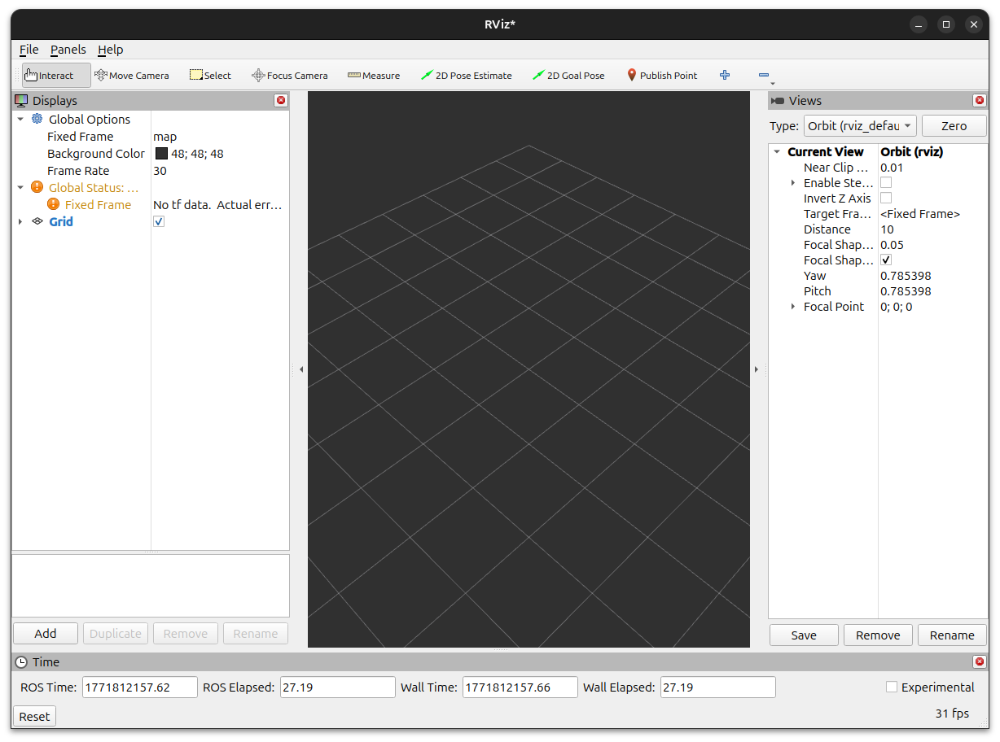
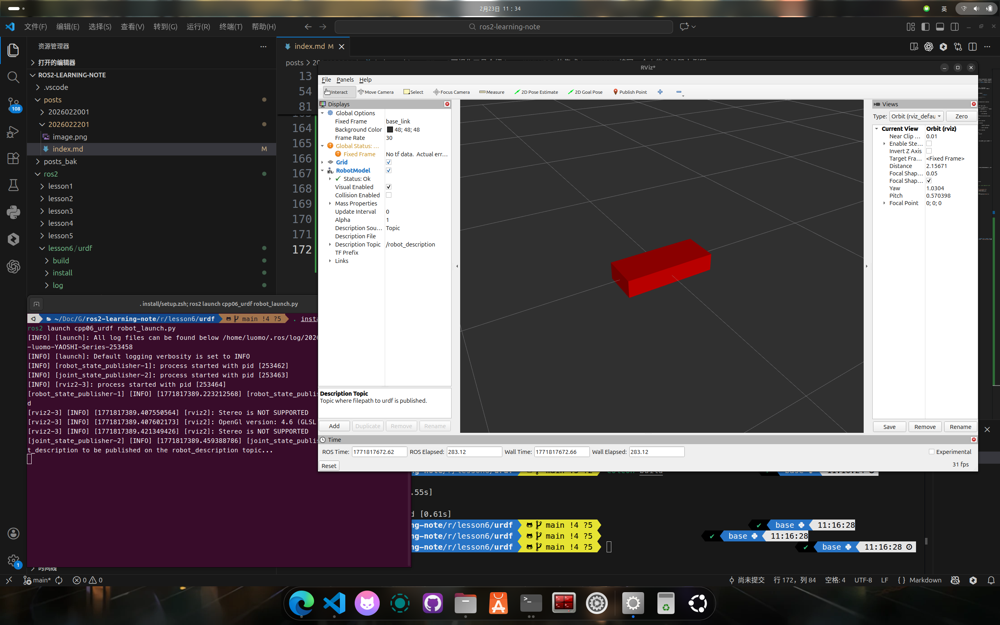
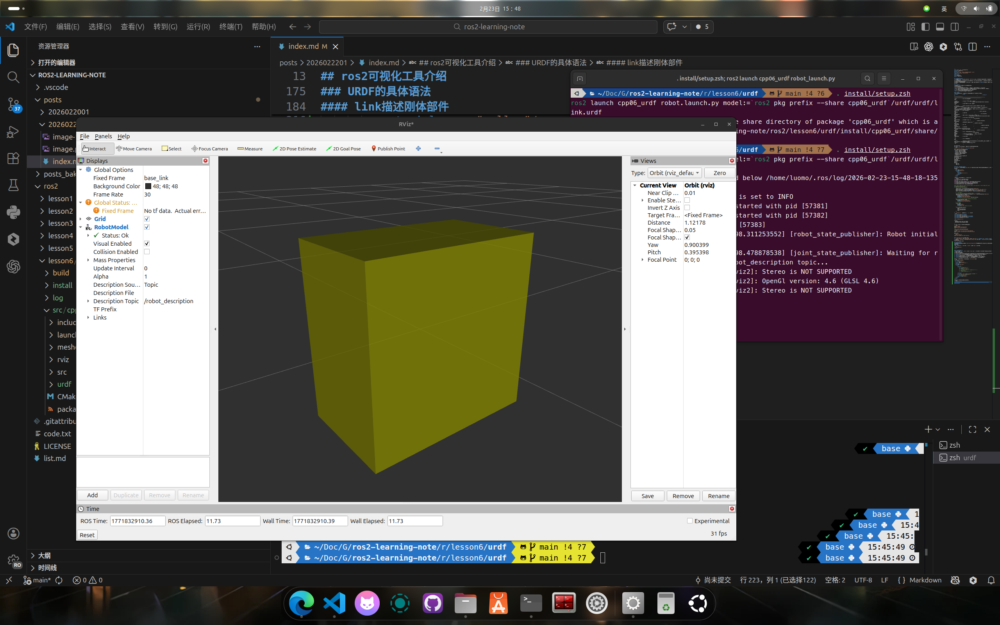
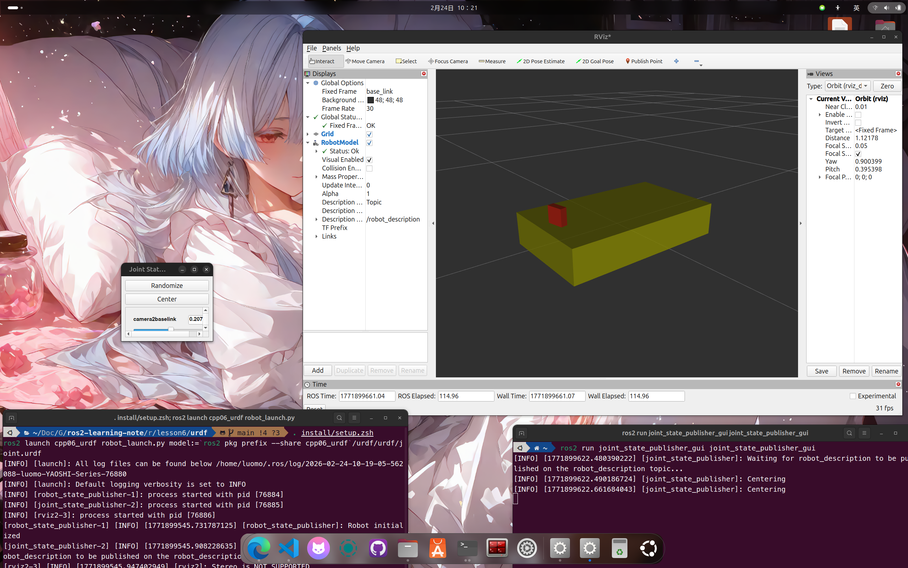
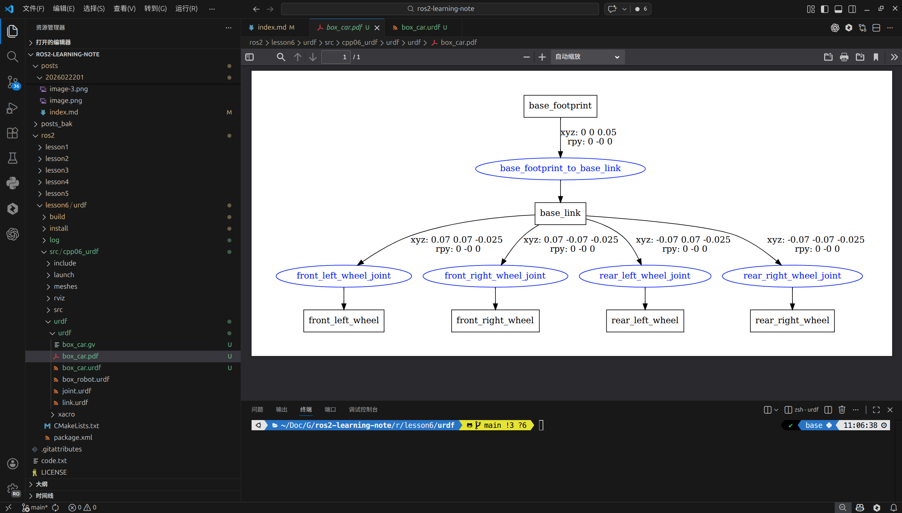
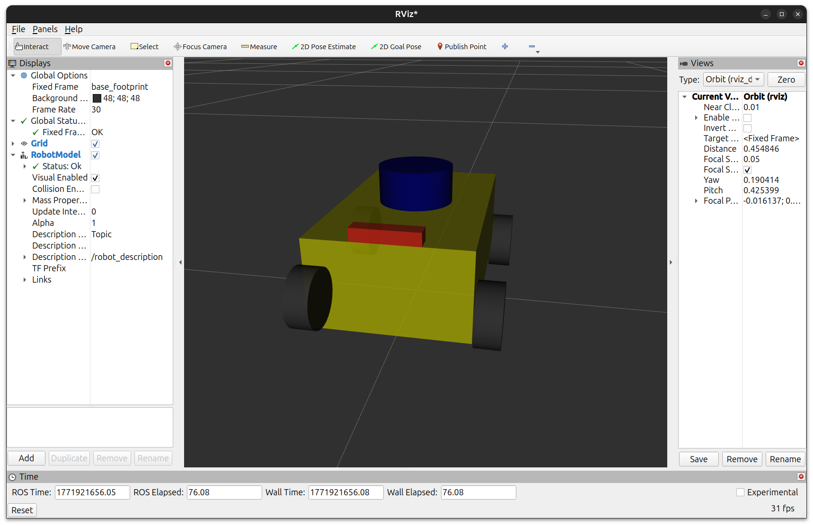

## ros2可视化工具介绍
在ros2系统中，离不开人机交互，但是如果所有东西都是用命令行，那么可视程度就会大大降低，因此需要图形化界面来辅助开发调试交互。
ros2中提供了rqt、rviz2等可视化工具，这里重点介绍一下rviz2。它可以将数据进行可视化表达。例如机器人模型、激光雷达数据、三维点云数据等等。
机器人建模也是可视化很重要的一部分，ros2中使用统一的机器人描述格式**URDF**，它可以以一种xml格式来存储机器人的结构。

### rviz2的使用
在终端输入`rviz2`，即可启动rviz2可视化工具。
rviz2的界面如下：

1. 上部为工具栏：包括视角控制、预估位姿设置、目标设置等，还可以添加自定义插件；
2. 左侧为插件显示区：包括添加、删除、复制、重命名插件，显示插件，以及设置插件属性等功能；
3. 中间为3D视图显示区：以可视化的方式显示添加的插件信息；
4. 右侧为观测视角设置区：可以设置不同的观测视角；
5. 下侧为时间显示区：包括系统时间和ROS时间。

#### 插件介绍
rviz2中已经预定义了一些插件，这些插件名称、功能以及订阅的消息类型如下：
| **名称**          | **功能**                                                                     | **消息类型**                                                        |
| :---------------- | :--------------------------------------------------------------------------- | :------------------------------------------------------------------ |
| Axes              | 显示 rviz2 默认的坐标系。                                                    |                                                                     |
| Camera            | 显示相机图像，必须需要使用消息：CameraInfo。                                 | sensor\_msgs/msg/Image，sensor\_msgs/msg/CameraInfo                 |
| Grid              | 显示以参考坐标系原点为中心的网格。                                           |                                                                     |
| Grid Cells        | 从网格中绘制单元格，通常是导航堆栈中成本地图中的障碍物。                     | nav\_msgs/msg/GridCells                                             |
| Image             | 显示相机图像，但是和Camera插件不同，它不需要使用 CameraInfo 消息。           | sensor\_msgs/msg/Image                                              |
| InteractiveMarker | 显示来自一个或多个交互式标记服务器的 3D 对象，并允许与它们进行鼠标交互。     | visualization\_msgs/msg/InteractiveMarker                           |
| Laser Scan        | 显示激光雷达数据。                                                           | sensor\_msgs/msg/LaserScan                                          |
| Map               | 显示地图数据。                                                               | nav\_msgs/msg/OccupancyGrid                                         |
| Markers           | 允许开发者通过主题显示任意原始形状的几何体。                                 | visualization\_msgs/msg/Marker，visualization\_msgs/msg/MarkerArray |
| Path              | 显示机器人导航中的路径相关数据。                                             | nav\_msgs/msg/Path                                                  |
| PointStamped      | 以小球的形式绘制一个点。                                                     | geometry\_msgs/msg/PointStamped                                     |
| Pose              | 以箭头或坐标轴的方式绘制位姿。                                               | geometry\_msgs/msg/PoseStamped                                      |
| Pose Array        | 绘制一组 Pose。                                                              | geometry\_msgs/msg/PoseArray                                        |
| Point Cloud2      | 绘制点云数据。                                                               | sensor\_msgs/msg/PointCloud，sensor\_msgs/msg/PointCloud2           |
| Polygon           | 将多边形的轮廓绘制为线。                                                     | geometry\_msgs/msg/Polygon                                          |
| Odometry          | 显示随着时间推移累积的里程计消息。                                           | nav\_msgs/msg/Odometry                                              |
| Range             | 显示表示来自声纳或红外距离传感器的距离测量值的圆锥。                         | sensor\_msgs/msg/Range                                              |
| RobotModel        | 显示机器人模型。                                                             |                                                                     |
| TF                | 显示 tf 变换层次结构。                                                       |                                                                     |
| Wrench            | 将geometry\_msgs/WrenchStamped消息显示为表示力的箭头和表示扭矩的箭头加圆圈。 | geometry\_msgs/msg/WrenchStamped                                    |
| Oculus            | 将 RViz 场景渲染到 Oculus 头戴设备。                                         |                                                                     |

### URDF的集成
先进入工作空间src，然后新建一个功能包，在终端输入如下的命令。  
``` bash
ros2 pkg create cpp06_urdf --build-type ament_cmake
```
之后进入功能包，新建下面的文件夹。  
- urdf：用于存储 urdf 文件。
- xacro：用于存储 xacro 文件。
- rviz：用于存储 rviz 文件。
- launch：用于存储 launch 文件。
- meshes：用于存储模型文件。
参考下面的文件树：  
``` tree
ros2/lesson6/urdf/src/cpp06_urdf
├── CMakeLists.txt
├── include
│   └── cpp06_urdf
├── launch
├── meshes
├── package.xml
├── rviz
├── src
└── urdf
    ├── urdf
    └── xacro
```

#### 编写一个火柴盒机器人例程
在``urdf/urdf``文件夹下面新建`box_robot.urdf`文件，然后在文件中编写urdf文件。下面的xml用于描述一个机器人的结构
``` xml
 <robot name="my_robot">
   <link name="base_link">
     <visual>
       <geometry>
         <box size="0.5 0.2 0.1"/>
       </geometry>
     </visual>
   </link>
 </robot>
 ```
 之后新建一个launch文件，用于启动整个机器人
 ``` python
from launch import LaunchDescription
from launch_ros.actions import Node
import os
from ament_index_python.packages import get_package_share_directory
from launch_ros.parameter_descriptions import ParameterValue
from launch.substitutions import Command,LaunchConfiguration
from launch.actions import DeclareLaunchArgument

#ros2 launch cpp06_urdf display.launch.py model:=`ros2 pkg prefix --share cpp06_urdf`/urdf/urdf/demo01_helloworld.urdf
def generate_launch_description():

    cpp06_urdf_dir = get_package_share_directory("cpp06_urdf")
    default_model_path = os.path.join(cpp06_urdf_dir,"urdf/urdf","box_robot.urdf")
    default_rviz_path = os.path.join(cpp06_urdf_dir,"rviz","display.rviz")
    model = DeclareLaunchArgument(name="model", default_value=default_model_path)

    # 加载机器人模型
    # 1.启动 robot_state_publisher 节点并以参数方式加载 urdf 文件
    robot_description = ParameterValue(Command(["xacro ",LaunchConfiguration("model")]))
    robot_state_publisher = Node(
        package="robot_state_publisher",
        executable="robot_state_publisher",
        parameters=[{"robot_description": robot_description}]
    )
    # 2.启动 joint_state_publisher 节点发布非固定关节状态
    joint_state_publisher = Node(
        package="joint_state_publisher",
        executable="joint_state_publisher"
    )
    # rviz2 节点
    rviz2 = Node(
        package="rviz2",
        executable="rviz2"
        # arguments=["-d", default_rviz_path]
    )
    return LaunchDescription([
        model,
        robot_state_publisher,
        joint_state_publisher,
        rviz2
    ])
```
在 ``package.xml`` 中需要手动添加一些执行时依赖
```XML
<exec_depend>rviz2</exec_depend>
<exec_depend>xacro</exec_depend>
<exec_depend>robot_state_publisher</exec_depend>
<exec_depend>joint_state_publisher</exec_depend>
<exec_depend>ros2launch</exec_depend>
```
配置一下`CMakeLists.txt`
```
install(
  DIRECTORY launch urdf rviz meshes
  DESTINATION share/${PROJECT_NAME}  
)
```
当前工作空间下，启动终端，输入如下指令：
``` bash
sudo apt update
sudo apt install ros-jazzy-xacro
source /opt/ros/jazzy/setup.zsh
```
同时进行joint_state_publisher的安装
``` bash
sudo apt install ros-jazzy-joint-state-publisher
sudo apt install ros-jazzy-joint-state-publisher-gui
```
最后进行运行
``` bash
. install/setup.zsh
ros2 launch cpp06_urdf robot_launch.py
```

然后 rviz2 会启动，启动后做如下配置：
1. ``Global Options``中的``Fixed Frame``设置为`base_link`**(和urdf文件中link标签的name一致)**；
2. 左下角添加`RobotModel`插件，并将参数`Description Topic`的值设置为 `/robot_description`，即可显示机器人模型。  


### URDF的具体语法
urdf的编写具体到下面三个模块：`robot`、`link`、`joint`，分别负责了描述机器人信息，机器人的关节还有连接不同的关节。  
#### robot根标签
所有 ``link、joint`` 都必须写在 `<\robot>` 里面，`name` 是模型名。  
``` xml
<robot name="mycar">
</robot>
```

#### link描述刚体部件
每个部件(底盘、雷达......)都是一个link标签，在 link 标签内，可以设计该部件的形状、尺寸、颜色、惯性矩阵、碰撞参数等一系列属性。  
`link` 属性与子标签可以整理为下面这棵树：

```text
<link>
├── 属性
│   └── name (必填): 连杆名称
└── 子标签
    ├── <visual> (可选): link 的可视化属性
    │   ├── name (可选): visual 名称(可用于引用与定位)
    │   ├── <geometry> (必填): 几何形状定义
    │   │   ├── <box>: size 设置长宽高，原点在几何中心
    │   │   ├── <cylinder>: 圆柱体 radius 半径, length 高度，原点在几何中心
    │   │   ├── <sphere>: 球体 radius 半径，原点在几何中心
    │   │   └── <mesh>: filename 引用模型文件(本地文件，常用 package://<packagename>/<path>)
    │   ├── <origin> (可选): visual 相对位姿
    │   │   ├── xyz: 平移偏移(米)，默认 0 0 0
    │   │   └── rpy: 翻滚/俯仰/偏航(弧度)，默认 0 0 0
    │   └── <material> (可选): 材质定义(也可在 robot 根标签定义后按 name 引用)
    │       ├── name (可选): 材质名称
    │       ├── <color> (可选): rgba，范围 [0,1]
    │       └── <texture> (可选): filename 指定纹理
    ├── <collision> (可选): link 的碰撞属性(可有多个实例)
    │   ├── name (可选): collision 名称
    │   ├── <geometry> (必填): 用法同 visual/geometry
    │   └── <origin> (可选): 用法同 visual/origin
    └── <inertial> (可选): 质量、质心、惯性参数
        ├── <origin> (可选): 质心框架 C 相对 link 框架 L 的位姿
        │   ├── xyz: Lo->Co 的位置向量(在 L 框架下)
        │   └── rpy: C 相对 L 的欧拉角(弧度)
        ├── <mass> (必填): value 设置连杆质量
        └── <inertia> (必填): ixx/iyy/izz/ixy/ixz/iyz 惯性参数(关于 Co)
```

注意：`<collision>` 和 `<inertial>` 主要在仿真环境中使用；如果只是把 URDF 放到 rviz2 里显示，通常不是必须定义。

接下来使用上面的字样弄一个圆柱体。新建一个`link.urdf`文件    
``` xml
<robot name="link_demo">
  <!-- 颜色rgba -->
  <material name="yellow">
    <color rgba="0.7 0.7 0 0.8" />
  </material>
  <link name="base_link">
    <visual>
        <!-- 形状 -->
        <geometry>
            <!-- 长方体的长宽高 -->
            <box size="0.5 0.3 0.5" />
            <!-- 圆柱，半径和长度 -->
            <!-- <cylinder radius="0.5" length="1.0" /> -->
            <!-- 球体，半径-->
            <!-- <sphere radius="0.3" /> -->

        </geometry>
        <!-- xyz坐标 rpy翻滚俯仰与偏航角度(3.14=180度) -->
        <origin xyz="0 0 0" rpy="0 0 0" />
        <!-- 调用已定义的颜色 -->
        <material name="yellow"/>
    </visual>
  </link>
</robot>
```
编译之后，在终端输入下面的命令可以运行
``` bash
. install/setup.zsh
ros2 launch cpp06_urdf robot_launch.py model:=`ros2 pkg prefix --share cpp06_urdf`/urdf/urdf/link.urdf
```


#### joint描述关节
joint标签用于描述 ``parent link → child link`` 的连接关系与运动形式，例如机器人上面的机械臂，摄像头那些可以动来动去的，包括旋转关节和平移关节。必要的字段包括`<name>`和`type`。
`joint` 属性与子标签可以整理为下面这棵树：

```text
<joint>
├── 属性
│   ├── name (必填): 关节名称，必须唯一
│   └── type (必填): 关节类型
│       ├── continuous: 单轴无限旋转
│       ├── revolute: 单轴旋转，带角度限制
│       ├── prismatic: 沿单轴平移，带位置限制
│       ├── planar: 在平面内运动(平移/旋转)
│       ├── floating: 空间六自由度运动
│       └── fixed: 固定不动
└── 子标签
    ├── <parent> (必填)
    │   └── link (必填): 父 link 名称
    ├── <child> (必填)
    │   └── link (必填): 子 link 名称
    ├── <origin> (可选): 父 link 到子 link 的位姿变换
    │   ├── xyz: 平移偏移
    │   └── rpy: 旋转偏移(弧度)
    ├── <axis> (可选，默认 1 0 0)
    │   └── xyz: 关节运动轴方向
    ├── <calibration> (可选): 关节参考位置(绝对位置校准)
    │   ├── rising (可选): 正向运动时触发上升沿
    │   └── falling (可选): 正向运动时触发下降沿
    ├── <dynamics> (可选): 关节动力学参数
    │   ├── damping (可选): 阻尼，默认 0
    │   └── friction (可选): 静摩擦，默认 0
    ├── <limit> (revolute/prismatic 时必填)
    │   ├── lower (可选): 下限(旋转:rad, 平移:m)
    │   ├── upper (可选): 上限(旋转:rad, 平移:m)
    │   ├── effort (必填): 最大受力/力矩
    │   └── velocity (必填): 最大速度(旋转:rad/s, 平移:m/s)
    ├── <mimic> (可选): 模仿其他关节
    │   ├── joint (必填): 被模仿关节名
    │   ├── multiplier (可选): 倍数因子
    │   └── offset (可选): 偏移量，默认 0
    │       value = multiplier * other_joint_value + offset
    └── <safety_controller> (可选): 安全控制器
        ├── soft_lower_limit (可选): 软下限(需高于 joint.lower)
        ├── soft_upper_limit (可选): 软上限(需低于 joint.upper)
        ├── k_position (可选): 位置-速度限制关系
        └── k_velocity (必填): 力-速度限制关系
```

接下来给火柴盒机器人做个升级：给上面加个可以挪动的摄像头，在``urdf/urdf``里面新建一个`joint.urdf`文件
``` xml
<robot name="joint_robot">
    <!-- 定义颜色 -->
    <material name="yellow">
        <color rgba="0.7 0.7 0 0.8" />
    </material>
    <material name="red">
        <color rgba="0.8 0.1 0.1 0.8" />
    </material>
    <link name="base_link">
        <visual>
            <!-- 形状 -->
            <geometry>
                <box size="0.5 0.3 0.1" />
            </geometry>
            <origin xyz="0 0 0" rpy="0 0 0" />
            <material name="yellow" />
        </visual>
    </link>

    <!-- 摄像头 -->
    <link name="camera">
        <visual>
            <geometry>
                <box size="0.02 0.05 0.05" />
            </geometry>
            <origin xyz="0 0 0" rpy="0 0 0" />
            <material name="red" />
        </visual>
    </link>

    <!-- 关节 -->
    <joint name="camera2baselink" type="continuous">
        <parent link="base_link" />
        <child link="camera" />
        <!-- 需要计算两个 link 的物理中心之间的偏移量 -->
        <origin xyz="0.2 0 0.075" rpy="0 0 0" />
        <!-- 设置沿着z轴运动-->
        <axis xyz="0 0 1" />
    </joint>
</robot>
```
之后使用colcon编译，然后运行
``` zsh
. install/setup.zsh
ros2 launch cpp06_urdf robot_launch.py model:=`ros2 pkg prefix --share cpp06_urdf`/urdf/urdf/joint.urdf
```
可以在终端运行关节体调节gui组件进行摄像头(红色火柴盒)的调整。  
``` bash
ros2 run joint_state_publisher_gui joint_state_publisher_gui
```


#### 解决机器人沉底问题
现在放大可以看到机器人会有点穿模，可以进行抬底。因为机器人底盘如果以几何中心在原点上面，就会有一半在地面以下，这时候可以加一个很小的`base_footprint`来解决。把它作为根link，再使用`joint_fixed`来抬起来，回到上一个urdf或者新建一个,增加一个小球体在中心，同时把`base_link`也绑定到`base_footprint`上
``` xml
<robot name="joint_robot">
    <!-- 定义颜色 -->
    <material name="yellow">
        <color rgba="0.7 0.7 0 0.8" />
    </material>
    <material name="red">
        <color rgba="0.8 0.1 0.1 0.8" />
    </material>

    <!-- 添加一个投影基底，用一个半径很小的球体-->
    <link name="base_footprint">
        <visual>
            <geometry>
                <sphere radius="0.001" />
            </geometry>
        </visual>
    </link>

    <link name="base_link">
        <visual>
            <!-- 形状 -->
            <geometry>
                <box size="0.5 0.3 0.1" />
            </geometry>
            <origin xyz="0 0 0" rpy="0 0 0" />
            <material name="yellow" />
        </visual>
    </link>

    <!-- 摄像头 -->
    <link name="camera">
        <visual>
            <geometry>
                <box size="0.02 0.05 0.05" />
            </geometry>
            <origin xyz="0 0 0" rpy="0 0 0" />
            <material name="red" />
        </visual>
    </link>

    <!-- 关节 -->
    <joint name="camera2baselink" type="continuous">
        <parent link="base_link" />
        <child link="camera" />
        <!-- 需要计算两个 link 的物理中心之间的偏移量 -->
        <origin xyz="0.2 0 0.075" rpy="0 0 0" />
        <!-- 设置沿着z轴运动-->
        <axis xyz="0 0 1" />
    </joint>

    <!-- 把底盘绑定到这个球体上面-->
    <joint name="baselink2basefootprint" type="fixed">
        <parent link="base_footprint" />
        <child link="base_link" />
        <origin xyz="0.0 0.0 0.05" />
    </joint>
</robot>
```
之后使用colcon编译，然后运行
``` zsh
. install/setup.zsh
ros2 launch cpp06_urdf robot_launch.py model:=`ros2 pkg prefix --share cpp06_urdf`/urdf/urdf/joint.urdf
```
运行之后把`fixed_frame`(全局参考坐标系)换成`base_footprint`，可以看到机器人已经抬起来了。  

#### 弄一个火柴盒机器人小车
``` xml
<robot name="box_car">
  <!-- 颜色 -->
  <material name="body_blue">
    <color rgba="0.15 0.45 0.85 1.0" />
  </material>
  <material name="wheel_black">
    <color rgba="0.10 0.10 0.10 1.0" />
  </material>

  <!-- 地面参考系 -->
  <link name="base_footprint" />

  <!-- 车身底盘（长=0.2, 宽=0.12, 高=0.07） -->
  <link name="base_link">
    <visual>
      <geometry>
        <box size="0.2 0.12 0.07" />
      </geometry>
      <origin xyz="0 0 0" rpy="0 0 0" />
      <material name="body_blue" />
    </visual>
  </link>

  <!-- 车轮（半径=0.025, 厚度=0.02） -->
  <link name="front_left_wheel">
    <visual>
      <geometry>
        <cylinder radius="0.025" length="0.02" />
      </geometry>
      <origin xyz="0 0 0" rpy="1.57079632679 0 0" />
      <material name="wheel_black" />
    </visual>
  </link>

  <link name="front_right_wheel">
    <visual>
      <geometry>
        <cylinder radius="0.025" length="0.02" />
      </geometry>
      <origin xyz="0 0 0" rpy="1.57079632679 0 0" />
      <material name="wheel_black" />
    </visual>
  </link>

  <link name="rear_left_wheel">
    <visual>
      <geometry>
        <cylinder radius="0.025" length="0.02" />
      </geometry>
      <origin xyz="0 0 0" rpy="1.57079632679 0 0" />
      <material name="wheel_black" />
    </visual>
  </link>

  <link name="rear_right_wheel">
    <visual>
      <geometry>
        <cylinder radius="0.025" length="0.02" />
      </geometry>
      <origin xyz="0 0 0" rpy="1.57079632679 0 0" />
      <material name="wheel_black" />
    </visual>
  </link>

  <!-- 底盘位姿
       车身中心高度 z = 离地间隙 + 车身高度/2 = 0.015 + 0.035 = 0.05 -->
  <joint name="base_footprint_to_base_link" type="fixed">
    <parent link="base_footprint" />
    <child link="base_link" />
    <origin xyz="0 0 0.05" rpy="0 0 0" />
  </joint>

  <!-- 车轮中心位置
       x = +/-0.07, y = +/-0.07
       相对 base_link 的 z 偏移 = 轮半径 - 车身中心高度 = 0.025 - 0.05 = -0.025 -->
  <joint name="front_left_wheel_joint" type="continuous">
    <parent link="base_link" />
    <child link="front_left_wheel" />
    <origin xyz="0.07 0.07 -0.025" rpy="0 0 0" />
    <axis xyz="0 1 0" />
  </joint>

  <joint name="front_right_wheel_joint" type="continuous">
    <parent link="base_link" />
    <child link="front_right_wheel" />
    <origin xyz="0.07 -0.07 -0.025" rpy="0 0 0" />
    <axis xyz="0 1 0" />
  </joint>

  <joint name="rear_left_wheel_joint" type="continuous">
    <parent link="base_link" />
    <child link="rear_left_wheel" />
    <origin xyz="-0.07 0.07 -0.025" rpy="0 0 0" />
    <axis xyz="0 1 0" />
  </joint>

  <joint name="rear_right_wheel_joint" type="continuous">
    <parent link="base_link" />
    <child link="rear_right_wheel" />
    <origin xyz="-0.07 -0.07 -0.025" rpy="0 0 0" />
    <axis xyz="0 1 0" />
  </joint>
</robot>
```
编译之后在终端执行
``` zsh
. install/setup.zsh
ros2 launch cpp06_urdf robot_launch.py model:=`ros2 pkg prefix --share cpp06_urdf`/urdf/urdf/box_car.urdf
```

#### URDF的一些辅助工具
和之前的tf工具一样，ros2提供了一套辅助工具用来提高开发效率，首先使用终端安装一些工具
``` bash
sudo apt install liburdfdom-tools
```
之后可以运行一些工具了
``` bash
# 在urdf文件所在目录运行下面命令检查语法
check_urdf xxx.urdf

# 例如
check_urdf box_car.urdf 
robot name is: box_car
---------- Successfully Parsed XML ---------------
root Link: base_footprint has 1 child(ren)
    child(1):  base_link
        child(1):  front_left_wheel
        child(2):  front_right_wheel
        child(3):  rear_left_wheel
        child(4):  rear_right_wheel

# 查看urdf文件结构,输入之后会生成pdf用于查询
urdf_to_graphviz xxx.urdf

# 例如
urdf_to_graphviz box_car.urdf 
WARNING: OUTPUT not given. This type of usage is deprecated!Usage: urdf_to_graphviz input.xml [OUTPUT]  Will create either $ROBOT_NAME.gv & $ROBOT_NAME.pdf in CWD  or OUTPUT.gv & OUTPUT.pdf.
Created file box_car.gv
Created file box_car.pdf
```
查看pdf文件


### XACRO扩展
在编写urdf常常会很痛苦：一个四轮小车，四个车轮都是一样的，但是我要算四遍，非常不爽，同时轮子等部件重复多，复制粘贴易错，参数一改，很多 joint 位姿要重算......   
上面的缺陷，在xacro得到了解决。xacro可以用变量封装尺寸、PI 等参数，同时支持数学表达式；同时使用宏封装重复结构；还可以包含其他文件，实现代码复用。   

#### XACRO的基本语法
xacro 提供了可编程接口，类似于计算机语言，包括变量声明调用、函数声明与调用等语法实现。在使用 xacro 生成 urdf 时，根标签robot中必须包含命名空间声明: ``xmlns:xacro="http://wiki.ros.org/xacro"``。  
常见的格式包括下面的
``` xml
<robot name="mycar" xmlns:xacro="http://wiki.ros.org/xacro">
    <!-- 变量声明 -->
    <xacro:property name="变量名" value="变量值" />
    <xacro:property name="pi" value="3.141592" />

    <!-- 调用变量 ${变量名} -->
    <geometry>
        <cylinder radius="${wheel_radius}" length="${wheel_length}" />
    </geometry>

    <!-- 变量计算 ${数学表达式} -->
    <origin xyz="0 0 0" rpy="${PI / 2} 0 0" />

    <!-- 宏定义 -->
    <xacro:macro name="宏名称" params="参数列表(多参数之间使用空格分隔)">
        .....
        参数调用格式: ${参数名}
    </xacro:macro>

    <!-- 创建轮子的宏 -->
    <xacro:macro name="wheel_func" params="wheel_name">
        <link name="${wheel_name}_wheel">
            <visual>
                <geometry>
                    <cylinder radius="${wheel_radius}" length="${wheel_length}" />
                </geometry>

                <origin xyz="0 0 0" rpy="${PI / 2} 0 0" />

                <material name="wheel_color">
                    <color rgba="0 0 0 0.3" />
                </material>
            </visual>
        </link>
    </xacro:macro>

    <!-- 调用宏 -->
    <xacro:宏名称 参数1="xxx" 参数2="xxx" />
    <!-- 创建四个车轮 -->
    <xacro:wheel_func wheel_name="left_front" />
    <xacro:wheel_func wheel_name="left_back" />
    <xacro:wheel_func wheel_name="right_front" />
    <xacro:wheel_func wheel_name="right_back" />

    <!-- 包含其他xacro文件-->
    <xacro:include filename="其他xacro文件" />

    <!-- 示例 -->
    <robot name="car" xmlns:xacro="http://wiki.ros.org/xacro">
        <xacro:include filename="car_base.xacro" />
        <xacro:include filename="car_camera.xacro" />
        <xacro:include filename="car_laser.xacro" />
    </robot>

</robot>
```

#### 使用xacro重构火柴盒小车
在xacro文件夹新建四个xacro文件`car.xacro`，`car_base.xacro`，`car_camera.xacro`，`car_laser.xacro`，其中`car.xacro`用来包括其他三个文件
``` xml
<robot name="car" xmlns:xacro="http://wiki.ros.org/xacro">
    <xacro:include filename="car_base.xacro" />
    <xacro:include filename="car_camera.xacro" />
    <xacro:include filename="car_laser.xacro" />
</robot>
```
第一个`car_base.xacro`用来描述车的基本结构,包括车身和轮子
``` xml
<robot xmlns:xacro="http://wiki.ros.org/xacro">
    <!-- PI 值 -->
    <xacro:property name="PI" value="3.1416" />
    <!-- 定义车辆参数 -->
    <!-- 车体长宽高 -->
    <xacro:property name="base_link_x" value="0.2" />
    <xacro:property name="base_link_y" value="0.12" />
    <xacro:property name="base_link_z" value="0.07" />
    <!-- 离地间距 -->
    <xacro:property name="distance" value="0.015" />
    <!-- 车轮半径 宽度 -->
    <xacro:property name="wheel_radius" value="0.025" />
    <xacro:property name="wheel_length" value="0.02" />

    <!-- 定义颜色 -->
    <material name="yellow">
        <color rgba="0.7 0.7 0 0.8" />
    </material>
    <material name="red">
        <color rgba="0.8 0.1 0.1 0.8" />
    </material>
    <material name="gray">
        <color rgba="0.2 0.2 0.2 0.95" />
    </material>

    <!-- 定义 base_footprint -->
    <link name="base_footprint">
        <visual>
            <geometry>
                <sphere radius="0.001" />
            </geometry>
        </visual>
    </link>

    <!-- 定义 base_link -->
    <link name="base_link">
        <visual>
            <!-- 形状 -->
            <geometry>
                <box size="${base_link_x} ${base_link_y} ${base_link_z}" />
            </geometry>
            <origin xyz="0 0 0" rpy="0 0 0" />
            <material name="yellow" />
        </visual>
    </link>

    <!-- 定义关节连接-->
    <joint name="baselink2basefootprint" type="fixed">
        <parent link="base_footprint" />
        <child link="base_link" />
        <!--  离地距离+ 车身高度的一半 -->
        <origin xyz="0.0 0.0 ${distance + base_link_z / 2}" />
    </joint>

    <!-- 车轮宏定义，包括轮子名字 是否是前轮 是否是后轮 同时变量用正负1运算 -->
    <xacro:macro name="wheel_func" params="wheel_name is_front is_left">
        <link name="${wheel_name}_wheel">
            <visual>
                <geometry>
                    <cylinder radius="${wheel_radius}" length="${wheel_length}" />
                </geometry>
                <origin xyz="0 0 0" rpy="${PI / 2} 0 0" />
                <material name="gray" />
            </visual>
        </link>
        <joint name="${wheel_name}2baselink" type="continuous">
            <parent link="base_link" />
            <child link="${wheel_name}_wheel" />
            <!-- 计算车轮位置 正负表示前后-->
            <origin
                xyz="${(base_link_x / 2 - wheel_radius) * is_front}
                     ${base_link_y / 2 * is_left + wheel_length / 2 * is_left} 
                     ${(base_link_z / 2 + distance - wheel_radius) * -1}"
                rpy="0 0 0" />
            <axis xyz="0 1 0" />
        </joint>
    </xacro:macro>


    <!-- 车轮宏调用 -->
    <xacro:wheel_func wheel_name="left_front" is_front="1" is_left="1" />
    <xacro:wheel_func wheel_name="left_back" is_front="-1" is_left="1" />
    <xacro:wheel_func wheel_name="right_front" is_front="1" is_left="-1" />
    <xacro:wheel_func wheel_name="right_back" is_front="-1" is_left="-1" />
</robot>
```
之后来进行激光雷达的处理，雷达在车的中心上面，打开`car_laser.xacro`
``` xml
<robot xmlns:xacro="http://wiki.ros.org/xacro">

    <!--  颜色 -->
    <material name="blue">
        <color rgba="0.0 0.0 0.4 0.95" />
    </material>

    <!-- 雷达属性 -->
    <xacro:property name="laser_length" value="0.03" /> <!-- 雷达长度 -->
    <xacro:property name="laser_radius" value="0.03" /> <!-- 雷达半径 -->
    <xacro:property name="laser_joint_x" value="0.0" /> <!-- 雷达安装的x坐标 -->
    <xacro:property name="laser_joint_y" value="0.0" /> <!-- 雷达安装的y坐标 -->
    <!-- 雷达安装的高度坐标是车体高度 / 2 + 雷达高度 / 2  -->
    <xacro:property name="laser_joint_z" value="${base_link_z / 2 + laser_length / 2}" />

    <!-- 雷达link -->
    <link name="laser">
        <visual>
            <geometry>
                <cylinder radius="${laser_radius}" length="${laser_length}" />
            </geometry>
            <origin xyz="0.0 0.0 0.0" rpy="0.0 0.0 0.0" />
            <material name="blue" />
        </visual>
    </link>

    <!-- 雷达关节 -->
    <joint name="laser2baselink" type="fixed">
        <parent link="base_link" />
        <child link="laser" />
        <origin xyz="${laser_joint_x} ${laser_joint_y} ${laser_joint_z}" />
    </joint>
</robot>
```
最后处理车辆前面摄像头，打开`car_camera.xacro`
``` xml
<robot xmlns:xacro="http://wiki.ros.org/xacro">
    <!-- 摄像头属性 -->
    <xacro:property name="camera_x" value="0.012" /> <!-- 摄像头长度(x) -->
    <xacro:property name="camera_y" value="0.05" /> <!-- 摄像头宽度(y) -->
    <xacro:property name="camera_z" value="0.01" /> <!-- 摄像头高度(z) -->

    <!-- 摄像头位置 -->
    <!-- 摄像头安装的x坐标 -->
    <xacro:property name="camera_joint_x" value="${base_link_x / 2 - camera_x / 2}" />
    <!-- 摄像头安装的y坐标 -->
    <xacro:property name="camera_joint_y" value="0.0" />
    <!-- 摄像头安装的高度坐标是底盘高度 / 2 + 摄像头高度 / 2  -->
    <xacro:property name="camera_joint_z" value="${base_link_z / 2 + camera_z / 2}" />


    <!-- 摄像头link -->
    <link name="camera">
        <visual>
            <geometry>
                <box size="${camera_x} ${camera_y} ${camera_z}" />
            </geometry>
            <origin xyz="0.0 0.0 0.0" rpy="0.0 0.0 0.0" />
            <material name="red" />
        </visual>
    </link>

    <!-- 摄像头关节连接 -->
    <joint name="camera2baselink" type="fixed">
        <parent link="base_link" />
        <child link="camera" />
        <origin xyz="${camera_joint_x} ${camera_joint_y} ${camera_joint_z}" />
    </joint>
</robot>
```
弄完之后，使用语法检查工具检查是否有错误
``` bash
# 转换成urdf格式
xacro xxx.xacro > xxx.urdf && check_urdf xxx.urdf

# 进行检查
check_urdf xxx.urdf
```
没有问题之后编译运行
``` bash
. install/setup.zsh
ros2 launch cpp06_urdf robot_launch.py model:=`ros2 pkg prefix --share cpp06_urdf`/urdf/xacro/car.xacro
```
