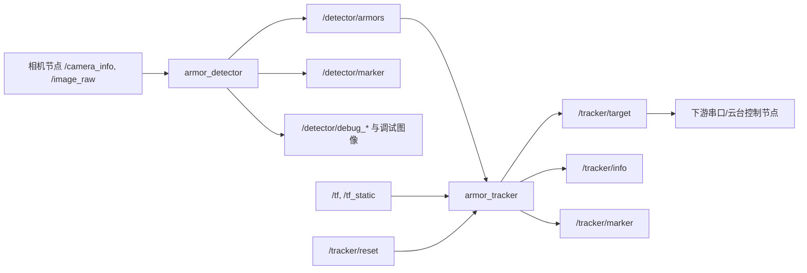
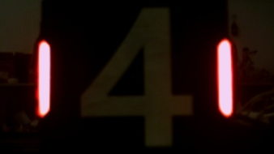

# 写在前面
除开前几年的君瞄是用的ros2之外，剩下的无论是sp_vision25还是jlu_vision26的仓库看下来，给我最大的感受就是：他们都开始丢掉ros2了。而我们ACE现在用的也还是基于ros2的节点来进行整个自瞄系统的管理，但这也给我们带来了挑战。不说学长学姐他们，我自己前阵子在研究怎么样在Unity的camera进行ros2的时候就遇到问题，进程间的通信就避免不了图像的拷贝传输，因为一定要走ros2的连接桥，才能通过ros2 tcp节点来订阅到引擎画面，而现在还是对齐工业相机的规格(1440 * 1080 * 150FPS),这样对内存的带宽要求也是极高的。同时ros2的高度依赖对应发行版也很沟槽......

诸如此类种种问题，在这十几天来，除了学习这几个自瞄项目的图像算法之外，更要熟悉他们的项目架构管理，了解他们的通信层等等，如果后续有机会的话就可以更彻底地卸下历史包袱，重构整套通信系统，实现零拷贝的跨进程或者进程内通信，减少硬件的负担，腾出更多的算力来支持其他组件。

# 君瞄

## 结构
君瞄算是一个非常经典的视觉算法开山鼻祖(我在许多视觉开源的项目都能看到君瞄的鸣谢)，同时也是基于ros2完成，作为很多ros2自瞄的脚手架，它提供了相机包和串口包在内的ros2节点，同时还有一套完整的自瞄打击系统，基本的结构就按照下面的节点图所示


## armor_detector 节点

这里就是很标准的传统网络识别，接下来开始来介绍一下大致的流程。在前面通过订阅相机节点之后，就可以直接进入主要的流程

``` cpp
binary_img = preprocessImage(input);
lights_ = findLights(input, binary_img);
armors_ = matchLights(lights_);

if (!armors_.empty()) {
  classifier->extractNumbers(input, armors_);
  classifier->classify(armors_);
}

return armors_;
```

### 灯条识别

首先进行图片的预处理，通过进行二值化，这里二值化要使用灰度的方法，因为工业相机的 **动态范围不大**，为了得到白色数字 ，这导致灯条会出现过曝。所以选择灰度二值化这样就能得到比较完美的灯条

|                 原图                 |                    二值化                     |
| :--------------------------------: | :------------------------------------------: |
|  |  |

来到了``findlights``函数，通过进行外接矩形的拟合来获得灯条的rbox,然后再经过一个`Light`函数来进行排序，把旋转矩形按照y进行重排序，最后取上下的中点来作为灯条的轴。之后进行几何过滤，通过计算宽高比和角度来筛选假灯条。来到颜色区分，通过累加rbox内部的靠近r和靠近b的像素，看看r和b哪个占比大。

### 灯条配对
首先先选择颜色相同的灯条进行一个复杂度为O(N^2)的二重循环遍历所有组合，其中去掉不同的颜色组合，再过滤掉两个灯条中间还有一个灯条的情况，还有长宽比，中心距离，连线的倾角进行一个筛子的处理。后续判断装甲板大小则使用中心距将其归一化，然后判断长度。

### 数字识别

| 原始数字 | 透视变换 | ROI | 二值化 |
| :----------------------------------------: | :------------------------------------------: | :----------------------------------------: | :----------------------------------------: |
|  |  |  |  |

如图片所示，首先从匹配好的灯条构建一个稍大一点的ROI区域，然后对其进行透视变换，之后缩放为高度固定的图像，之后根据装甲板大小截取中间的roi，之后进行转灰度然后二值化，得到清晰的二值化数字，如上面图4所示。之后送进下面的mlp识别网络里面。

### MLP网络
![[mlp.png]]

如上图所示，这是一个分类器使用了分类网络，同时这是一个多层感知机MLP，用来应付这种数字分类绰绰有余。
前面的roi是固定的大小20x28大小，然后送进多个隐藏层里面进行权重的计算，同时使用ReLU激活函数，这样就可以具备非线性表达能力，经过多次隐藏层的作用，最后变成了9个输出层，即每个类型的原始分数，再使用softmax函数把原始分数变成概率，得到了每个类别的概率，最后取最高值进行输出。

## armor_tracker 节点
来到这个部分，就可以开始处理跟踪装甲板整车估计了。同时这里也负责TF广播和消息发布。当收到了回调信号之后开始进行处理。

### EKF
![[ekf.png]]
如上图所示，我们先看状态向量

## auto_aim_interfaces 消息

`Armor` 是 detector 输出的单块装甲板：

- `number`：装甲板数字分类结果。
- `type`：大小装甲板，通常是 `small` 或 `large`。
- `distance_to_image_center`：装甲板中心到图像中心的距离。
- `pose`：装甲板在当前 header frame 下的位姿。

`Armors` 是 detector 每帧发布的装甲板数组：

- `header`：时间戳和坐标系。
- `armors`：当前帧所有装甲板观测。

`Target` 是 tracker 对下游输出的目标状态：

- `tracking`：当前是否处于有效跟踪。
- `id`：当前跟踪目标的装甲板数字。
- `armors_num`：目标车辆装甲板数量。
- `position`：目标中心位置。
- `velocity`：目标中心速度。
- `yaw`、`v_yaw`：目标朝向和角速度。
- `radius_1`、`radius_2`：目标中心到装甲板的半径。四装甲板目标可能存在两组半径。
- `dz`：四装甲板目标两组装甲板的高度差。

`TrackerInfo` 是调试信息：

- `position_diff`：当前观测和预测之间的位置差。
- `yaw_diff`：当前观测和预测之间的 yaw 差。
- `position`、`yaw`：未滤波的观测位置和 yaw。

## 这套节点设计对我们项目的启发

君瞄这套 ROS2 节点的分层还是很清楚的：相机负责图像，detector 负责当前帧观测，tracker 负责时序状态，下游串口或云台控制节点负责执行。每一层的数据类型也比较克制，不会把太多业务状态塞到一个节点里。

不过它的代价也明显：图像流、识别结果、TF、目标状态都走 ROS2 topic/service/component 这一套。如果 detector 和相机不是进程内组合，`/image_raw` 的复制和调度成本会比较高。对我们现在的架构来说，可以先学习它的节点边界和消息定义，但后续真要做高帧率工业相机链路，最好把图像采集和检测尽量放到同一进程，或者至少使用 ROS2 composition / loaned message / shared memory 方向去减轻传输压力。
