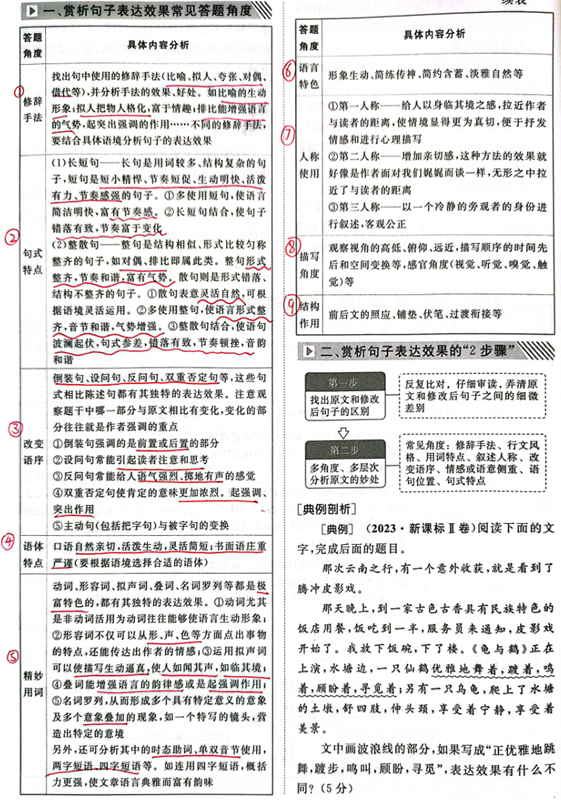

# 语用

**语言文字运用：**

**一、词语积累：**

熟语主要包括成语、俗语、惯用语、谚语和歇后语。

成语：可以引经据典，有明确出处和典故，并且使用程度相当高的用语。

例子：膛目结舌、眼花缭乱、万籁俱寂、柳暗花明

俗语：指汉语语汇里为群众所创造，并在群众口语中流传，具有口语性和通俗性的语言。

例子：被人卖了还帮着数钱、不见真佛不烧香

惯用语：指一种习用的固定的词组，既有三音节为主的固定格式，又有比较灵活的结构和强烈的修辞色彩。它通过比喻等方法而获得修辞转义。

例子：敲门砖、敲边鼓、挖墙脚、露马脚、穿小鞋、扣帽子

谚语：民间集体创造、广为流传、言简意赅并较为定性的艺术语句，是民众的丰富智慧和普遍经验的规律性总结。多数谚语反映了劳动人民的生活实践经验，而且一般是经过口头传下来的。它多是口语形式的通俗易懂的短句或韵语。

例子：冬吃萝卜夏吃姜，不用医生开药方

歇后语：汉语的一种特殊语言形式。它由前后两部分组成，前一部分起“引子”的作用，后一部分起“后衬”的作用。

例子：八仙过海——各显神通；蚕豆开花——黑心

**二、词语运用：  
**（一）理解并分析实词、虚词含义  
汉语的词可以分为12类。名词、动词、形容  
词、数词、量词和代词是实词，副词、介词、连词、助词、叹词和拟声词是虚词。

类型1 多义词的词义辨别

如“品格”有两个义项：①品性，品行；②指文学、艺术作品的质量和风格。“拾掇”有三个义项：①整理，归拢；②修理；③惩治。

类型2 人称代词的用法与表达效果

①以各种形式考察人称代词确指与泛指（虚指）的区别；

②以各种形式考查人称代词用法和人称；

③有些试题虽然含有“我”“你”等代词，但实质上考查的是句式的选用奸商句子的表达效果。

类型3 叠词表达效果

叠词指在表达上将同一个字（词）重复使用，形成新的词汇，使用叠词可以达到的表达效果：

①增强语气，通过叠词强调某个词的重要性或者强度，使语言更加有力量；

②表示数量或者程度，通过使用重复词语的方式，表达某个事物的数量或者程度，让读者对其有更加直观的理解；

③削弱或加强贬义词语的韵味，通过使用叠词的方式，可以削弱或加强一些贬义词语的韵味，让读者对其理解得更为客观；

④增强语言的音韵效果，通过使用叠词的方式，可以让语言更加优美、和谐，增强其音韵效果；

⑤可以让语言更加生动形象，营造出特定的语言氛围。

类型4 构词法代入分析

审准题目，明确答题方向；其次，要结合词语所在的上下文理解词义（本义+深层含义），分析其构词特点或表达效果；最后，根据题干需求，用简练的语言分条作答

类型5 表面义与深层义

理解词语的含义，必须要透过词语的表面义体味其深刻的内涵，如比喻义、象征义、反语义、双关义、指代义等。

比喻义：要搞清其比喻的对象，即寻找它的本体；  
象征义：要寻找词语的象征对象；  
反语义：要将褒贬互换；  
双关义：要注意它是谐音双关还是语意双关；  
指代义：要在上句或下句寻找释义。

**三、病句修改：**

**类型一 语序不当**

（一）多项定语次序不当：多项定语一般可按以下次序排列：①表领属性的或表时间、处所的短语；②指称或数量短语；③动词或动词性短语；④形容词或形容词性短语；⑤名词或名词性短语。可简记为：“属”“指（数）”“动”“形”“名”。

（二）多项状语次序不当：多项状语一般可按以下次序排列：①表目的或原因的介宾短语；②表时间的名词或介宾短语；③表处所的名词或介宾短语；④副词（表范围或频率）；⑤形容词或动词（表情态）；⑥表对象的介宾短语。可简记为：“目（因）”“时”“处”“范（频）”“情”“对”。

（三）定语与状语位置不当：定语是限制主语和宾语的，状语是修饰谓语的，如果颠倒了定语与状语的位置，即在状语的位置使用了定语的词语或与之相反，就造成了语病。  
1.定语误放在状语位置上

2.状语误放在定语位置上

（四）虚词的位置不当：虚词的位置不当，主要是指副词和关联词的位置不当。  
1.副词的位置不当

2.关联词的位置不当

（五）主客体颠倒：句子表述的对象有主动者与被动者之分。若表述不当，会出现主客体颠倒的现象。这种颠倒一般有两种情形：  
1.“为”“使”“对”“对于”等介词介引的对象主客体颠倒 2.语意上的主客体颠倒

（六）并列短（词）语位置不当：在一个句子中，要注意并列短（词）语中各项的轻重、先后、大小的关系，遵循一定的逻辑关系，否则容易出现位置不当的现象。辨析时应重点注意以下技巧的应用：  
1.认真分析并列短（词）语之间的时间先后、空间距离、范围大小、程度轻重、情感流程、时局变化、数目常规、成绩名次、法定位置、对应承接等逻辑关系，看有无违反逻辑关系。  
2.倒序检查：对句中并列短（词）语问题如一时无法判断，可将语序前后调换一下，如通顺，则说明原顺序有问题；反之，则无问题。因为在组织并列短（词）语时要符合一定的逻辑关系和语言习惯。

（七）分句位置不当：在承接关系复句、递进关系复句中，分句之间的次序分别有先后和轻重关系，如果次序颠倒，就会造成分句位置不当。

**类型二 搭配不当**

1.主谓搭配不当：主要表现为谓语不能用来陈述主语，有时主语或谓语由并列短语充当，其中一部分不搭配。

2.动宾搭配不当  
（1)当谓语动词和宾语中心语之间加了很长的修饰限定成分，谓语动词和宾语中心语间隔很远，这时宾语中心语往往会和前面的谓语动词不搭配。

（2)当一个谓语动词后面带有两个或两个以上的宾语时，其中的一个宾语常会和这个谓语动词搭配不当。

3.主宾搭配不当  
（1)同一个句子的主宾搭配不当。

（2)在第一个句子中搭配恰当，但在第二个句子中则改换了主语，致使主宾搭配不当。

（二）枝叶成分搭配不当  
1.动补搭配不当（补语与中心语搭配不当）：主要指一动与多补不能完全相搭配。  
2.修饰语与中心语搭配不当：主要指修饰语或限制语用在中心语前面会造成表达上的不合习惯或不合事理的现象。  
（1)定语和中心语搭配不当。

（2)状语和中心语搭配不当。

3.呼应成分搭配不当

（1)关联词语搭配不当。有一些关联词语有其固定的搭配对象，如“只有”和“才”、“只要”和“就”、“不但不”和“反而”等，混淆使用则会犯搭配不当的毛病；有些关联词语搭配的对象不同，则其表意功能也不同，如“不是”与“而是”搭配表并列，与“就是”搭配则表选择，命题者有时就会利用其搭配情况来设置错例。

（2)一面与两面搭配不当。主要特点：句子前面（或“后面”）出现一正一反两方面意思的词语（如成败、升降、高低、好坏、优劣、强弱、得失、能否、是否、有无等），后面（或“前面”）却只有一方面意思（或“正”或“反”）的词句与之相呼应，从而造成前后内容搭配的不协调。

**类型三 成分残缺或赘余：**

**（一）成分残缺  
**1.主语成分残缺

（1)滥用介词造成主语残缺。  
滥用介词，介词和主语构成介宾短语，介宾短语只能充当修饰语，所以往往会使主语残缺。修改这类病句时一般应将介词删掉。在辨析语病时，“介词当头审主残”，意思就是当“在”“对”“从”“通过”“经过”“由于”“根据”等介词放在句首时，  
一定要看看是否造成了主语残缺。

（2)滥用使令动词造成主语残缺。

（3)偏正短语中中心语残缺，造成主语残缺。

（4)滥用省略，使分句中的主语残缺。

2.谓语成分残缺：

（1)句首陈述对象缺乏相应的谓语，却另起一个头，造成谓语残缺。  
（2)缺少与宾语呼应的谓语中心词。

3.宾语成分残缺

（1)动词的宾语残缺。

（2)介词的宾语残缺。

**（二）成分赘余**

1.主语赘余；2.谓语赘余；3.宾语赘余；4.附加成分或助词赘余；5.表约数、概数的词语并列，造成重复

**类型四 结构混乱**

结构混乱是比较复杂的一种病句类型，主要包括句式杂糅、中途易辙（偷换主语）、藕断丝连等。

（一）句式杂糅：

句式杂糅是把两种或两种以上的句式混杂在一个句子中，该结束的地方不结束，前后交叉错叠，句子结构混乱，形成病句。

（二）中途易辙  
中途易辙，就是表达句意时，前一个分句没有说完，而后一个分句又偷换了主语，造成表意混杂。

（三）藕断丝连  
此类语病的特点是，把结构完整的一句话的最后一部分用作另一句的开头硬凑起来。

**类型5表意不明：**

表意不明就是句子表达的意思不清楚、不明白。主要有以下几种情况。

（一）指代不明；（二）对象不明；（三）修饰两可造成歧义；（四）多义词（短语）造成歧义；（五）多音带来多种理解；（六）停顿不明；（七）词性不同带来多种理解；

**类型6 不合逻辑：**

（一）概念混乱（概念并列不当）

1.相互并列的概念，就是按照统一标准划分的概念，如果标准混乱，就会出现概念之间包含或者交叉的错误现象。

2.并列的短语不全部属于同一范畴

3.同一个句子，应该保持语义逻辑前后的一致性。否则就会自身矛盾

（二）否定失当：为了增强表达效果，多次运用否定导致本意弄反

（三）不合事理：陈述的内容或者观点不符合生活常理或普遍认同的公理

（四）数量误用：增加可以用倍数，下降、减少要用分数，增长率、升幅要用百分比

**梳理病句的方法：**

**（一）梳“干”理“枝”法**

常规句子的主干是：主语中心词（＋否定词）＋谓语中心词＋宾语中心词。高考试题中相当一部分病句是主语中心词、谓语中心词和宾语中心词相互搭配不当造成的，这些病句可以用找句子主干的方法来判断。通过找句子主干，我们可以查出句子成分是否残缺或赘余，成分搭配是否恰当。如果通过找主干没有发现病因，我们不妨查一下枝叶，看看附加成分修饰、限制、次序是否恰当。

1.梳“干”：（1)检查句子的主干，看成分是否残缺；（2)推敲词语运用，看成分是否搭配；（3)心里默读，看是否有不同的句式混用；（4)综合思考，看是否符合逻辑思维。

2.理“枝”：（1)理顺句子的枝叶，检查定语和中心词是否搭配；（2)看多层定语、状语的排列次序是否恰当。

**（二）捕捉标志法**  
1.并列短语排列次序是否恰当。  
2.互相并列的概念是否交叉。  
3.关联词语的搭配及位置是否恰当。  
4.否定词（禁止、否认、切忌、避免、防止等）运用是否得当。  
5.两面词是否搭配。  
6.介词、代词、助词运用是否正确。

**二、修改病句的方法与步骤  
（一）主观题**  
修改病句的方法多种多样，归纳起来有以下四种：

1.增补。对成分残缺的病句用增补法，缺什么成分就补什么成分。  
2.删除。对成分赘余的病句用删除法，删去多余的，对自相矛盾的逻辑病句，依据实际情况删除矛盾的一方。  
3.调换。对搭配不当的病句，用此法调换词语；对语序不当的病句，用此法调换词语的位置；对前后失去照应的病句，用此法作调整，以使前后照应。  
4.精简。对句式杂糅、结构混乱的病句，用此法作精简，以使语句表达方式具有单一性，能用多种方法改的，选用最简便的一种。

**语句复位：**

一、七大角度

1.话题统一：所讲述内容的统一，主语或者陈述对象的统一；

2.逻辑或事例相承：语段在表达一定意思时候，总是会按照特定的逻辑顺序或者符合一定的生活事例；

3.前后呼应：句子间前后连贯，就要注意内容的衔接和呼应，做到先起后承；

4.意境协调：文段的画面、色彩、情调、氛围、风格应和谐统一；

5.句式得当：句子的一致性；句子的最佳表意

6.音节和谐：符合诗歌或语句在字数、句式、平仄、音韵等格律方面所特有的规定。

7.时间、空间一致：从古至今、从先到后、从内到外……

二语句复位三大步骤：1.读语段，明大意；2.读选项，明内容；3.入语境，析对应

**语句排序：**

**一、语句排序的要点**

（一）抓语言标志  
1.关联词语的呼应  
关联词语之间的搭配关系，或并列，或转折，或条件，或假设，或递进，或因果。关联词语是一一对应的，也有先后关系，从而确定上下句。

2.暗示性词语的使用

3.关键词语、相同句式的重复出现  
这些句子应是紧密相连的，据此也能确定句子的先后顺序。

（二）抓相邻语境（三）抓标点符号（四）抓行文思路（五）抓句群、关键句

**二、语句排序的步骤**

1.根据横线前面的内容确定第一句；2.找出紧密相连的两句；3.根据横线后的内容确定最后一句

**句子补写：**

**一、分析语段特点**

（一）常见语段三大结构类型

1.总分式。在说明事物或事理时段落（层次）之间有一个总分关系，表现为由总到分、由分到总、由总到分再到总。

2.承接式。各段落（层次）之间按照事物的发展过程或者按照时间、因果、条件等关系前后相互承接。

3.并列式。各段落（层次）之间的关系是并列的，无主次之分。

（二）常见补写句子四种类型

1.补写总领句；2.补写总结句；3.补写过渡句；4.补写照应句

**二、分析语段的步骤**

1.明确话题，定中心；2.理清关系，分层次；3.再读材料，重细节；4.斟酌词句，定答案

**九种修辞手法及其作用**

**（一）比喻**  
就是“打比方”，即利用不同事物之间的某些相似之处，用一个事物来比方另一个事物。由三部分组成，即本体（被比喻的事物）、喻体（作比结构喻的事物）和比喻词（比喻关系的标志性词语）。

条件：①本体和喻体必须是本质不同的事物，否则不能构成比喻②本体、喻体之间必须有相似点

类别：

①明喻。本体、喻体都出现，中间用比喻词“像、似、仿佛、犹如”等联结  
②暗喻。本体、喻体都出现，中间用比喻词“是、成了、变成”等联结，有时暗喻不用比喻词

③借喻。不出现本体，直接叙述喻体。例如：忽如一夜春风来，千树万树梨花开。  
④博喻。连用几个喻体，从不同的角度、多方面地说明或描绘本体的比喻，可用几个喻体说明本体的各个方面，也可用几个喻体说明本体的一个方面。运用博喻能把事物的特征或事理的内涵从各个不同的侧面、不同的角度表现出来。

作用：

①具体、形象、生动。②浅显易懂。③表达感情。

**（二）比拟**  
把甲事物模拟作乙事物来写

类别：（1)拟人。把物当作人来写，把事物“人化”（拟人）（2）拟物。①把人当作物来写，把人“物化”（拟物），②把此物当作彼物来写，把“甲物乙物化”（拟物）

作用：

①色彩鲜明。②描绘形象。③表意丰富。

**（三）借代**

不直接说出要说的某人或某事物的本来名称，而是借用和它密切相关的名称来代替（用来代替的事物叫作借体，被代替的事物叫作本体）。

类别：①特征代本体。②材料代本体。③标志代本体。④人名代著作。⑤绰号代本人。⑥专名代泛称。⑦具体代抽象。⑧部分代整体。

作用：

①形象生动，重点突出。②简洁，精练。③灵活，不死板，给人以幽默感。

**（四）夸张**

为达到某种表达需要，对事物的形象、特征、作用、程度等方面着意扩大或缩小

类别：①扩大夸张：故意把客观事物说得“大、多、高、强、深······”的夸张形式。②超前夸张：在时间上，把后出现的事物提前一步的夸张形式。③缩小夸张：故意把客观事物说得“小、少、低、弱、浅······”的夸张形式。

作用：

①形象漫画化，使特点更显著。②揭示事物本质，起强调作用。③态度鲜明，有强烈的感情色彩。

**（五）对偶**

用字数相等、结构形式相同、意义对称的一对短语或句子，来表达两个相近或相对意思的修辞手法。

类别：（1)形式上：①单句对偶，用一句对一句。②偶句对偶，用两句对两句。③多句对偶，用三句对三句，或用更多的句子相对。（2)内容上：①正对，上下句表达的意思是同类的、相近的或互补的。②反对，上下句表达的意思是相反的或相对的，多指同一事物的两个方面。③串对（流水对），上下句意思具有承接、递进、因果、假设、条件等关系。

作用：

①便于吟诵，易于记忆。②用于诗词，有音乐美。③凝练概括，抒情酣畅。

**（六）反复**

为了强调某个意思，表达某种感情，有意重复某个词语或句子。

类别：①连续反复。②间隔反复。

作用：

①反复咏叹，表达强烈情感。②格式整齐有序，而又回环起伏，充满韵律美。

**（七）排比**

由三个或三个以上结构相同或相似、内容相关、语气一致的短语或句子排列在一起，用来加强语势，强调内容，加重情感。

类别：①成分排比，一个句子中的某些成分组成排比。②分句排比，一个复句的各个分句构成排比。③单句排比。④复句排比。

作用：

①内容集中，增强气势。②条分缕析，叙事透辟。③节奏鲜明，便于抒情。

**（八）设问**  
为了引人注意，故意先提出问题，然后再作回答。

作用：

①突出文章的重点，增强语言的气势，引起读者的注意，有助于更好地抒情论理。②可使行文有波澜，收到生动、不呆板的效果。

**（九）反问  
**反问也叫激问、反诘、诘问，是用疑问形式表达确  
定意思的一种修辞手法  
类别：或用肯定形式反问表否定，或用否定形式反问表肯定，且只问不答，答案暗含在问句中。

作用：

①加强语气，增强句子的气势和说服力。②发人深思，激发读者情感，加深读者印象

**易混修辞手法**

**1.比喻与比拟**

（1)反映事物间的关系不同。比喻是以甲喻乙，两者有相似点，是相似关系；比拟是以甲拟乙，两者融为一体，是交融关系。  
（2)表达的结构方式不同。比喻的本体和喻体一主一从，本体或出现或不出现，而喻体必须出现；比拟的本体和拟体成为一统，本体必须出现，拟体不出现。

**2.借喻与借代**

（1)相同点：它们都用一种事物代另一事物，事物本体不出现。  
（2)不同点：①借喻的作用是“比喻”，虽然也有代替的作用，但总是喻中有代；借代的作用是“称代”，即直接把借体称为本体，它只代不喻。②构成借喻的基础是事物的相似性，即要求喻体和本体有某些方面的相似处；构成借代的基础是事物的相关性，即要求借体和本体有某种关系。③借喻可以改为明喻或暗喻，借代则不能。

**3.对偶与对比**

（1)基本特征不同。对偶重“偶”，基本特征是对称；对比重“比”，基本特征是对立。

（2)表达效果的侧重不同。对偶重结构形式，对比重内容意义。但有的对偶也是对比。

**4.排比与反复**

（1)排比是为了加强语势，反复是为了突出强调某种感情。

（2)排比是把三句或三句以上结构相同的句子连在一起，反复是把某个词语或句子重复两次以上。

（3)排比中有部分提示词语相同，而反复则是词语或句子完全相同。

**5.对偶与排比**

（1)对称性与平列式。对偶是两个语言单位，而排比是三个或三个以上的语言单位。对偶必须对称；排比要求结构大体相似，字数要求不甚严格。

（2)词语的重字与避重有别。典型的对偶句上下两句不重字；排比经常以同一词语作为彼此的提示语，使排比内容互相衔接，给人紧凑密集之感。

（3)对偶以要求平仄对仗为佳，排比则无此要求。

**6.设问与反问**

（1)设问不表示肯定什么或否定什么，而反问则明确地表示肯定或否定的内容。

（2)设问主要是提出问题，引起注意，启发思考，然后自己回答；而反问主要是加强语气，用确定的语气表明自己的思想，答在问中。

**一、长句与短句的基本概念**

长句，是指用词较多，结构较复杂的句子。它的修饰语（定语、状语等）多，并列成分（如并列宾语、并列谓语）多，或者某一成分（如谓语）结构比较复杂。短句，指的是短小精悍、结构简单、节奏短促、生动明快、活泼有力、节奏性强的句子。 

**二、长句与短句的特点和表达效果**

（一）、长句特点和表达效果长句一般有三个特点，一是主干修饰语用得多；二是并列成分（主干和枝叶中可能都有并列成分）用得多；三是某一成分结构（特别是谓语、定语、状语）比较复杂。长句的表达效果：表意严密，内容丰富，精确细致，宜于表达较为复杂的思想内容和严密精确的观点概念。

（二）、短句特点和表达效果短句的特点是字数少，结构简单，附加成分少（修饰语少），甚至不一定是主谓句，只是一个字，一个词、一个短语（词组）。  
短句的表达效果：能简明扼要地叙述事实，简洁生动地表现人物，反映事物的迅速变化，表现作者激越的情绪或果断肯定的语气。 

**三、长句与短句相互转换的方法p334**

（一）、长句改为短句：

1.将长句中能抽出来的较庞大、繁复的修饰限制成分抽出来，改成分句或单独成句，不能抽出来的修饰限制成分与句子主干另成一句。这种转换方法最大的要点是将原来可能是一个主语的大句子变为几个有不同主语的小句子。

2.把联合（并列）成分拆开，将原来跟联合（并列）成份相配的共用成分再分别重复（重新）搭配，形成一组大的排比句。

长句改短句要注意所改短句之间的逻辑顺序，改句意思和原句意思应该保持一致。长句改为短句的关键在于将长句的谓语、定语、状语、补语等拎出来，给它们重新组合或添加主语、谓语、宾语等成分，使之成为各自独立的完整的短小句子。

（二）、短句改为长句的方法：

要注意先了解几个短句表达的意思的共同点，找到它们能够共用的主语、谓语、宾语等成分，确定主干，然后把其他内容（词语）以长句子的修饰限制语的形式呈现出来（即把其他词语内容转变为长句子主干——主、谓、宾语的修饰语——定、状、补语），一定不能在词语和内容上有遗漏，也不能改变原句的主要意思。

重要的事情再说一遍：短句改为长句的关键在于将短句或短句的主要词语变作长句的谓语、宾语、定语、状语、补语等成分。